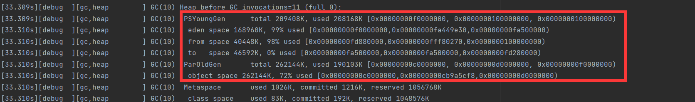
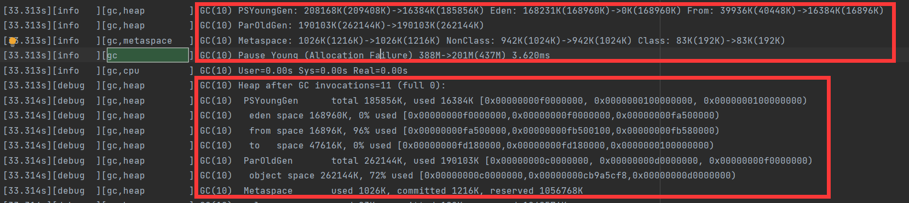
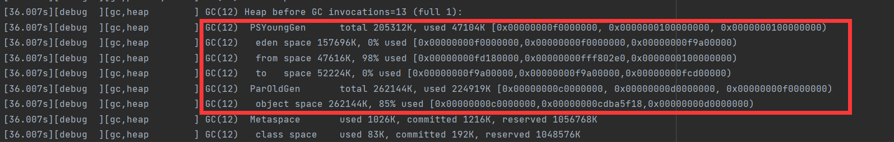
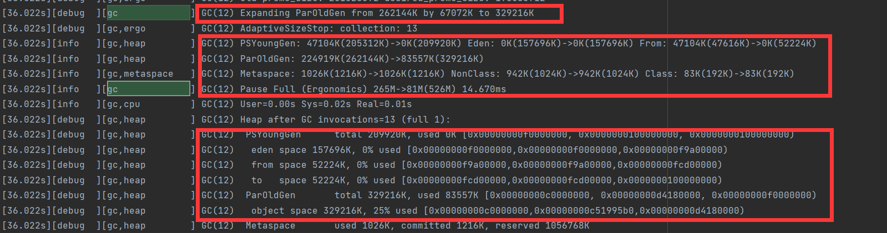

## 1. 任务背景

针对Parallel GC，编写程序模拟内存分配与垃圾回收场景，能够反应出该GC的特点。解释它的GC日志。修改程序或JVM参数以达成特定目标，如更低的GC延迟。
## 2. 研究计划
- [X] 实现GC测试用例
- [X] 选择SeriralGC作为baseline，记录实验结果
- [x] 选择ParrallelGC进行实验，记录实验结果
- [x] 改变参数配置，优化GC延迟
## 3. GC日志分析
### 3.1 Java程序
```java
import java.time.LocalDateTime;
import java.util.ArrayList;
import java.util.List;

/**
 * GC测试用例
 */
public class TestGC {
    public static void main(String[] args) throws InterruptedException {
        System.out.println("=========================GC测试用例=========================");
        long start= System.currentTimeMillis();
        List<byte[]> list = new ArrayList<>();
        int maxIterations = 3000;
        for(int i=1;i<=maxIterations;i++){
            //新增1M
            list.add(new byte[1*1024*1024]);
            //每隔100 clear一次
            if(i%100==0){
                list.clear();
                System.out.printf("iteration:%5d\t\t清空List\n",i);
            }
            //休眠10ms
            Thread.sleep(10);
        }
        long end= System.currentTimeMillis();
        System.out.printf("耗费时间"+(end-start)+'s');
        System.out.println("测试完成");
    }
}
```
### 3.2 JVM参数
```
# 使用ParallelGC
-XX:+UseParallelGC
# 最大堆空间1G                                              
-Xmx1024m 
# 最小堆空间512M
-Xms512m 
# 新生代空间256M
-Xmn256m
# 控制台输出日志 
-XX:+PrintGCDetails
# 打印日志 
-Xlog:gc*=debug:file=./log/gcParallel.log
```
### 3.3 GC参数配置
| 参数名字  | 详细配置 |
|:-----:|:----:|
|  CPU  |  12  |
|  线程数  |  10  |
|  最大堆  |  1G  |
|  最小堆  | 512M |
| 新生代大小 | 256M |
### 3.4 GC日志
#### 3.4.1 详细内容
```log
[0.004s][warning][gc] -XX:+PrintGCDetails is deprecated. Will use -Xlog:gc* instead.
[0.032s][debug  ][gc,heap] Minimum heap 536870912  Initial heap 536870912  Maximum heap 1073741824
[0.032s][info   ][gc     ] Using Parallel
[0.032s][debug  ][gc,heap,coops] Heap address: 0x00000000c0000000, size: 1024 MB, Compressed Oops mode: 32-bit
[0.034s][info   ][gc,init      ] Version: 17.0.2+8-86 (release)
[0.034s][info   ][gc,init      ] CPUs: 12 total, 12 available
[0.034s][info   ][gc,init      ] Memory: 14188M
[0.034s][info   ][gc,init      ] Large Page Support: Disabled
[0.034s][info   ][gc,init      ] NUMA Support: Disabled
[0.034s][info   ][gc,init      ] Compressed Oops: Enabled (32-bit)
[0.034s][info   ][gc,init      ] Alignments: Space 512K, Generation 512K, Heap 2M
[0.034s][info   ][gc,init      ] Heap Min Capacity: 512M
[0.034s][info   ][gc,init      ] Heap Initial Capacity: 512M
[0.034s][info   ][gc,init      ] Heap Max Capacity: 1G
[0.034s][info   ][gc,init      ] Pre-touch: Disabled
[0.034s][info   ][gc,init      ] Parallel Workers: 10
[0.035s][info   ][gc,metaspace ] CDS archive(s) mapped at: [0x0000000800000000-0x0000000800bc0000-0x0000000800bc0000), size 12320768, SharedBaseAddress: 0x0000000800000000, ArchiveRelocationMode: 0.
[0.035s][info   ][gc,metaspace ] Compressed class space mapped at: 0x0000000800c00000-0x0000000840c00000, reserved size: 1073741824
[0.035s][info   ][gc,metaspace ] Narrow klass base: 0x0000000800000000, Narrow klass shift: 0, Narrow klass range: 0x100000000
[3.026s][debug  ][gc,heap      ] GC(0) Heap before GC invocations=1 (full 0):
[3.026s][debug  ][gc,heap      ] GC(0)  PSYoungGen      total 229376K, used 195791K [0x00000000f0000000, 0x0000000100000000, 0x0000000100000000)
[3.026s][debug  ][gc,heap      ] GC(0)   eden space 196608K, 99% used [0x00000000f0000000,0x00000000fbf33fc8,0x00000000fc000000)
[3.026s][debug  ][gc,heap      ] GC(0)   from space 32768K, 0% used [0x00000000fe000000,0x00000000fe000000,0x0000000100000000)
[3.026s][debug  ][gc,heap      ] GC(0)   to   space 32768K, 0% used [0x00000000fc000000,0x00000000fc000000,0x00000000fe000000)
[3.026s][debug  ][gc,heap      ] GC(0)  ParOldGen       total 262144K, used 0K [0x00000000c0000000, 0x00000000d0000000, 0x00000000f0000000)
[3.026s][debug  ][gc,heap      ] GC(0)   object space 262144K, 0% used [0x00000000c0000000,0x00000000c0000000,0x00000000d0000000)
[3.026s][debug  ][gc,heap      ] GC(0)  Metaspace       used 1020K, committed 1216K, reserved 1056768K
[3.026s][debug  ][gc,heap      ] GC(0)   class space    used 83K, committed 192K, reserved 1048576K
[3.026s][debug  ][gc,tlab      ] GC(0) TLAB totals: thrds: 5  refills: 5 max: 1 slow allocs: 173 max 173 waste: 76.1% gc: 15313744B max: 4026448B slow: 0B max: 0B
[3.026s][info   ][gc,start     ] GC(0) Pause Young (Allocation Failure)
[3.026s][debug  ][gc,phases,start] GC(0) Scavenge
[3.043s][debug  ][gc,phases      ] GC(0) Scavenge 16.516ms
[3.043s][debug  ][gc,phases,start] GC(0) Reference Processing
[3.043s][debug  ][gc,ref         ] GC(0) Skipped phase 1 of Reference Processing: no references
[3.043s][debug  ][gc,ref         ] GC(0) ReferenceProcessor::execute queues: 1, RefProcThreadModel::Single, marks_oops_alive: false
[3.043s][debug  ][gc,ref         ] GC(0) Skipped phase 3 of Reference Processing: no references
[3.043s][debug  ][gc,ref         ] GC(0) ReferenceProcessor::execute queues: 1, RefProcThreadModel::Single, marks_oops_alive: false
[3.043s][debug  ][gc,phases,ref  ] GC(0) Reference Processing: 0.1ms
[3.043s][debug  ][gc,phases,ref  ] GC(0)   Reconsider SoftReferences: 0.0ms
[3.043s][debug  ][gc,phases,ref  ] GC(0)     SoftRef (ms):                  skipped
[3.043s][debug  ][gc,phases,ref  ] GC(0)   Notify Soft/WeakReferences: 0.1ms
[3.043s][debug  ][gc,phases,ref  ] GC(0)     SoftRef (ms):                  Min:  0.0, Avg:  0.0, Max:  0.0, Diff:  0.0, Sum:  0.0, Workers: 10
[3.043s][debug  ][gc,phases,ref  ] GC(0)     WeakRef (ms):                  Min:  0.0, Avg:  0.0, Max:  0.0, Diff:  0.0, Sum:  0.0, Workers: 10
[3.043s][debug  ][gc,phases,ref  ] GC(0)     FinalRef (ms):                 Min:  0.0, Avg:  0.0, Max:  0.0, Diff:  0.0, Sum:  0.0, Workers: 10
[3.044s][debug  ][gc,phases,ref  ] GC(0)     Total (ms):                    Min:  0.0, Avg:  0.0, Max:  0.0, Diff:  0.0, Sum:  0.0, Workers: 10
[3.044s][debug  ][gc,phases,ref  ] GC(0)   Notify and keep alive finalizable: 0.0ms
[3.044s][debug  ][gc,phases,ref  ] GC(0)     FinalRef (ms):                 skipped
[3.044s][debug  ][gc,phases,ref  ] GC(0)   Notify PhantomReferences: 0.0ms
[3.044s][debug  ][gc,phases,ref  ] GC(0)     PhantomRef (ms):               Min:  0.0, Avg:  0.0, Max:  0.0, Diff:  0.0, Sum:  0.0, Workers: 10
[3.044s][debug  ][gc,phases,ref  ] GC(0)   SoftReference:
[3.044s][debug  ][gc,phases,ref  ] GC(0)     Discovered: 0
[3.044s][debug  ][gc,phases,ref  ] GC(0)     Cleared: 0
[3.044s][debug  ][gc,phases,ref  ] GC(0)   WeakReference:
[3.044s][debug  ][gc,phases,ref  ] GC(0)     Discovered: 149
[3.044s][debug  ][gc,phases,ref  ] GC(0)     Cleared: 105
[3.044s][debug  ][gc,phases,ref  ] GC(0)   FinalReference:
[3.044s][debug  ][gc,phases,ref  ] GC(0)     Discovered: 0
[3.044s][debug  ][gc,phases,ref  ] GC(0)     Cleared: 0
[3.044s][debug  ][gc,phases,ref  ] GC(0)   PhantomReference:
[3.044s][debug  ][gc,phases,ref  ] GC(0)     Discovered: 35
[3.044s][debug  ][gc,phases,ref  ] GC(0)     Cleared: 5
[3.044s][debug  ][gc,phases      ] GC(0) Reference Processing 0.840ms
[3.044s][debug  ][gc,phases,start] GC(0) Weak Processing
[3.044s][debug  ][gc,phases      ] GC(0)   VM Weak                        Min:  0.0, Avg:  0.0, Max:  0.0, Diff:  0.0, Sum:  0.0, Workers: 6
[3.044s][debug  ][gc,phases      ] GC(0)     Dead                           Min: 0, Avg:  0.0, Max: 0, Diff: 0, Sum: 0, Workers: 6
[3.044s][debug  ][gc,phases      ] GC(0)     Total                          Min: 0, Avg:  1.3, Max: 8, Diff: 8, Sum: 8, Workers: 6
[3.044s][debug  ][gc,phases      ] GC(0)   ObjectSynchronizer Weak        Min:  0.0, Avg:  0.0, Max:  0.0, Diff:  0.0, Sum:  0.0, Workers: 6
[3.044s][debug  ][gc,phases      ] GC(0)     Dead                           Min: 0, Avg:  0.0, Max: 0, Diff: 0, Sum: 0, Workers: 6
[3.044s][debug  ][gc,phases      ] GC(0)     Total                          Min: 0, Avg:  0.5, Max: 3, Diff: 3, Sum: 3, Workers: 6
[3.044s][debug  ][gc,phases      ] GC(0)   JVMTI Tag Weak OopStorage      Min:  0.0, Avg:  0.0, Max:  0.0, Diff:  0.0, Sum:  0.0, Workers: 6
[3.044s][debug  ][gc,phases      ] GC(0)     Dead                           Min: 0, Avg:  0.0, Max: 0, Diff: 0, Sum: 0, Workers: 6
[3.044s][debug  ][gc,phases      ] GC(0)     Total                          Min: 0, Avg:  0.0, Max: 0, Diff: 0, Sum: 0, Workers: 6
[3.044s][debug  ][gc,phases      ] GC(0)   StringTable Weak               Min:  0.0, Avg:  0.0, Max:  0.0, Diff:  0.0, Sum:  0.2, Workers: 6
[3.044s][debug  ][gc,phases      ] GC(0)     Dead                           Min: 0, Avg:  0.8, Max: 3, Diff: 3, Sum: 5, Workers: 6
[3.044s][debug  ][gc,phases      ] GC(0)     Total                          Min: 448, Avg: 891.8, Max: 1344, Diff: 896, Sum: 5351, Workers: 6
[3.044s][debug  ][gc,phases      ] GC(0)   ResolvedMethodTable Weak       Min:  0.0, Avg:  0.0, Max:  0.0, Diff:  0.0, Sum:  0.0, Workers: 6
[3.044s][debug  ][gc,phases      ] GC(0)     Dead                           Min: 0, Avg:  0.2, Max: 1, Diff: 1, Sum: 1, Workers: 6
[3.044s][debug  ][gc,phases      ] GC(0)     Total                          Min: 0, Avg: 21.7, Max: 64, Diff: 64, Sum: 130, Workers: 6
[3.044s][debug  ][gc,phases      ] GC(0)   JNI Weak                       Min:  0.0, Avg:  0.0, Max:  0.0, Diff:  0.0, Sum:  0.0, Workers: 6
[3.044s][debug  ][gc,phases      ] GC(0)     Dead                           Min: 0, Avg:  0.0, Max: 0, Diff: 0, Sum: 0, Workers: 6
[3.044s][debug  ][gc,phases      ] GC(0)     Total                          Min: 0, Avg:  0.0, Max: 0, Diff: 0, Sum: 0, Workers: 6
[3.044s][debug  ][gc,phases      ] GC(0)   StringDedup Table Weak         Min:  0.0, Avg:  0.0, Max:  0.0, Diff:  0.0, Sum:  0.0, Workers: 6
[3.045s][debug  ][gc,phases      ] GC(0)     Dead                           Min: 0, Avg:  0.0, Max: 0, Diff: 0, Sum: 0, Workers: 6
[3.045s][debug  ][gc,phases      ] GC(0)     Total                          Min: 0, Avg:  0.0, Max: 0, Diff: 0, Sum: 0, Workers: 6
[3.045s][debug  ][gc,phases      ] GC(0)   StringDedup Requests0 Weak     Min:  0.0, Avg:  0.0, Max:  0.0, Diff:  0.0, Sum:  0.0, Workers: 6
[3.045s][debug  ][gc,phases      ] GC(0)     Dead                           Min: 0, Avg:  0.0, Max: 0, Diff: 0, Sum: 0, Workers: 6
[3.045s][debug  ][gc,phases      ] GC(0)     Total                          Min: 0, Avg:  0.0, Max: 0, Diff: 0, Sum: 0, Workers: 6
[3.045s][debug  ][gc,phases      ] GC(0)   StringDedup Requests1 Weak     Min:  0.0, Avg:  0.0, Max:  0.0, Diff:  0.0, Sum:  0.0, Workers: 6
[3.045s][debug  ][gc,phases      ] GC(0)     Dead                           Min: 0, Avg:  0.0, Max: 0, Diff: 0, Sum: 0, Workers: 6
[3.045s][debug  ][gc,phases      ] GC(0)     Total                          Min: 0, Avg:  0.0, Max: 0, Diff: 0, Sum: 0, Workers: 6
[3.045s][debug  ][gc,phases      ] GC(0)   Weak JFR Old Object Samples    Min:  0.0, Avg:  0.0, Max:  0.0, Diff:  0.0, Sum:  0.0, Workers: 6
[3.045s][debug  ][gc,phases      ] GC(0)     Dead                           Min: 0, Avg:  0.0, Max: 0, Diff: 0, Sum: 0, Workers: 6
[3.045s][debug  ][gc,phases      ] GC(0)     Total                          Min: 0, Avg:  0.0, Max: 0, Diff: 0, Sum: 0, Workers: 6
[3.045s][debug  ][gc,phases      ] GC(0) Weak Processing 0.880ms
[3.045s][debug  ][gc,ergo        ] GC(0) AdaptiveSizeStart:  collection: 1 
[3.045s][debug  ][gc,age         ] GC(0) Desired survivor size 33554432 bytes, new threshold 7 (max threshold 15)
[3.045s][debug  ][gc,ergo        ] GC(0) PSAdaptiveSizePolicy::compute_eden_space_size: costs minor_time: 0.006217 major_cost: 0.000000 mutator_cost: 0.993783 throughput_goal: 0.990000
[3.045s][debug  ][gc,ergo        ] GC(0) Live_space: 301736448 free_space: 402653184
[3.045s][debug  ][gc,ergo        ] GC(0) Old eden_size: 201326592 desired_eden_size: 201326592
[3.045s][debug  ][gc,ergo        ] GC(0) AdaptiveSizeStop: collection: 1 
[3.045s][info   ][gc,heap        ] GC(0) PSYoungGen: 195791K(229376K)->32520K(229376K) Eden: 195791K(196608K)->0K(196608K) From: 0K(32768K)->32520K(32768K)
[3.045s][info   ][gc,heap        ] GC(0) ParOldGen: 0K(262144K)->45064K(262144K)
[3.045s][info   ][gc,metaspace   ] GC(0) Metaspace: 1020K(1216K)->1020K(1216K) NonClass: 937K(1024K)->937K(1024K) Class: 83K(192K)->83K(192K)
[3.045s][info   ][gc             ] GC(0) Pause Young (Allocation Failure) 191M->75M(480M) 19.017ms
[3.045s][info   ][gc,cpu         ] GC(0) User=0.06s Sys=0.09s Real=0.02s
[3.045s][debug  ][gc,heap        ] GC(0) Heap after GC invocations=1 (full 0):
[3.045s][debug  ][gc,heap        ] GC(0)  PSYoungGen      total 229376K, used 32520K [0x00000000f0000000, 0x0000000100000000, 0x0000000100000000)
[3.045s][debug  ][gc,heap        ] GC(0)   eden space 196608K, 0% used [0x00000000f0000000,0x00000000f0000000,0x00000000fc000000)
[3.045s][debug  ][gc,heap        ] GC(0)   from space 32768K, 99% used [0x00000000fc000000,0x00000000fdfc2200,0x00000000fe000000)
[3.045s][debug  ][gc,heap        ] GC(0)   to   space 32768K, 0% used [0x00000000fe000000,0x00000000fe000000,0x0000000100000000)
[3.045s][debug  ][gc,heap        ] GC(0)  ParOldGen       total 262144K, used 45064K [0x00000000c0000000, 0x00000000d0000000, 0x00000000f0000000)
[3.045s][debug  ][gc,heap        ] GC(0)   object space 262144K, 17% used [0x00000000c0000000,0x00000000c2c022c0,0x00000000d0000000)
[3.045s][debug  ][gc,heap        ] GC(0)  Metaspace       used 1020K, committed 1216K, reserved 1056768K
[3.045s][debug  ][gc,heap        ] GC(0)   class space    used 83K, committed 192K, reserved 1048576K
[3.045s][debug  ][gc,task,time   ] GC(0) VM-Thread 30256020 30430761 30453743
[6.192s][debug  ][gc,heap        ] GC(1) Heap before GC invocations=2 (full 0):
[6.192s][debug  ][gc,heap        ] GC(1)  PSYoungGen      total 229376K, used 228770K [0x00000000f0000000, 0x0000000100000000, 0x0000000100000000)
[6.192s][debug  ][gc,heap        ] GC(1)   eden space 196608K, 99% used [0x00000000f0000000,0x00000000fbfa66a0,0x00000000fc000000)
[6.192s][debug  ][gc,heap        ] GC(1)   from space 32768K, 99% used [0x00000000fc000000,0x00000000fdfc2200,0x00000000fe000000)
[6.192s][debug  ][gc,heap        ] GC(1)   to   space 32768K, 0% used [0x00000000fe000000,0x00000000fe000000,0x0000000100000000)
[6.192s][debug  ][gc,heap        ] GC(1)  ParOldGen       total 262144K, used 45064K [0x00000000c0000000, 0x00000000d0000000, 0x00000000f0000000)
[6.192s][debug  ][gc,heap        ] GC(1)   object space 262144K, 17% used [0x00000000c0000000,0x00000000c2c022c0,0x00000000d0000000)
[6.192s][debug  ][gc,heap        ] GC(1)  Metaspace       used 1022K, committed 1216K, reserved 1056768K
[6.192s][debug  ][gc,heap        ] GC(1)   class space    used 83K, committed 192K, reserved 1048576K
[6.192s][debug  ][gc,tlab        ] GC(1) TLAB totals: thrds: 1  refills: 1 max: 1 slow allocs: 187 max 187 waste: 13.9% gc: 676240B max: 676240B slow: 0B max: 0B
[6.192s][info   ][gc,start       ] GC(1) Pause Young (Allocation Failure)
[6.192s][debug  ][gc,phases,start] GC(1) Scavenge
[6.200s][debug  ][gc,phases      ] GC(1) Scavenge 8.119ms
[6.200s][debug  ][gc,phases,start] GC(1) Reference Processing
[6.200s][debug  ][gc,ref         ] GC(1) Skipped phase 1 of Reference Processing: no references
[6.200s][debug  ][gc,ref         ] GC(1) ReferenceProcessor::execute queues: 1, RefProcThreadModel::Single, marks_oops_alive: false
[6.200s][debug  ][gc,ref         ] GC(1) Skipped phase 3 of Reference Processing: no references
[6.200s][debug  ][gc,ref         ] GC(1) ReferenceProcessor::execute queues: 1, RefProcThreadModel::Single, marks_oops_alive: false
[6.201s][debug  ][gc,phases,ref  ] GC(1) Reference Processing: 0.1ms
[6.201s][debug  ][gc,phases,ref  ] GC(1)   Reconsider SoftReferences: 0.0ms
[6.201s][debug  ][gc,phases,ref  ] GC(1)     SoftRef (ms):                  skipped
[6.201s][debug  ][gc,phases,ref  ] GC(1)   Notify Soft/WeakReferences: 0.0ms
[6.201s][debug  ][gc,phases,ref  ] GC(1)     SoftRef (ms):                  Min:  0.0, Avg:  0.0, Max:  0.0, Diff:  0.0, Sum:  0.0, Workers: 10
[6.201s][debug  ][gc,phases,ref  ] GC(1)     WeakRef (ms):                  Min:  0.0, Avg:  0.0, Max:  0.0, Diff:  0.0, Sum:  0.0, Workers: 10
[6.201s][debug  ][gc,phases,ref  ] GC(1)     FinalRef (ms):                 Min:  0.0, Avg:  0.0, Max:  0.0, Diff:  0.0, Sum:  0.0, Workers: 10
[6.201s][debug  ][gc,phases,ref  ] GC(1)     Total (ms):                    Min:  0.0, Avg:  0.0, Max:  0.0, Diff:  0.0, Sum:  0.0, Workers: 10
[6.201s][debug  ][gc,phases,ref  ] GC(1)   Notify and keep alive finalizable: 0.0ms
[6.201s][debug  ][gc,phases,ref  ] GC(1)     FinalRef (ms):                 skipped
[6.201s][debug  ][gc,phases,ref  ] GC(1)   Notify PhantomReferences: 0.0ms
[6.201s][debug  ][gc,phases,ref  ] GC(1)     PhantomRef (ms):               Min:  0.0, Avg:  0.0, Max:  0.0, Diff:  0.0, Sum:  0.0, Workers: 10
[6.201s][debug  ][gc,phases,ref  ] GC(1)   SoftReference:
[6.201s][debug  ][gc,phases,ref  ] GC(1)     Discovered: 0
[6.201s][debug  ][gc,phases,ref  ] GC(1)     Cleared: 0
[6.201s][debug  ][gc,phases,ref  ] GC(1)   WeakReference:
[6.201s][debug  ][gc,phases,ref  ] GC(1)     Discovered: 127
[6.201s][debug  ][gc,phases,ref  ] GC(1)     Cleared: 127
[6.201s][debug  ][gc,phases,ref  ] GC(1)   FinalReference:
[6.201s][debug  ][gc,phases,ref  ] GC(1)     Discovered: 0
[6.201s][debug  ][gc,phases,ref  ] GC(1)     Cleared: 0
[6.201s][debug  ][gc,phases,ref  ] GC(1)   PhantomReference:
[6.201s][debug  ][gc,phases,ref  ] GC(1)     Discovered: 5
[6.201s][debug  ][gc,phases,ref  ] GC(1)     Cleared: 5
[6.201s][debug  ][gc,phases      ] GC(1) Reference Processing 0.641ms
[6.201s][debug  ][gc,phases,start] GC(1) Weak Processing
[6.201s][debug  ][gc,phases      ] GC(1)   VM Weak                        Min:  0.0, Avg:  0.0, Max:  0.0, Diff:  0.0, Sum:  0.0, Workers: 6
[6.201s][debug  ][gc,phases      ] GC(1)     Dead                           Min: 0, Avg:  0.0, Max: 0, Diff: 0, Sum: 0, Workers: 6
[6.201s][debug  ][gc,phases      ] GC(1)     Total                          Min: 0, Avg:  1.3, Max: 8, Diff: 8, Sum: 8, Workers: 6
[6.201s][debug  ][gc,phases      ] GC(1)   ObjectSynchronizer Weak        Min:  0.0, Avg:  0.0, Max:  0.0, Diff:  0.0, Sum:  0.0, Workers: 6
[6.201s][debug  ][gc,phases      ] GC(1)     Dead                           Min: 0, Avg:  0.0, Max: 0, Diff: 0, Sum: 0, Workers: 6
[6.201s][debug  ][gc,phases      ] GC(1)     Total                          Min: 0, Avg:  0.5, Max: 3, Diff: 3, Sum: 3, Workers: 6
[6.201s][debug  ][gc,phases      ] GC(1)   JVMTI Tag Weak OopStorage      Min:  0.0, Avg:  0.0, Max:  0.0, Diff:  0.0, Sum:  0.0, Workers: 6
[6.201s][debug  ][gc,phases      ] GC(1)     Dead                           Min: 0, Avg:  0.0, Max: 0, Diff: 0, Sum: 0, Workers: 6
[6.201s][debug  ][gc,phases      ] GC(1)     Total                          Min: 0, Avg:  0.0, Max: 0, Diff: 0, Sum: 0, Workers: 6
[6.201s][debug  ][gc,phases      ] GC(1)   StringTable Weak               Min:  0.1, Avg:  0.1, Max:  0.1, Diff:  0.0, Sum:  0.3, Workers: 6
[6.201s][debug  ][gc,phases      ] GC(1)     Dead                           Min: 0, Avg:  0.0, Max: 0, Diff: 0, Sum: 0, Workers: 6
[6.202s][debug  ][gc,phases      ] GC(1)     Total                          Min: 512, Avg: 891.8, Max: 1344, Diff: 832, Sum: 5351, Workers: 6
[6.202s][debug  ][gc,phases      ] GC(1)   ResolvedMethodTable Weak       Min:  0.0, Avg:  0.0, Max:  0.0, Diff:  0.0, Sum:  0.0, Workers: 6
[6.202s][debug  ][gc,phases      ] GC(1)     Dead                           Min: 0, Avg:  0.0, Max: 0, Diff: 0, Sum: 0, Workers: 6
[6.202s][debug  ][gc,phases      ] GC(1)     Total                          Min: 0, Avg: 21.7, Max: 64, Diff: 64, Sum: 130, Workers: 6
[6.202s][debug  ][gc,phases      ] GC(1)   JNI Weak                       Min:  0.0, Avg:  0.0, Max:  0.0, Diff:  0.0, Sum:  0.0, Workers: 6
[6.202s][debug  ][gc,phases      ] GC(1)     Dead                           Min: 0, Avg:  0.0, Max: 0, Diff: 0, Sum: 0, Workers: 6
[6.202s][debug  ][gc,phases      ] GC(1)     Total                          Min: 0, Avg:  0.0, Max: 0, Diff: 0, Sum: 0, Workers: 6
[6.202s][debug  ][gc,phases      ] GC(1)   StringDedup Table Weak         Min:  0.0, Avg:  0.0, Max:  0.0, Diff:  0.0, Sum:  0.0, Workers: 6
[6.202s][debug  ][gc,phases      ] GC(1)     Dead                           Min: 0, Avg:  0.0, Max: 0, Diff: 0, Sum: 0, Workers: 6
[6.202s][debug  ][gc,phases      ] GC(1)     Total                          Min: 0, Avg:  0.0, Max: 0, Diff: 0, Sum: 0, Workers: 6
[6.202s][debug  ][gc,phases      ] GC(1)   StringDedup Requests0 Weak     Min:  0.0, Avg:  0.0, Max:  0.0, Diff:  0.0, Sum:  0.0, Workers: 6
[6.202s][debug  ][gc,phases      ] GC(1)     Dead                           Min: 0, Avg:  0.0, Max: 0, Diff: 0, Sum: 0, Workers: 6
[6.202s][debug  ][gc,phases      ] GC(1)     Total                          Min: 0, Avg:  0.0, Max: 0, Diff: 0, Sum: 0, Workers: 6
[6.202s][debug  ][gc,phases      ] GC(1)   StringDedup Requests1 Weak     Min:  0.0, Avg:  0.0, Max:  0.0, Diff:  0.0, Sum:  0.0, Workers: 6
[6.202s][debug  ][gc,phases      ] GC(1)     Dead                           Min: 0, Avg:  0.0, Max: 0, Diff: 0, Sum: 0, Workers: 6
[6.202s][debug  ][gc,phases      ] GC(1)     Total                          Min: 0, Avg:  0.0, Max: 0, Diff: 0, Sum: 0, Workers: 6
[6.202s][debug  ][gc,phases      ] GC(1)   Weak JFR Old Object Samples    Min:  0.0, Avg:  0.0, Max:  0.0, Diff:  0.0, Sum:  0.0, Workers: 6
[6.202s][debug  ][gc,phases      ] GC(1)     Dead                           Min: 0, Avg:  0.0, Max: 0, Diff: 0, Sum: 0, Workers: 6
[6.202s][debug  ][gc,phases      ] GC(1)     Total                          Min: 0, Avg:  0.0, Max: 0, Diff: 0, Sum: 0, Workers: 6
[6.202s][debug  ][gc,phases      ] GC(1) Weak Processing 0.852ms
[6.202s][debug  ][gc,ergo        ] GC(1) AdaptiveSizeStart:  collection: 2 
[6.202s][debug  ][gc,age         ] GC(1) Desired survivor size 33554432 bytes, new threshold 7 (max threshold 15)
[6.202s][debug  ][gc,ergo        ] GC(1) PSAdaptiveSizePolicy::compute_eden_space_size: costs minor_time: 0.004655 major_cost: 0.000000 mutator_cost: 0.995345 throughput_goal: 0.990000
[6.202s][debug  ][gc,ergo        ] GC(1) Live_space: 301720064 free_space: 402653184
[6.202s][debug  ][gc,ergo        ] GC(1) Old eden_size: 201326592 desired_eden_size: 201326592
[6.202s][debug  ][gc,ergo        ] GC(1) AdaptiveSizeStop: collection: 2 
[6.202s][info   ][gc,heap        ] GC(1) PSYoungGen: 228770K(229376K)->32488K(229376K) Eden: 196249K(196608K)->0K(196608K) From: 32520K(32768K)->32488K(32768K)
[6.202s][info   ][gc,heap        ] GC(1) ParOldGen: 45064K(262144K)->80913K(262144K)
[6.202s][info   ][gc,metaspace   ] GC(1) Metaspace: 1022K(1216K)->1022K(1216K) NonClass: 939K(1024K)->939K(1024K) Class: 83K(192K)->83K(192K)
[6.202s][info   ][gc             ] GC(1) Pause Young (Allocation Failure) 267M->110M(480M) 10.025ms
[6.202s][info   ][gc,cpu         ] GC(1) User=0.03s Sys=0.12s Real=0.01s
[6.202s][debug  ][gc,heap        ] GC(1) Heap after GC invocations=2 (full 0):
[6.202s][debug  ][gc,heap        ] GC(1)  PSYoungGen      total 229376K, used 32488K [0x00000000f0000000, 0x0000000100000000, 0x0000000100000000)
[6.202s][debug  ][gc,heap        ] GC(1)   eden space 196608K, 0% used [0x00000000f0000000,0x00000000f0000000,0x00000000fc000000)
[6.202s][debug  ][gc,heap        ] GC(1)   from space 32768K, 99% used [0x00000000fe000000,0x00000000fffba200,0x0000000100000000)
[6.202s][debug  ][gc,heap        ] GC(1)   to   space 32768K, 0% used [0x00000000fc000000,0x00000000fc000000,0x00000000fe000000)
[6.202s][debug  ][gc,heap        ] GC(1)  ParOldGen       total 262144K, used 80913K [0x00000000c0000000, 0x00000000d0000000, 0x00000000f0000000)
[6.202s][debug  ][gc,heap        ] GC(1)   object space 262144K, 30% used [0x00000000c0000000,0x00000000c4f044f0,0x00000000d0000000)
[6.202s][debug  ][gc,heap        ] GC(1)  Metaspace       used 1022K, committed 1216K, reserved 1056768K
[6.202s][debug  ][gc,heap        ] GC(1)   class space    used 83K, committed 192K, reserved 1048576K
[6.202s][debug  ][gc,task,time   ] GC(1) VM-Thread 61916301 62003679 62023474
[9.327s][debug  ][gc,heap        ] GC(2) Heap before GC invocations=3 (full 0):
[9.327s][debug  ][gc,heap        ] GC(2)  PSYoungGen      total 229376K, used 228800K [0x00000000f0000000, 0x0000000100000000, 0x0000000100000000)
[9.327s][debug  ][gc,heap        ] GC(2)   eden space 196608K, 99% used [0x00000000f0000000,0x00000000fbfb6198,0x00000000fc000000)
[9.327s][debug  ][gc,heap        ] GC(2)   from space 32768K, 99% used [0x00000000fe000000,0x00000000fffba200,0x0000000100000000)
[9.327s][debug  ][gc,heap        ] GC(2)   to   space 32768K, 0% used [0x00000000fc000000,0x00000000fc000000,0x00000000fe000000)
[9.327s][debug  ][gc,heap        ] GC(2)  ParOldGen       total 262144K, used 80913K [0x00000000c0000000, 0x00000000d0000000, 0x00000000f0000000)
[9.327s][debug  ][gc,heap        ] GC(2)   object space 262144K, 30% used [0x00000000c0000000,0x00000000c4f044f0,0x00000000d0000000)
[9.327s][debug  ][gc,heap        ] GC(2)  Metaspace       used 1022K, committed 1216K, reserved 1056768K
[9.327s][debug  ][gc,heap        ] GC(2)   class space    used 83K, committed 192K, reserved 1048576K
[9.327s][debug  ][gc,tlab        ] GC(2) TLAB totals: thrds: 1  refills: 1 max: 1 slow allocs: 187 max 187 waste: 15.0% gc: 740488B max: 740488B slow: 0B max: 0B
[9.327s][info   ][gc,start       ] GC(2) Pause Young (Allocation Failure)
[9.327s][debug  ][gc,phases,start] GC(2) Scavenge
[9.334s][debug  ][gc,phases      ] GC(2) Scavenge 6.465ms
[9.334s][debug  ][gc,phases,start] GC(2) Reference Processing
[9.334s][debug  ][gc,ref         ] GC(2) Skipped phase 1 of Reference Processing: no references
[9.334s][debug  ][gc,ref         ] GC(2) ReferenceProcessor::execute queues: 1, RefProcThreadModel::Single, marks_oops_alive: false
[9.334s][debug  ][gc,ref         ] GC(2) Skipped phase 3 of Reference Processing: no references
[9.334s][debug  ][gc,ref         ] GC(2) ReferenceProcessor::execute queues: 1, RefProcThreadModel::Single, marks_oops_alive: false
[9.334s][debug  ][gc,phases,ref  ] GC(2) Reference Processing: 0.1ms
[9.334s][debug  ][gc,phases,ref  ] GC(2)   Reconsider SoftReferences: 0.0ms
[9.334s][debug  ][gc,phases,ref  ] GC(2)     SoftRef (ms):                  skipped
[9.334s][debug  ][gc,phases,ref  ] GC(2)   Notify Soft/WeakReferences: 0.0ms
[9.334s][debug  ][gc,phases,ref  ] GC(2)     SoftRef (ms):                  Min:  0.0, Avg:  0.0, Max:  0.0, Diff:  0.0, Sum:  0.0, Workers: 10
[9.334s][debug  ][gc,phases,ref  ] GC(2)     WeakRef (ms):                  Min:  0.0, Avg:  0.0, Max:  0.0, Diff:  0.0, Sum:  0.0, Workers: 10
[9.334s][debug  ][gc,phases,ref  ] GC(2)     FinalRef (ms):                 Min:  0.0, Avg:  0.0, Max:  0.0, Diff:  0.0, Sum:  0.0, Workers: 10
[9.334s][debug  ][gc,phases,ref  ] GC(2)     Total (ms):                    Min:  0.0, Avg:  0.0, Max:  0.0, Diff:  0.0, Sum:  0.0, Workers: 10
[9.334s][debug  ][gc,phases,ref  ] GC(2)   Notify and keep alive finalizable: 0.0ms
[9.334s][debug  ][gc,phases,ref  ] GC(2)     FinalRef (ms):                 skipped
[9.334s][debug  ][gc,phases,ref  ] GC(2)   Notify PhantomReferences: 0.0ms
[9.334s][debug  ][gc,phases,ref  ] GC(2)     PhantomRef (ms):               Min:  0.0, Avg:  0.0, Max:  0.0, Diff:  0.0, Sum:  0.0, Workers: 10
[9.334s][debug  ][gc,phases,ref  ] GC(2)   SoftReference:
[9.334s][debug  ][gc,phases,ref  ] GC(2)     Discovered: 0
[9.334s][debug  ][gc,phases,ref  ] GC(2)     Cleared: 0
[9.334s][debug  ][gc,phases,ref  ] GC(2)   WeakReference:
[9.334s][debug  ][gc,phases,ref  ] GC(2)     Discovered: 103
[9.334s][debug  ][gc,phases,ref  ] GC(2)     Cleared: 103
[9.334s][debug  ][gc,phases,ref  ] GC(2)   FinalReference:
[9.334s][debug  ][gc,phases,ref  ] GC(2)     Discovered: 0
[9.335s][debug  ][gc,phases,ref  ] GC(2)     Cleared: 0
[9.335s][debug  ][gc,phases,ref  ] GC(2)   PhantomReference:
[9.335s][debug  ][gc,phases,ref  ] GC(2)     Discovered: 5
[9.335s][debug  ][gc,phases,ref  ] GC(2)     Cleared: 5
[9.335s][debug  ][gc,phases      ] GC(2) Reference Processing 0.740ms
[9.335s][debug  ][gc,phases,start] GC(2) Weak Processing
[9.335s][debug  ][gc,phases      ] GC(2)   VM Weak                        Min:  0.0, Avg:  0.0, Max:  0.0, Diff:  0.0, Sum:  0.0, Workers: 6
[9.335s][debug  ][gc,phases      ] GC(2)     Dead                           Min: 0, Avg:  0.0, Max: 0, Diff: 0, Sum: 0, Workers: 6
[9.335s][debug  ][gc,phases      ] GC(2)     Total                          Min: 0, Avg:  1.3, Max: 8, Diff: 8, Sum: 8, Workers: 6
[9.335s][debug  ][gc,phases      ] GC(2)   ObjectSynchronizer Weak        Min:  0.0, Avg:  0.0, Max:  0.0, Diff:  0.0, Sum:  0.0, Workers: 6
[9.335s][debug  ][gc,phases      ] GC(2)     Dead                           Min: 0, Avg:  0.0, Max: 0, Diff: 0, Sum: 0, Workers: 6
[9.335s][debug  ][gc,phases      ] GC(2)     Total                          Min: 0, Avg:  0.5, Max: 3, Diff: 3, Sum: 3, Workers: 6
[9.335s][debug  ][gc,phases      ] GC(2)   JVMTI Tag Weak OopStorage      Min:  0.0, Avg:  0.0, Max:  0.0, Diff:  0.0, Sum:  0.0, Workers: 6
[9.335s][debug  ][gc,phases      ] GC(2)     Dead                           Min: 0, Avg:  0.0, Max: 0, Diff: 0, Sum: 0, Workers: 6
[9.335s][debug  ][gc,phases      ] GC(2)     Total                          Min: 0, Avg:  0.0, Max: 0, Diff: 0, Sum: 0, Workers: 6
[9.335s][debug  ][gc,phases      ] GC(2)   StringTable Weak               Min:  0.1, Avg:  0.1, Max:  0.1, Diff:  0.0, Sum:  0.4, Workers: 6
[9.335s][debug  ][gc,phases      ] GC(2)     Dead                           Min: 0, Avg:  0.0, Max: 0, Diff: 0, Sum: 0, Workers: 6
[9.335s][debug  ][gc,phases      ] GC(2)     Total                          Min: 512, Avg: 891.8, Max: 1344, Diff: 832, Sum: 5351, Workers: 6
[9.335s][debug  ][gc,phases      ] GC(2)   ResolvedMethodTable Weak       Min:  0.0, Avg:  0.0, Max:  0.0, Diff:  0.0, Sum:  0.0, Workers: 6
[9.335s][debug  ][gc,phases      ] GC(2)     Dead                           Min: 0, Avg:  0.0, Max: 0, Diff: 0, Sum: 0, Workers: 6
[9.335s][debug  ][gc,phases      ] GC(2)     Total                          Min: 0, Avg: 21.7, Max: 64, Diff: 64, Sum: 130, Workers: 6
[9.335s][debug  ][gc,phases      ] GC(2)   JNI Weak                       Min:  0.0, Avg:  0.0, Max:  0.0, Diff:  0.0, Sum:  0.0, Workers: 6
[9.335s][debug  ][gc,phases      ] GC(2)     Dead                           Min: 0, Avg:  0.0, Max: 0, Diff: 0, Sum: 0, Workers: 6
[9.335s][debug  ][gc,phases      ] GC(2)     Total                          Min: 0, Avg:  0.0, Max: 0, Diff: 0, Sum: 0, Workers: 6
[9.335s][debug  ][gc,phases      ] GC(2)   StringDedup Table Weak         Min:  0.0, Avg:  0.0, Max:  0.0, Diff:  0.0, Sum:  0.0, Workers: 6
[9.335s][debug  ][gc,phases      ] GC(2)     Dead                           Min: 0, Avg:  0.0, Max: 0, Diff: 0, Sum: 0, Workers: 6
[9.335s][debug  ][gc,phases      ] GC(2)     Total                          Min: 0, Avg:  0.0, Max: 0, Diff: 0, Sum: 0, Workers: 6
[9.335s][debug  ][gc,phases      ] GC(2)   StringDedup Requests0 Weak     Min:  0.0, Avg:  0.0, Max:  0.0, Diff:  0.0, Sum:  0.0, Workers: 6
[9.335s][debug  ][gc,phases      ] GC(2)     Dead                           Min: 0, Avg:  0.0, Max: 0, Diff: 0, Sum: 0, Workers: 6
[9.335s][debug  ][gc,phases      ] GC(2)     Total                          Min: 0, Avg:  0.0, Max: 0, Diff: 0, Sum: 0, Workers: 6
[9.335s][debug  ][gc,phases      ] GC(2)   StringDedup Requests1 Weak     Min:  0.0, Avg:  0.0, Max:  0.0, Diff:  0.0, Sum:  0.0, Workers: 6
[9.335s][debug  ][gc,phases      ] GC(2)     Dead                           Min: 0, Avg:  0.0, Max: 0, Diff: 0, Sum: 0, Workers: 6
[9.335s][debug  ][gc,phases      ] GC(2)     Total                          Min: 0, Avg:  0.0, Max: 0, Diff: 0, Sum: 0, Workers: 6
[9.335s][debug  ][gc,phases      ] GC(2)   Weak JFR Old Object Samples    Min:  0.0, Avg:  0.0, Max:  0.0, Diff:  0.0, Sum:  0.0, Workers: 6
[9.335s][debug  ][gc,phases      ] GC(2)     Dead                           Min: 0, Avg:  0.0, Max: 0, Diff: 0, Sum: 0, Workers: 6
[9.335s][debug  ][gc,phases      ] GC(2)     Total                          Min: 0, Avg:  0.0, Max: 0, Diff: 0, Sum: 0, Workers: 6
[9.335s][debug  ][gc,phases      ] GC(2) Weak Processing 0.869ms
[9.336s][debug  ][gc,ergo        ] GC(2) AdaptiveSizeStart:  collection: 3 
[9.336s][debug  ][gc,age         ] GC(2) Desired survivor size 33554432 bytes, new threshold 7 (max threshold 15)
[9.336s][debug  ][gc,ergo        ] GC(2) PSAdaptiveSizePolicy::compute_eden_space_size: costs minor_time: 0.003984 major_cost: 0.000000 mutator_cost: 0.996016 throughput_goal: 0.990000
[9.336s][debug  ][gc,ergo        ] GC(2) Live_space: 301730880 free_space: 402653184
[9.336s][debug  ][gc,ergo        ] GC(2) Old eden_size: 201326592 desired_eden_size: 201326592
[9.336s][debug  ][gc,ergo        ] GC(2) AdaptiveSizeStop: collection: 3 
[9.336s][info   ][gc,heap        ] GC(2) PSYoungGen: 228800K(229376K)->32536K(229376K) Eden: 196312K(196608K)->0K(196608K) From: 32488K(32768K)->32536K(32768K)
[9.336s][info   ][gc,heap        ] GC(2) ParOldGen: 80913K(262144K)->107537K(262144K)
[9.336s][info   ][gc,metaspace   ] GC(2) Metaspace: 1022K(1216K)->1022K(1216K) NonClass: 939K(1024K)->939K(1024K) Class: 83K(192K)->83K(192K)
[9.336s][info   ][gc             ] GC(2) Pause Young (Allocation Failure) 302M->136M(480M) 8.503ms
[9.336s][info   ][gc,cpu         ] GC(2) User=0.02s Sys=0.00s Real=0.01s
[9.336s][debug  ][gc,heap        ] GC(2) Heap after GC invocations=3 (full 0):
[9.336s][debug  ][gc,heap        ] GC(2)  PSYoungGen      total 229376K, used 32536K [0x00000000f0000000, 0x0000000100000000, 0x0000000100000000)
[9.336s][debug  ][gc,heap        ] GC(2)   eden space 196608K, 0% used [0x00000000f0000000,0x00000000f0000000,0x00000000fc000000)
[9.336s][debug  ][gc,heap        ] GC(2)   from space 32768K, 99% used [0x00000000fc000000,0x00000000fdfc6210,0x00000000fe000000)
[9.336s][debug  ][gc,heap        ] GC(2)   to   space 32768K, 0% used [0x00000000fe000000,0x00000000fe000000,0x0000000100000000)
[9.336s][debug  ][gc,heap        ] GC(2)  ParOldGen       total 262144K, used 107537K [0x00000000c0000000, 0x00000000d0000000, 0x00000000f0000000)
[9.336s][debug  ][gc,heap        ] GC(2)   object space 262144K, 41% used [0x00000000c0000000,0x00000000c6904690,0x00000000d0000000)
[9.336s][debug  ][gc,heap        ] GC(2)  Metaspace       used 1022K, committed 1216K, reserved 1056768K
[9.336s][debug  ][gc,heap        ] GC(2)   class space    used 83K, committed 192K, reserved 1048576K
[9.336s][debug  ][gc,task,time   ] GC(2) VM-Thread 93268426 93338621 93361189
[12.479s][debug  ][gc,heap        ] GC(3) Heap before GC invocations=4 (full 0):
[12.479s][debug  ][gc,heap        ] GC(3)  PSYoungGen      total 229376K, used 228890K [0x00000000f0000000, 0x0000000100000000, 0x0000000100000000)
[12.479s][debug  ][gc,heap        ] GC(3)   eden space 196608K, 99% used [0x00000000f0000000,0x00000000fbfc09e0,0x00000000fc000000)
[12.479s][debug  ][gc,heap        ] GC(3)   from space 32768K, 99% used [0x00000000fc000000,0x00000000fdfc6210,0x00000000fe000000)
[12.479s][debug  ][gc,heap        ] GC(3)   to   space 32768K, 0% used [0x00000000fe000000,0x00000000fe000000,0x0000000100000000)
[12.479s][debug  ][gc,heap        ] GC(3)  ParOldGen       total 262144K, used 107537K [0x00000000c0000000, 0x00000000d0000000, 0x00000000f0000000)
[12.479s][debug  ][gc,heap        ] GC(3)   object space 262144K, 41% used [0x00000000c0000000,0x00000000c6904690,0x00000000d0000000)
[12.479s][debug  ][gc,heap        ] GC(3)  Metaspace       used 1023K, committed 1216K, reserved 1056768K
[12.479s][debug  ][gc,heap        ] GC(3)   class space    used 83K, committed 192K, reserved 1048576K
[12.479s][debug  ][gc,tlab        ] GC(3) TLAB totals: thrds: 1  refills: 1 max: 1 slow allocs: 187 max 187 waste: 15.7% gc: 783568B max: 783568B slow: 0B max: 0B
[12.479s][info   ][gc,start       ] GC(3) Pause Young (Allocation Failure)
[12.479s][debug  ][gc,phases,start] GC(3) Scavenge
[12.485s][debug  ][gc,phases      ] GC(3) Scavenge 5.446ms
[12.485s][debug  ][gc,phases,start] GC(3) Reference Processing
[12.485s][debug  ][gc,ref         ] GC(3) Skipped phase 1 of Reference Processing: no references
[12.485s][debug  ][gc,ref         ] GC(3) ReferenceProcessor::execute queues: 1, RefProcThreadModel::Single, marks_oops_alive: false
[12.485s][debug  ][gc,ref         ] GC(3) Skipped phase 3 of Reference Processing: no references
[12.485s][debug  ][gc,ref         ] GC(3) ReferenceProcessor::execute queues: 1, RefProcThreadModel::Single, marks_oops_alive: false
[12.485s][debug  ][gc,phases,ref  ] GC(3) Reference Processing: 0.1ms
[12.485s][debug  ][gc,phases,ref  ] GC(3)   Reconsider SoftReferences: 0.0ms
[12.485s][debug  ][gc,phases,ref  ] GC(3)     SoftRef (ms):                  skipped
[12.485s][debug  ][gc,phases,ref  ] GC(3)   Notify Soft/WeakReferences: 0.0ms
[12.485s][debug  ][gc,phases,ref  ] GC(3)     SoftRef (ms):                  Min:  0.0, Avg:  0.0, Max:  0.0, Diff:  0.0, Sum:  0.0, Workers: 10
[12.485s][debug  ][gc,phases,ref  ] GC(3)     WeakRef (ms):                  Min:  0.0, Avg:  0.0, Max:  0.0, Diff:  0.0, Sum:  0.0, Workers: 10
[12.485s][debug  ][gc,phases,ref  ] GC(3)     FinalRef (ms):                 Min:  0.0, Avg:  0.0, Max:  0.0, Diff:  0.0, Sum:  0.0, Workers: 10
[12.485s][debug  ][gc,phases,ref  ] GC(3)     Total (ms):                    Min:  0.0, Avg:  0.0, Max:  0.0, Diff:  0.0, Sum:  0.0, Workers: 10
[12.485s][debug  ][gc,phases,ref  ] GC(3)   Notify and keep alive finalizable: 0.0ms
[12.485s][debug  ][gc,phases,ref  ] GC(3)     FinalRef (ms):                 skipped
[12.485s][debug  ][gc,phases,ref  ] GC(3)   Notify PhantomReferences: 0.0ms
[12.485s][debug  ][gc,phases,ref  ] GC(3)     PhantomRef (ms):               Min:  0.0, Avg:  0.0, Max:  0.0, Diff:  0.0, Sum:  0.0, Workers: 10
[12.485s][debug  ][gc,phases,ref  ] GC(3)   SoftReference:
[12.485s][debug  ][gc,phases,ref  ] GC(3)     Discovered: 0
[12.485s][debug  ][gc,phases,ref  ] GC(3)     Cleared: 0
[12.485s][debug  ][gc,phases,ref  ] GC(3)   WeakReference:
[12.485s][debug  ][gc,phases,ref  ] GC(3)     Discovered: 103
[12.485s][debug  ][gc,phases,ref  ] GC(3)     Cleared: 103
[12.485s][debug  ][gc,phases,ref  ] GC(3)   FinalReference:
[12.485s][debug  ][gc,phases,ref  ] GC(3)     Discovered: 0
[12.485s][debug  ][gc,phases,ref  ] GC(3)     Cleared: 0
[12.485s][debug  ][gc,phases,ref  ] GC(3)   PhantomReference:
[12.485s][debug  ][gc,phases,ref  ] GC(3)     Discovered: 5
[12.486s][debug  ][gc,phases,ref  ] GC(3)     Cleared: 5
[12.486s][debug  ][gc,phases      ] GC(3) Reference Processing 0.749ms
[12.486s][debug  ][gc,phases,start] GC(3) Weak Processing
[12.486s][debug  ][gc,phases      ] GC(3)   VM Weak                        Min:  0.0, Avg:  0.0, Max:  0.0, Diff:  0.0, Sum:  0.0, Workers: 6
[12.486s][debug  ][gc,phases      ] GC(3)     Dead                           Min: 0, Avg:  0.0, Max: 0, Diff: 0, Sum: 0, Workers: 6
[12.486s][debug  ][gc,phases      ] GC(3)     Total                          Min: 0, Avg:  1.3, Max: 8, Diff: 8, Sum: 8, Workers: 6
[12.486s][debug  ][gc,phases      ] GC(3)   ObjectSynchronizer Weak        Min:  0.0, Avg:  0.0, Max:  0.0, Diff:  0.0, Sum:  0.0, Workers: 6
[12.486s][debug  ][gc,phases      ] GC(3)     Dead                           Min: 0, Avg:  0.0, Max: 0, Diff: 0, Sum: 0, Workers: 6
[12.486s][debug  ][gc,phases      ] GC(3)     Total                          Min: 0, Avg:  0.5, Max: 3, Diff: 3, Sum: 3, Workers: 6
[12.486s][debug  ][gc,phases      ] GC(3)   JVMTI Tag Weak OopStorage      Min:  0.0, Avg:  0.0, Max:  0.0, Diff:  0.0, Sum:  0.0, Workers: 6
[12.486s][debug  ][gc,phases      ] GC(3)     Dead                           Min: 0, Avg:  0.0, Max: 0, Diff: 0, Sum: 0, Workers: 6
[12.486s][debug  ][gc,phases      ] GC(3)     Total                          Min: 0, Avg:  0.0, Max: 0, Diff: 0, Sum: 0, Workers: 6
[12.486s][debug  ][gc,phases      ] GC(3)   StringTable Weak               Min:  0.0, Avg:  0.0, Max:  0.0, Diff:  0.0, Sum:  0.2, Workers: 6
[12.486s][debug  ][gc,phases      ] GC(3)     Dead                           Min: 0, Avg:  0.0, Max: 0, Diff: 0, Sum: 0, Workers: 6
[12.486s][debug  ][gc,phases      ] GC(3)     Total                          Min: 704, Avg: 891.8, Max: 1280, Diff: 576, Sum: 5351, Workers: 6
[12.486s][debug  ][gc,phases      ] GC(3)   ResolvedMethodTable Weak       Min:  0.0, Avg:  0.0, Max:  0.0, Diff:  0.0, Sum:  0.0, Workers: 6
[12.486s][debug  ][gc,phases      ] GC(3)     Dead                           Min: 0, Avg:  0.0, Max: 0, Diff: 0, Sum: 0, Workers: 6
[12.486s][debug  ][gc,phases      ] GC(3)     Total                          Min: 0, Avg: 21.7, Max: 64, Diff: 64, Sum: 130, Workers: 6
[12.486s][debug  ][gc,phases      ] GC(3)   JNI Weak                       Min:  0.0, Avg:  0.0, Max:  0.0, Diff:  0.0, Sum:  0.0, Workers: 6
[12.486s][debug  ][gc,phases      ] GC(3)     Dead                           Min: 0, Avg:  0.0, Max: 0, Diff: 0, Sum: 0, Workers: 6
[12.486s][debug  ][gc,phases      ] GC(3)     Total                          Min: 0, Avg:  0.0, Max: 0, Diff: 0, Sum: 0, Workers: 6
[12.486s][debug  ][gc,phases      ] GC(3)   StringDedup Table Weak         Min:  0.0, Avg:  0.0, Max:  0.0, Diff:  0.0, Sum:  0.0, Workers: 6
[12.486s][debug  ][gc,phases      ] GC(3)     Dead                           Min: 0, Avg:  0.0, Max: 0, Diff: 0, Sum: 0, Workers: 6
[12.486s][debug  ][gc,phases      ] GC(3)     Total                          Min: 0, Avg:  0.0, Max: 0, Diff: 0, Sum: 0, Workers: 6
[12.486s][debug  ][gc,phases      ] GC(3)   StringDedup Requests0 Weak     Min:  0.0, Avg:  0.0, Max:  0.0, Diff:  0.0, Sum:  0.0, Workers: 6
[12.486s][debug  ][gc,phases      ] GC(3)     Dead                           Min: 0, Avg:  0.0, Max: 0, Diff: 0, Sum: 0, Workers: 6
[12.486s][debug  ][gc,phases      ] GC(3)     Total                          Min: 0, Avg:  0.0, Max: 0, Diff: 0, Sum: 0, Workers: 6
[12.486s][debug  ][gc,phases      ] GC(3)   StringDedup Requests1 Weak     Min:  0.0, Avg:  0.0, Max:  0.0, Diff:  0.0, Sum:  0.0, Workers: 6
[12.486s][debug  ][gc,phases      ] GC(3)     Dead                           Min: 0, Avg:  0.0, Max: 0, Diff: 0, Sum: 0, Workers: 6
[12.486s][debug  ][gc,phases      ] GC(3)     Total                          Min: 0, Avg:  0.0, Max: 0, Diff: 0, Sum: 0, Workers: 6
[12.486s][debug  ][gc,phases      ] GC(3)   Weak JFR Old Object Samples    Min:  0.0, Avg:  0.0, Max:  0.0, Diff:  0.0, Sum:  0.0, Workers: 6
[12.486s][debug  ][gc,phases      ] GC(3)     Dead                           Min: 0, Avg:  0.0, Max: 0, Diff: 0, Sum: 0, Workers: 6
[12.486s][debug  ][gc,phases      ] GC(3)     Total                          Min: 0, Avg:  0.0, Max: 0, Diff: 0, Sum: 0, Workers: 6
[12.486s][debug  ][gc,phases      ] GC(3) Weak Processing 0.850ms
[12.486s][debug  ][gc,ergo        ] GC(3) AdaptiveSizeStart:  collection: 4 
[12.486s][debug  ][gc,age         ] GC(3) Desired survivor size 33554432 bytes, new threshold 7 (max threshold 15)
[12.486s][debug  ][gc,ergo        ] GC(3) PSAdaptiveSizePolicy::compute_eden_space_size: costs minor_time: 0.003560 major_cost: 0.000000 mutator_cost: 0.996440 throughput_goal: 0.990000
[12.487s][debug  ][gc,ergo        ] GC(3) Live_space: 301732288 free_space: 402653184
[12.487s][debug  ][gc,ergo        ] GC(3) Old eden_size: 201326592 desired_eden_size: 201326592
[12.487s][debug  ][gc,ergo        ] GC(3) AdaptiveSizeStop: collection: 4 
[12.487s][info   ][gc,heap        ] GC(3) PSYoungGen: 228890K(229376K)->32520K(229376K) Eden: 196354K(196608K)->0K(196608K) From: 32536K(32768K)->32520K(32768K)
[12.487s][info   ][gc,heap        ] GC(3) ParOldGen: 107537K(262144K)->124945K(262144K)
[12.487s][info   ][gc,metaspace   ] GC(3) Metaspace: 1023K(1216K)->1023K(1216K) NonClass: 939K(1024K)->939K(1024K) Class: 83K(192K)->83K(192K)
[12.487s][info   ][gc             ] GC(3) Pause Young (Allocation Failure) 328M->153M(480M) 7.504ms
[12.487s][info   ][gc,cpu         ] GC(3) User=0.00s Sys=0.00s Real=0.01s
[12.487s][debug  ][gc,heap        ] GC(3) Heap after GC invocations=4 (full 0):
[12.487s][debug  ][gc,heap        ] GC(3)  PSYoungGen      total 229376K, used 32520K [0x00000000f0000000, 0x0000000100000000, 0x0000000100000000)
[12.487s][debug  ][gc,heap        ] GC(3)   eden space 196608K, 0% used [0x00000000f0000000,0x00000000f0000000,0x00000000fc000000)
[12.487s][debug  ][gc,heap        ] GC(3)   from space 32768K, 99% used [0x00000000fe000000,0x00000000fffc2200,0x0000000100000000)
[12.487s][debug  ][gc,heap        ] GC(3)   to   space 32768K, 0% used [0x00000000fc000000,0x00000000fc000000,0x00000000fe000000)
[12.487s][debug  ][gc,heap        ] GC(3)  ParOldGen       total 262144K, used 124945K [0x00000000c0000000, 0x00000000d0000000, 0x00000000f0000000)
[12.487s][debug  ][gc,heap        ] GC(3)   object space 262144K, 47% used [0x00000000c0000000,0x00000000c7a047a0,0x00000000d0000000)
[12.487s][debug  ][gc,heap        ] GC(3)  Metaspace       used 1023K, committed 1216K, reserved 1056768K
[12.487s][debug  ][gc,heap        ] GC(3)   class space    used 83K, committed 192K, reserved 1048576K
[12.487s][debug  ][gc,task,time   ] GC(3) VM-Thread 124787673 124847883 124869595
[15.624s][debug  ][gc,heap        ] GC(4) Heap before GC invocations=5 (full 0):
[15.624s][debug  ][gc,heap        ] GC(4)  PSYoungGen      total 229376K, used 228902K [0x00000000f0000000, 0x0000000100000000, 0x0000000100000000)
[15.624s][debug  ][gc,heap        ] GC(4)   eden space 196608K, 99% used [0x00000000f0000000,0x00000000fbfc7618,0x00000000fc000000)
[15.624s][debug  ][gc,heap        ] GC(4)   from space 32768K, 99% used [0x00000000fe000000,0x00000000fffc2200,0x0000000100000000)
[15.624s][debug  ][gc,heap        ] GC(4)   to   space 32768K, 0% used [0x00000000fc000000,0x00000000fc000000,0x00000000fe000000)
[15.624s][debug  ][gc,heap        ] GC(4)  ParOldGen       total 262144K, used 124945K [0x00000000c0000000, 0x00000000d0000000, 0x00000000f0000000)
[15.624s][debug  ][gc,heap        ] GC(4)   object space 262144K, 47% used [0x00000000c0000000,0x00000000c7a047a0,0x00000000d0000000)
[15.624s][debug  ][gc,heap        ] GC(4)  Metaspace       used 1024K, committed 1216K, reserved 1056768K
[15.624s][debug  ][gc,heap        ] GC(4)   class space    used 83K, committed 192K, reserved 1048576K
[15.624s][debug  ][gc,tlab        ] GC(4) TLAB totals: thrds: 1  refills: 1 max: 1 slow allocs: 187 max 187 waste: 16.2% gc: 811272B max: 811272B slow: 0B max: 0B
[15.624s][info   ][gc,start       ] GC(4) Pause Young (Allocation Failure)
[15.624s][debug  ][gc,phases,start] GC(4) Scavenge
[15.629s][debug  ][gc,phases      ] GC(4) Scavenge 4.370ms
[15.629s][debug  ][gc,phases,start] GC(4) Reference Processing
[15.629s][debug  ][gc,ref         ] GC(4) Skipped phase 1 of Reference Processing: no references
[15.629s][debug  ][gc,ref         ] GC(4) ReferenceProcessor::execute queues: 1, RefProcThreadModel::Single, marks_oops_alive: false
[15.629s][debug  ][gc,ref         ] GC(4) Skipped phase 3 of Reference Processing: no references
[15.629s][debug  ][gc,ref         ] GC(4) ReferenceProcessor::execute queues: 1, RefProcThreadModel::Single, marks_oops_alive: false
[15.629s][debug  ][gc,phases,ref  ] GC(4) Reference Processing: 0.1ms
[15.629s][debug  ][gc,phases,ref  ] GC(4)   Reconsider SoftReferences: 0.0ms
[15.629s][debug  ][gc,phases,ref  ] GC(4)     SoftRef (ms):                  skipped
[15.629s][debug  ][gc,phases,ref  ] GC(4)   Notify Soft/WeakReferences: 0.0ms
[15.629s][debug  ][gc,phases,ref  ] GC(4)     SoftRef (ms):                  Min:  0.0, Avg:  0.0, Max:  0.0, Diff:  0.0, Sum:  0.0, Workers: 10
[15.629s][debug  ][gc,phases,ref  ] GC(4)     WeakRef (ms):                  Min:  0.0, Avg:  0.0, Max:  0.0, Diff:  0.0, Sum:  0.0, Workers: 10
[15.629s][debug  ][gc,phases,ref  ] GC(4)     FinalRef (ms):                 Min:  0.0, Avg:  0.0, Max:  0.0, Diff:  0.0, Sum:  0.0, Workers: 10
[15.629s][debug  ][gc,phases,ref  ] GC(4)     Total (ms):                    Min:  0.0, Avg:  0.0, Max:  0.0, Diff:  0.0, Sum:  0.0, Workers: 10
[15.629s][debug  ][gc,phases,ref  ] GC(4)   Notify and keep alive finalizable: 0.0ms
[15.629s][debug  ][gc,phases,ref  ] GC(4)     FinalRef (ms):                 skipped
[15.629s][debug  ][gc,phases,ref  ] GC(4)   Notify PhantomReferences: 0.0ms
[15.629s][debug  ][gc,phases,ref  ] GC(4)     PhantomRef (ms):               Min:  0.0, Avg:  0.0, Max:  0.0, Diff:  0.0, Sum:  0.0, Workers: 10
[15.629s][debug  ][gc,phases,ref  ] GC(4)   SoftReference:
[15.629s][debug  ][gc,phases,ref  ] GC(4)     Discovered: 0
[15.629s][debug  ][gc,phases,ref  ] GC(4)     Cleared: 0
[15.629s][debug  ][gc,phases,ref  ] GC(4)   WeakReference:
[15.629s][debug  ][gc,phases,ref  ] GC(4)     Discovered: 103
[15.629s][debug  ][gc,phases,ref  ] GC(4)     Cleared: 103
[15.629s][debug  ][gc,phases,ref  ] GC(4)   FinalReference:
[15.629s][debug  ][gc,phases,ref  ] GC(4)     Discovered: 0
[15.629s][debug  ][gc,phases,ref  ] GC(4)     Cleared: 0
[15.629s][debug  ][gc,phases,ref  ] GC(4)   PhantomReference:
[15.630s][debug  ][gc,phases,ref  ] GC(4)     Discovered: 5
[15.630s][debug  ][gc,phases,ref  ] GC(4)     Cleared: 5
[15.630s][debug  ][gc,phases      ] GC(4) Reference Processing 0.725ms
[15.630s][debug  ][gc,phases,start] GC(4) Weak Processing
[15.630s][debug  ][gc,phases      ] GC(4)   VM Weak                        Min:  0.0, Avg:  0.0, Max:  0.0, Diff:  0.0, Sum:  0.0, Workers: 6
[15.630s][debug  ][gc,phases      ] GC(4)     Dead                           Min: 0, Avg:  0.0, Max: 0, Diff: 0, Sum: 0, Workers: 6
[15.630s][debug  ][gc,phases      ] GC(4)     Total                          Min: 0, Avg:  1.3, Max: 8, Diff: 8, Sum: 8, Workers: 6
[15.630s][debug  ][gc,phases      ] GC(4)   ObjectSynchronizer Weak        Min:  0.0, Avg:  0.0, Max:  0.0, Diff:  0.0, Sum:  0.0, Workers: 6
[15.630s][debug  ][gc,phases      ] GC(4)     Dead                           Min: 0, Avg:  0.0, Max: 0, Diff: 0, Sum: 0, Workers: 6
[15.630s][debug  ][gc,phases      ] GC(4)     Total                          Min: 0, Avg:  0.5, Max: 3, Diff: 3, Sum: 3, Workers: 6
[15.630s][debug  ][gc,phases      ] GC(4)   JVMTI Tag Weak OopStorage      Min:  0.0, Avg:  0.0, Max:  0.0, Diff:  0.0, Sum:  0.0, Workers: 6
[15.630s][debug  ][gc,phases      ] GC(4)     Dead                           Min: 0, Avg:  0.0, Max: 0, Diff: 0, Sum: 0, Workers: 6
[15.630s][debug  ][gc,phases      ] GC(4)     Total                          Min: 0, Avg:  0.0, Max: 0, Diff: 0, Sum: 0, Workers: 6
[15.630s][debug  ][gc,phases      ] GC(4)   StringTable Weak               Min:  0.0, Avg:  0.0, Max:  0.0, Diff:  0.0, Sum:  0.2, Workers: 6
[15.630s][debug  ][gc,phases      ] GC(4)     Dead                           Min: 0, Avg:  0.0, Max: 0, Diff: 0, Sum: 0, Workers: 6
[15.630s][debug  ][gc,phases      ] GC(4)     Total                          Min: 576, Avg: 891.8, Max: 1280, Diff: 704, Sum: 5351, Workers: 6
[15.630s][debug  ][gc,phases      ] GC(4)   ResolvedMethodTable Weak       Min:  0.0, Avg:  0.0, Max:  0.0, Diff:  0.0, Sum:  0.0, Workers: 6
[15.630s][debug  ][gc,phases      ] GC(4)     Dead                           Min: 0, Avg:  0.0, Max: 0, Diff: 0, Sum: 0, Workers: 6
[15.630s][debug  ][gc,phases      ] GC(4)     Total                          Min: 0, Avg: 21.7, Max: 64, Diff: 64, Sum: 130, Workers: 6
[15.630s][debug  ][gc,phases      ] GC(4)   JNI Weak                       Min:  0.0, Avg:  0.0, Max:  0.0, Diff:  0.0, Sum:  0.0, Workers: 6
[15.630s][debug  ][gc,phases      ] GC(4)     Dead                           Min: 0, Avg:  0.0, Max: 0, Diff: 0, Sum: 0, Workers: 6
[15.630s][debug  ][gc,phases      ] GC(4)     Total                          Min: 0, Avg:  0.0, Max: 0, Diff: 0, Sum: 0, Workers: 6
[15.630s][debug  ][gc,phases      ] GC(4)   StringDedup Table Weak         Min:  0.0, Avg:  0.0, Max:  0.0, Diff:  0.0, Sum:  0.0, Workers: 6
[15.630s][debug  ][gc,phases      ] GC(4)     Dead                           Min: 0, Avg:  0.0, Max: 0, Diff: 0, Sum: 0, Workers: 6
[15.630s][debug  ][gc,phases      ] GC(4)     Total                          Min: 0, Avg:  0.0, Max: 0, Diff: 0, Sum: 0, Workers: 6
[15.630s][debug  ][gc,phases      ] GC(4)   StringDedup Requests0 Weak     Min:  0.0, Avg:  0.0, Max:  0.0, Diff:  0.0, Sum:  0.0, Workers: 6
[15.630s][debug  ][gc,phases      ] GC(4)     Dead                           Min: 0, Avg:  0.0, Max: 0, Diff: 0, Sum: 0, Workers: 6
[15.630s][debug  ][gc,phases      ] GC(4)     Total                          Min: 0, Avg:  0.0, Max: 0, Diff: 0, Sum: 0, Workers: 6
[15.630s][debug  ][gc,phases      ] GC(4)   StringDedup Requests1 Weak     Min:  0.0, Avg:  0.0, Max:  0.0, Diff:  0.0, Sum:  0.0, Workers: 6
[15.630s][debug  ][gc,phases      ] GC(4)     Dead                           Min: 0, Avg:  0.0, Max: 0, Diff: 0, Sum: 0, Workers: 6
[15.630s][debug  ][gc,phases      ] GC(4)     Total                          Min: 0, Avg:  0.0, Max: 0, Diff: 0, Sum: 0, Workers: 6
[15.630s][debug  ][gc,phases      ] GC(4)   Weak JFR Old Object Samples    Min:  0.0, Avg:  0.0, Max:  0.0, Diff:  0.0, Sum:  0.0, Workers: 6
[15.630s][debug  ][gc,phases      ] GC(4)     Dead                           Min: 0, Avg:  0.0, Max: 0, Diff: 0, Sum: 0, Workers: 6
[15.630s][debug  ][gc,phases      ] GC(4)     Total                          Min: 0, Avg:  0.0, Max: 0, Diff: 0, Sum: 0, Workers: 6
[15.630s][debug  ][gc,phases      ] GC(4) Weak Processing 0.834ms
[15.630s][debug  ][gc,ergo        ] GC(4) AdaptiveSizeStart:  collection: 5 
[15.630s][debug  ][gc,ergo        ] GC(4) avg_survived_padded_avg: 33347368.000000
[15.630s][debug  ][gc,ergo        ] GC(4) avg_promoted_padded_avg: 55638472.000000  avg_pretenured_padded_avg: 0.000000  tenuring_thresh: 6  target_size: 33554432
[15.631s][debug  ][gc,age         ] GC(4) Desired survivor size 33554432 bytes, new threshold 6 (max threshold 15)
[15.631s][debug  ][gc,ergo        ] GC(4) PSAdaptiveSizePolicy::compute_eden_space_size: costs minor_time: 0.003154 major_cost: 0.000000 mutator_cost: 0.996846 throughput_goal: 0.990000
[15.631s][debug  ][gc,ergo        ] GC(4) Live_space: 301739648 free_space: 402653184
[15.631s][debug  ][gc,ergo        ] GC(4) Old eden_size: 201326592 desired_eden_size: 196608000
[15.631s][debug  ][gc,ergo        ] GC(4) AdaptiveSizeStop: collection: 5 
[15.631s][info   ][gc,heap        ] GC(4) PSYoungGen: 228902K(229376K)->32552K(229376K) Eden: 196381K(196608K)->0K(196608K) From: 32520K(32768K)->32552K(32768K)
[15.631s][info   ][gc,heap        ] GC(4) ParOldGen: 124945K(262144K)->133138K(262144K)
[15.631s][info   ][gc,metaspace   ] GC(4) Metaspace: 1024K(1216K)->1024K(1216K) NonClass: 941K(1024K)->941K(1024K) Class: 83K(192K)->83K(192K)
[15.631s][info   ][gc             ] GC(4) Pause Young (Allocation Failure) 345M->161M(480M) 6.434ms
[15.631s][info   ][gc,cpu         ] GC(4) User=0.00s Sys=0.00s Real=0.01s
[15.631s][debug  ][gc,heap        ] GC(4) Heap after GC invocations=5 (full 0):
[15.631s][debug  ][gc,heap        ] GC(4)  PSYoungGen      total 229376K, used 32552K [0x00000000f0000000, 0x0000000100000000, 0x0000000100000000)
[15.631s][debug  ][gc,heap        ] GC(4)   eden space 196608K, 0% used [0x00000000f0000000,0x00000000f0000000,0x00000000fc000000)
[15.631s][debug  ][gc,heap        ] GC(4)   from space 32768K, 99% used [0x00000000fc000000,0x00000000fdfca200,0x00000000fe000000)
[15.631s][debug  ][gc,heap        ] GC(4)   to   space 32768K, 0% used [0x00000000fe000000,0x00000000fe000000,0x0000000100000000)
[15.631s][debug  ][gc,heap        ] GC(4)  ParOldGen       total 262144K, used 133138K [0x00000000c0000000, 0x00000000d0000000, 0x00000000f0000000)
[15.631s][debug  ][gc,heap        ] GC(4)   object space 262144K, 50% used [0x00000000c0000000,0x00000000c8204820,0x00000000d0000000)
[15.631s][debug  ][gc,heap        ] GC(4)  Metaspace       used 1024K, committed 1216K, reserved 1056768K
[15.631s][debug  ][gc,heap        ] GC(4)   class space    used 83K, committed 192K, reserved 1048576K
[15.631s][debug  ][gc,task,time   ] GC(4) VM-Thread 156238439 156288253 156310078
[18.793s][debug  ][gc,heap        ] GC(5) Heap before GC invocations=6 (full 0):
[18.793s][debug  ][gc,heap        ] GC(5)  PSYoungGen      total 229376K, used 228951K [0x00000000f0000000, 0x0000000100000000, 0x0000000100000000)
[18.793s][debug  ][gc,heap        ] GC(5)   eden space 196608K, 99% used [0x00000000f0000000,0x00000000fbfcbbb0,0x00000000fc000000)
[18.793s][debug  ][gc,heap        ] GC(5)   from space 32768K, 99% used [0x00000000fc000000,0x00000000fdfca200,0x00000000fe000000)
[18.793s][debug  ][gc,heap        ] GC(5)   to   space 32768K, 0% used [0x00000000fe000000,0x00000000fe000000,0x0000000100000000)
[18.793s][debug  ][gc,heap        ] GC(5)  ParOldGen       total 262144K, used 133138K [0x00000000c0000000, 0x00000000d0000000, 0x00000000f0000000)
[18.793s][debug  ][gc,heap        ] GC(5)   object space 262144K, 50% used [0x00000000c0000000,0x00000000c8204820,0x00000000d0000000)
[18.793s][debug  ][gc,heap        ] GC(5)  Metaspace       used 1024K, committed 1216K, reserved 1056768K
[18.793s][debug  ][gc,heap        ] GC(5)   class space    used 83K, committed 192K, reserved 1048576K
[18.793s][debug  ][gc,tlab        ] GC(5) TLAB totals: thrds: 1  refills: 1 max: 1 slow allocs: 187 max 187 waste: 16.5% gc: 829296B max: 829296B slow: 0B max: 0B
[18.793s][info   ][gc,start       ] GC(5) Pause Young (Allocation Failure)
[18.793s][debug  ][gc,phases,start] GC(5) Scavenge
[18.796s][debug  ][gc,phases      ] GC(5) Scavenge 3.040ms
[18.796s][debug  ][gc,phases,start] GC(5) Reference Processing
[18.796s][debug  ][gc,ref         ] GC(5) Skipped phase 1 of Reference Processing: no references
[18.796s][debug  ][gc,ref         ] GC(5) ReferenceProcessor::execute queues: 1, RefProcThreadModel::Single, marks_oops_alive: false
[18.796s][debug  ][gc,ref         ] GC(5) Skipped phase 3 of Reference Processing: no references
[18.796s][debug  ][gc,ref         ] GC(5) ReferenceProcessor::execute queues: 1, RefProcThreadModel::Single, marks_oops_alive: false
[18.796s][debug  ][gc,phases,ref  ] GC(5) Reference Processing: 0.1ms
[18.796s][debug  ][gc,phases,ref  ] GC(5)   Reconsider SoftReferences: 0.0ms
[18.796s][debug  ][gc,phases,ref  ] GC(5)     SoftRef (ms):                  skipped
[18.796s][debug  ][gc,phases,ref  ] GC(5)   Notify Soft/WeakReferences: 0.0ms
[18.796s][debug  ][gc,phases,ref  ] GC(5)     SoftRef (ms):                  Min:  0.0, Avg:  0.0, Max:  0.0, Diff:  0.0, Sum:  0.0, Workers: 10
[18.796s][debug  ][gc,phases,ref  ] GC(5)     WeakRef (ms):                  Min:  0.0, Avg:  0.0, Max:  0.0, Diff:  0.0, Sum:  0.0, Workers: 10
[18.796s][debug  ][gc,phases,ref  ] GC(5)     FinalRef (ms):                 Min:  0.0, Avg:  0.0, Max:  0.0, Diff:  0.0, Sum:  0.0, Workers: 10
[18.797s][debug  ][gc,phases,ref  ] GC(5)     Total (ms):                    Min:  0.0, Avg:  0.0, Max:  0.0, Diff:  0.0, Sum:  0.0, Workers: 10
[18.797s][debug  ][gc,phases,ref  ] GC(5)   Notify and keep alive finalizable: 0.0ms
[18.797s][debug  ][gc,phases,ref  ] GC(5)     FinalRef (ms):                 skipped
[18.797s][debug  ][gc,phases,ref  ] GC(5)   Notify PhantomReferences: 0.0ms
[18.797s][debug  ][gc,phases,ref  ] GC(5)     PhantomRef (ms):               Min:  0.0, Avg:  0.0, Max:  0.0, Diff:  0.0, Sum:  0.0, Workers: 10
[18.797s][debug  ][gc,phases,ref  ] GC(5)   SoftReference:
[18.797s][debug  ][gc,phases,ref  ] GC(5)     Discovered: 0
[18.797s][debug  ][gc,phases,ref  ] GC(5)     Cleared: 0
[18.797s][debug  ][gc,phases,ref  ] GC(5)   WeakReference:
[18.797s][debug  ][gc,phases,ref  ] GC(5)     Discovered: 91
[18.797s][debug  ][gc,phases,ref  ] GC(5)     Cleared: 91
[18.797s][debug  ][gc,phases,ref  ] GC(5)   FinalReference:
[18.797s][debug  ][gc,phases,ref  ] GC(5)     Discovered: 0
[18.797s][debug  ][gc,phases,ref  ] GC(5)     Cleared: 0
[18.797s][debug  ][gc,phases,ref  ] GC(5)   PhantomReference:
[18.797s][debug  ][gc,phases,ref  ] GC(5)     Discovered: 4
[18.797s][debug  ][gc,phases,ref  ] GC(5)     Cleared: 4
[18.797s][debug  ][gc,phases      ] GC(5) Reference Processing 0.714ms
[18.797s][debug  ][gc,phases,start] GC(5) Weak Processing
[18.797s][debug  ][gc,phases      ] GC(5)   VM Weak                        Min:  0.0, Avg:  0.0, Max:  0.0, Diff:  0.0, Sum:  0.0, Workers: 6
[18.797s][debug  ][gc,phases      ] GC(5)     Dead                           Min: 0, Avg:  0.0, Max: 0, Diff: 0, Sum: 0, Workers: 6
[18.797s][debug  ][gc,phases      ] GC(5)     Total                          Min: 0, Avg:  1.3, Max: 8, Diff: 8, Sum: 8, Workers: 6
[18.797s][debug  ][gc,phases      ] GC(5)   ObjectSynchronizer Weak        Min:  0.0, Avg:  0.0, Max:  0.0, Diff:  0.0, Sum:  0.0, Workers: 6
[18.797s][debug  ][gc,phases      ] GC(5)     Dead                           Min: 0, Avg:  0.0, Max: 0, Diff: 0, Sum: 0, Workers: 6
[18.797s][debug  ][gc,phases      ] GC(5)     Total                          Min: 0, Avg:  0.5, Max: 3, Diff: 3, Sum: 3, Workers: 6
[18.797s][debug  ][gc,phases      ] GC(5)   JVMTI Tag Weak OopStorage      Min:  0.0, Avg:  0.0, Max:  0.0, Diff:  0.0, Sum:  0.0, Workers: 6
[18.797s][debug  ][gc,phases      ] GC(5)     Dead                           Min: 0, Avg:  0.0, Max: 0, Diff: 0, Sum: 0, Workers: 6
[18.797s][debug  ][gc,phases      ] GC(5)     Total                          Min: 0, Avg:  0.0, Max: 0, Diff: 0, Sum: 0, Workers: 6
[18.797s][debug  ][gc,phases      ] GC(5)   StringTable Weak               Min:  0.0, Avg:  0.0, Max:  0.0, Diff:  0.0, Sum:  0.2, Workers: 6
[18.797s][debug  ][gc,phases      ] GC(5)     Dead                           Min: 0, Avg:  0.0, Max: 0, Diff: 0, Sum: 0, Workers: 6
[18.797s][debug  ][gc,phases      ] GC(5)     Total                          Min: 640, Avg: 891.8, Max: 1088, Diff: 448, Sum: 5351, Workers: 6
[18.797s][debug  ][gc,phases      ] GC(5)   ResolvedMethodTable Weak       Min:  0.0, Avg:  0.0, Max:  0.0, Diff:  0.0, Sum:  0.0, Workers: 6
[18.797s][debug  ][gc,phases      ] GC(5)     Dead                           Min: 0, Avg:  0.0, Max: 0, Diff: 0, Sum: 0, Workers: 6
[18.797s][debug  ][gc,phases      ] GC(5)     Total                          Min: 0, Avg: 21.7, Max: 64, Diff: 64, Sum: 130, Workers: 6
[18.797s][debug  ][gc,phases      ] GC(5)   JNI Weak                       Min:  0.0, Avg:  0.0, Max:  0.0, Diff:  0.0, Sum:  0.0, Workers: 6
[18.797s][debug  ][gc,phases      ] GC(5)     Dead                           Min: 0, Avg:  0.0, Max: 0, Diff: 0, Sum: 0, Workers: 6
[18.797s][debug  ][gc,phases      ] GC(5)     Total                          Min: 0, Avg:  0.0, Max: 0, Diff: 0, Sum: 0, Workers: 6
[18.797s][debug  ][gc,phases      ] GC(5)   StringDedup Table Weak         Min:  0.0, Avg:  0.0, Max:  0.0, Diff:  0.0, Sum:  0.0, Workers: 6
[18.797s][debug  ][gc,phases      ] GC(5)     Dead                           Min: 0, Avg:  0.0, Max: 0, Diff: 0, Sum: 0, Workers: 6
[18.798s][debug  ][gc,phases      ] GC(5)     Total                          Min: 0, Avg:  0.0, Max: 0, Diff: 0, Sum: 0, Workers: 6
[18.798s][debug  ][gc,phases      ] GC(5)   StringDedup Requests0 Weak     Min:  0.0, Avg:  0.0, Max:  0.0, Diff:  0.0, Sum:  0.0, Workers: 6
[18.798s][debug  ][gc,phases      ] GC(5)     Dead                           Min: 0, Avg:  0.0, Max: 0, Diff: 0, Sum: 0, Workers: 6
[18.798s][debug  ][gc,phases      ] GC(5)     Total                          Min: 0, Avg:  0.0, Max: 0, Diff: 0, Sum: 0, Workers: 6
[18.798s][debug  ][gc,phases      ] GC(5)   StringDedup Requests1 Weak     Min:  0.0, Avg:  0.0, Max:  0.0, Diff:  0.0, Sum:  0.0, Workers: 6
[18.798s][debug  ][gc,phases      ] GC(5)     Dead                           Min: 0, Avg:  0.0, Max: 0, Diff: 0, Sum: 0, Workers: 6
[18.798s][debug  ][gc,phases      ] GC(5)     Total                          Min: 0, Avg:  0.0, Max: 0, Diff: 0, Sum: 0, Workers: 6
[18.798s][debug  ][gc,phases      ] GC(5)   Weak JFR Old Object Samples    Min:  0.0, Avg:  0.0, Max:  0.0, Diff:  0.0, Sum:  0.0, Workers: 6
[18.798s][debug  ][gc,phases      ] GC(5)     Dead                           Min: 0, Avg:  0.0, Max: 0, Diff: 0, Sum: 0, Workers: 6
[18.798s][debug  ][gc,phases      ] GC(5)     Total                          Min: 0, Avg:  0.0, Max: 0, Diff: 0, Sum: 0, Workers: 6
[18.798s][debug  ][gc,phases      ] GC(5) Weak Processing 0.843ms
[18.798s][debug  ][gc,ergo        ] GC(5) AdaptiveSizeStart:  collection: 6 
[18.798s][debug  ][gc,ergo        ] GC(5) avg_survived_padded_avg: 33604232.000000
[18.798s][debug  ][gc,ergo        ] GC(5) avg_promoted_padded_avg: 51271272.000000  avg_pretenured_padded_avg: 0.000000  tenuring_thresh: 5  target_size: 34078720
[18.798s][debug  ][gc,age         ] GC(5) Desired survivor size 34078720 bytes, new threshold 5 (max threshold 15)
[18.798s][debug  ][gc,ergo        ] GC(5) PSAdaptiveSizePolicy::compute_eden_space_size: costs minor_time: 0.002738 major_cost: 0.000000 mutator_cost: 0.997262 throughput_goal: 0.990000
[18.798s][debug  ][gc,ergo        ] GC(5) Live_space: 301566144 free_space: 397934592
[18.798s][debug  ][gc,ergo        ] GC(5) Old eden_size: 196608000 desired_eden_size: 196608000
[18.798s][debug  ][gc,ergo        ] GC(5) AdaptiveSizeStop: collection: 6 
[18.798s][info   ][gc,heap        ] GC(5) PSYoungGen: 228951K(229376K)->31464K(228352K) Eden: 196398K(196608K)->0K(195584K) From: 32552K(32768K)->31464K(32768K)
[18.798s][info   ][gc,heap        ] GC(5) ParOldGen: 133138K(262144K)->133138K(262144K)
[18.798s][info   ][gc,metaspace   ] GC(5) Metaspace: 1024K(1216K)->1024K(1216K) NonClass: 941K(1024K)->941K(1024K) Class: 83K(192K)->83K(192K)
[18.798s][info   ][gc             ] GC(5) Pause Young (Allocation Failure) 353M->160M(479M) 5.049ms
[18.798s][info   ][gc,cpu         ] GC(5) User=0.00s Sys=0.00s Real=0.00s
[18.798s][debug  ][gc,heap        ] GC(5) Heap after GC invocations=6 (full 0):
[18.798s][debug  ][gc,heap        ] GC(5)  PSYoungGen      total 228352K, used 31464K [0x00000000f0000000, 0x0000000100000000, 0x0000000100000000)
[18.798s][debug  ][gc,heap        ] GC(5)   eden space 195584K, 0% used [0x00000000f0000000,0x00000000f0000000,0x00000000fbf00000)
[18.798s][debug  ][gc,heap        ] GC(5)   from space 32768K, 96% used [0x00000000fe000000,0x00000000ffeba1f0,0x0000000100000000)
[18.798s][debug  ][gc,heap        ] GC(5)   to   space 33280K, 0% used [0x00000000fbf00000,0x00000000fbf00000,0x00000000fdf80000)
[18.798s][debug  ][gc,heap        ] GC(5)  ParOldGen       total 262144K, used 133138K [0x00000000c0000000, 0x00000000d0000000, 0x00000000f0000000)
[18.798s][debug  ][gc,heap        ] GC(5)   object space 262144K, 50% used [0x00000000c0000000,0x00000000c8204820,0x00000000d0000000)
[18.798s][debug  ][gc,heap        ] GC(5)  Metaspace       used 1024K, committed 1216K, reserved 1056768K
[18.798s][debug  ][gc,heap        ] GC(5)   class space    used 83K, committed 192K, reserved 1048576K
[18.798s][debug  ][gc,task,time   ] GC(5) VM-Thread 187926446 187961775 187984401
[21.927s][debug  ][gc,heap        ] GC(6) Heap before GC invocations=7 (full 0):
[21.927s][debug  ][gc,heap        ] GC(6)  PSYoungGen      total 228352K, used 226830K [0x00000000f0000000, 0x0000000100000000, 0x0000000100000000)
[21.927s][debug  ][gc,heap        ] GC(6)   eden space 195584K, 99% used [0x00000000f0000000,0x00000000fbec9738,0x00000000fbf00000)
[21.927s][debug  ][gc,heap        ] GC(6)   from space 32768K, 96% used [0x00000000fe000000,0x00000000ffeba1f0,0x0000000100000000)
[21.928s][debug  ][gc,heap        ] GC(6)   to   space 33280K, 0% used [0x00000000fbf00000,0x00000000fbf00000,0x00000000fdf80000)
[21.928s][debug  ][gc,heap        ] GC(6)  ParOldGen       total 262144K, used 133138K [0x00000000c0000000, 0x00000000d0000000, 0x00000000f0000000)
[21.928s][debug  ][gc,heap        ] GC(6)   object space 262144K, 50% used [0x00000000c0000000,0x00000000c8204820,0x00000000d0000000)
[21.928s][debug  ][gc,heap        ] GC(6)  Metaspace       used 1025K, committed 1216K, reserved 1056768K
[21.928s][debug  ][gc,heap        ] GC(6)   class space    used 83K, committed 192K, reserved 1048576K
[21.928s][debug  ][gc,tlab        ] GC(6) TLAB totals: thrds: 1  refills: 1 max: 1 slow allocs: 186 max 186 waste: 16.3% gc: 819976B max: 819976B slow: 0B max: 0B
[21.928s][info   ][gc,start       ] GC(6) Pause Young (Allocation Failure)
[21.928s][debug  ][gc,phases,start] GC(6) Scavenge
[21.930s][debug  ][gc,phases      ] GC(6) Scavenge 2.293ms
[21.930s][debug  ][gc,phases,start] GC(6) Reference Processing
[21.930s][debug  ][gc,ref         ] GC(6) Skipped phase 1 of Reference Processing: no references
[21.930s][debug  ][gc,ref         ] GC(6) Skipped phase 2 of Reference Processing: no references
[21.930s][debug  ][gc,ref         ] GC(6) Skipped phase 3 of Reference Processing: no references
[21.930s][debug  ][gc,ref         ] GC(6) Skipped phase 4 of Reference Processing: no references
[21.930s][debug  ][gc,phases,ref  ] GC(6) Reference Processing: 0.1ms
[21.930s][debug  ][gc,phases,ref  ] GC(6)   Reconsider SoftReferences: 0.0ms
[21.930s][debug  ][gc,phases,ref  ] GC(6)     SoftRef (ms):                  skipped
[21.930s][debug  ][gc,phases,ref  ] GC(6)   Notify Soft/WeakReferences: 0.0ms
[21.930s][debug  ][gc,phases,ref  ] GC(6)     SoftRef (ms):                  skipped
[21.930s][debug  ][gc,phases,ref  ] GC(6)     WeakRef (ms):                  skipped
[21.930s][debug  ][gc,phases,ref  ] GC(6)     FinalRef (ms):                 skipped
[21.930s][debug  ][gc,phases,ref  ] GC(6)     Total (ms):                    skipped
[21.930s][debug  ][gc,phases,ref  ] GC(6)   Notify and keep alive finalizable: 0.0ms
[21.930s][debug  ][gc,phases,ref  ] GC(6)     FinalRef (ms):                 skipped
[21.930s][debug  ][gc,phases,ref  ] GC(6)   Notify PhantomReferences: 0.0ms
[21.930s][debug  ][gc,phases,ref  ] GC(6)     PhantomRef (ms):               skipped
[21.930s][debug  ][gc,phases,ref  ] GC(6)   SoftReference:
[21.931s][debug  ][gc,phases,ref  ] GC(6)     Discovered: 0
[21.931s][debug  ][gc,phases,ref  ] GC(6)     Cleared: 0
[21.931s][debug  ][gc,phases,ref  ] GC(6)   WeakReference:
[21.931s][debug  ][gc,phases,ref  ] GC(6)     Discovered: 0
[21.931s][debug  ][gc,phases,ref  ] GC(6)     Cleared: 0
[21.931s][debug  ][gc,phases,ref  ] GC(6)   FinalReference:
[21.931s][debug  ][gc,phases,ref  ] GC(6)     Discovered: 0
[21.931s][debug  ][gc,phases,ref  ] GC(6)     Cleared: 0
[21.931s][debug  ][gc,phases,ref  ] GC(6)   PhantomReference:
[21.931s][debug  ][gc,phases,ref  ] GC(6)     Discovered: 0
[21.931s][debug  ][gc,phases,ref  ] GC(6)     Cleared: 0
[21.931s][debug  ][gc,phases      ] GC(6) Reference Processing 0.681ms
[21.931s][debug  ][gc,phases,start] GC(6) Weak Processing
[21.931s][debug  ][gc,phases      ] GC(6)   VM Weak                        Min:  0.0, Avg:  0.0, Max:  0.0, Diff:  0.0, Sum:  0.0, Workers: 6
[21.931s][debug  ][gc,phases      ] GC(6)     Dead                           Min: 0, Avg:  0.0, Max: 0, Diff: 0, Sum: 0, Workers: 6
[21.931s][debug  ][gc,phases      ] GC(6)     Total                          Min: 0, Avg:  1.3, Max: 8, Diff: 8, Sum: 8, Workers: 6
[21.931s][debug  ][gc,phases      ] GC(6)   ObjectSynchronizer Weak        Min:  0.0, Avg:  0.0, Max:  0.0, Diff:  0.0, Sum:  0.0, Workers: 6
[21.931s][debug  ][gc,phases      ] GC(6)     Dead                           Min: 0, Avg:  0.0, Max: 0, Diff: 0, Sum: 0, Workers: 6
[21.931s][debug  ][gc,phases      ] GC(6)     Total                          Min: 0, Avg:  0.5, Max: 3, Diff: 3, Sum: 3, Workers: 6
[21.931s][debug  ][gc,phases      ] GC(6)   JVMTI Tag Weak OopStorage      Min:  0.0, Avg:  0.0, Max:  0.0, Diff:  0.0, Sum:  0.0, Workers: 6
[21.931s][debug  ][gc,phases      ] GC(6)     Dead                           Min: 0, Avg:  0.0, Max: 0, Diff: 0, Sum: 0, Workers: 6
[21.931s][debug  ][gc,phases      ] GC(6)     Total                          Min: 0, Avg:  0.0, Max: 0, Diff: 0, Sum: 0, Workers: 6
[21.931s][debug  ][gc,phases      ] GC(6)   StringTable Weak               Min:  0.0, Avg:  0.0, Max:  0.0, Diff:  0.0, Sum:  0.1, Workers: 6
[21.931s][debug  ][gc,phases      ] GC(6)     Dead                           Min: 0, Avg:  0.0, Max: 0, Diff: 0, Sum: 0, Workers: 6
[21.931s][debug  ][gc,phases      ] GC(6)     Total                          Min: 704, Avg: 891.8, Max: 999, Diff: 295, Sum: 5351, Workers: 6
[21.931s][debug  ][gc,phases      ] GC(6)   ResolvedMethodTable Weak       Min:  0.0, Avg:  0.0, Max:  0.0, Diff:  0.0, Sum:  0.0, Workers: 6
[21.931s][debug  ][gc,phases      ] GC(6)     Dead                           Min: 0, Avg:  0.0, Max: 0, Diff: 0, Sum: 0, Workers: 6
[21.931s][debug  ][gc,phases      ] GC(6)     Total                          Min: 0, Avg: 21.7, Max: 64, Diff: 64, Sum: 130, Workers: 6
[21.931s][debug  ][gc,phases      ] GC(6)   JNI Weak                       Min:  0.0, Avg:  0.0, Max:  0.0, Diff:  0.0, Sum:  0.0, Workers: 6
[21.931s][debug  ][gc,phases      ] GC(6)     Dead                           Min: 0, Avg:  0.0, Max: 0, Diff: 0, Sum: 0, Workers: 6
[21.931s][debug  ][gc,phases      ] GC(6)     Total                          Min: 0, Avg:  0.0, Max: 0, Diff: 0, Sum: 0, Workers: 6
[21.931s][debug  ][gc,phases      ] GC(6)   StringDedup Table Weak         Min:  0.0, Avg:  0.0, Max:  0.0, Diff:  0.0, Sum:  0.0, Workers: 6
[21.931s][debug  ][gc,phases      ] GC(6)     Dead                           Min: 0, Avg:  0.0, Max: 0, Diff: 0, Sum: 0, Workers: 6
[21.931s][debug  ][gc,phases      ] GC(6)     Total                          Min: 0, Avg:  0.0, Max: 0, Diff: 0, Sum: 0, Workers: 6
[21.932s][debug  ][gc,phases      ] GC(6)   StringDedup Requests0 Weak     Min:  0.0, Avg:  0.0, Max:  0.0, Diff:  0.0, Sum:  0.0, Workers: 6
[21.932s][debug  ][gc,phases      ] GC(6)     Dead                           Min: 0, Avg:  0.0, Max: 0, Diff: 0, Sum: 0, Workers: 6
[21.932s][debug  ][gc,phases      ] GC(6)     Total                          Min: 0, Avg:  0.0, Max: 0, Diff: 0, Sum: 0, Workers: 6
[21.932s][debug  ][gc,phases      ] GC(6)   StringDedup Requests1 Weak     Min:  0.0, Avg:  0.0, Max:  0.0, Diff:  0.0, Sum:  0.0, Workers: 6
[21.932s][debug  ][gc,phases      ] GC(6)     Dead                           Min: 0, Avg:  0.0, Max: 0, Diff: 0, Sum: 0, Workers: 6
[21.932s][debug  ][gc,phases      ] GC(6)     Total                          Min: 0, Avg:  0.0, Max: 0, Diff: 0, Sum: 0, Workers: 6
[21.932s][debug  ][gc,phases      ] GC(6)   Weak JFR Old Object Samples    Min:  0.0, Avg:  0.0, Max:  0.0, Diff:  0.0, Sum:  0.0, Workers: 6
[21.932s][debug  ][gc,phases      ] GC(6)     Dead                           Min: 0, Avg:  0.0, Max: 0, Diff: 0, Sum: 0, Workers: 6
[21.932s][debug  ][gc,phases      ] GC(6)     Total                          Min: 0, Avg:  0.0, Max: 0, Diff: 0, Sum: 0, Workers: 6
[21.932s][debug  ][gc,phases      ] GC(6) Weak Processing 0.942ms
[21.932s][debug  ][gc,ergo        ] GC(6) AdaptiveSizeStart:  collection: 7 
[21.932s][debug  ][gc,ergo        ] GC(6) avg_survived_padded_avg: 36459416.000000
[21.932s][debug  ][gc,ergo        ] GC(6) avg_promoted_padded_avg: 51996916.000000  avg_pretenured_padded_avg: 0.000000  tenuring_thresh: 4  target_size: 36700160
[21.932s][debug  ][gc,age         ] GC(6) Desired survivor size 36700160 bytes, new threshold 4 (max threshold 15)
[21.932s][debug  ][gc,ergo        ] GC(6) PSAdaptiveSizePolicy::compute_eden_space_size: costs minor_time: 0.002376 major_cost: 0.000000 mutator_cost: 0.997624 throughput_goal: 0.990000
[21.932s][debug  ][gc,ergo        ] GC(6) Live_space: 299717088 free_space: 397934592
[21.932s][debug  ][gc,ergo        ] GC(6) Old eden_size: 196608000 desired_eden_size: 195559424
[21.932s][debug  ][gc,ergo        ] GC(6) AdaptiveSizeStop: collection: 7 
[21.932s][info   ][gc,heap        ] GC(6) PSYoungGen: 226830K(228352K)->19456K(210944K) Eden: 195365K(195584K)->0K(190976K) From: 31464K(32768K)->19456K(19968K)
[21.932s][info   ][gc,heap        ] GC(6) ParOldGen: 133138K(262144K)->134806K(262144K)
[21.932s][info   ][gc,metaspace   ] GC(6) Metaspace: 1025K(1216K)->1025K(1216K) NonClass: 941K(1024K)->941K(1024K) Class: 83K(192K)->83K(192K)
[21.932s][info   ][gc             ] GC(6) Pause Young (Allocation Failure) 351M->150M(462M) 4.371ms
[21.932s][info   ][gc,cpu         ] GC(6) User=0.16s Sys=0.00s Real=0.01s
[21.932s][debug  ][gc,heap        ] GC(6) Heap after GC invocations=7 (full 0):
[21.932s][debug  ][gc,heap        ] GC(6)  PSYoungGen      total 210944K, used 19456K [0x00000000f0000000, 0x0000000100000000, 0x0000000100000000)
[21.932s][debug  ][gc,heap        ] GC(6)   eden space 190976K, 0% used [0x00000000f0000000,0x00000000f0000000,0x00000000fba80000)
[21.932s][debug  ][gc,heap        ] GC(6)   from space 19968K, 97% used [0x00000000fbf00000,0x00000000fd200130,0x00000000fd280000)
[21.932s][debug  ][gc,heap        ] GC(6)   to   space 35840K, 0% used [0x00000000fdd00000,0x00000000fdd00000,0x0000000100000000)
[21.932s][debug  ][gc,heap        ] GC(6)  ParOldGen       total 262144K, used 134806K [0x00000000c0000000, 0x00000000d0000000, 0x00000000f0000000)
[21.932s][debug  ][gc,heap        ] GC(6)   object space 262144K, 51% used [0x00000000c0000000,0x00000000c83a5998,0x00000000d0000000)
[21.932s][debug  ][gc,heap        ] GC(6)  Metaspace       used 1025K, committed 1216K, reserved 1056768K
[21.932s][debug  ][gc,heap        ] GC(6)   class space    used 83K, committed 192K, reserved 1048576K
[21.932s][debug  ][gc,task,time   ] GC(6) VM-Thread 219273270 219300758 219323172
[24.961s][debug  ][gc,heap        ] GC(7) Heap before GC invocations=8 (full 0):
[24.962s][debug  ][gc,heap        ] GC(7)  PSYoungGen      total 210944K, used 209617K [0x00000000f0000000, 0x0000000100000000, 0x0000000100000000)
[24.962s][debug  ][gc,heap        ] GC(7)   eden space 190976K, 99% used [0x00000000f0000000,0x00000000fb9b4620,0x00000000fba80000)
[24.962s][debug  ][gc,heap        ] GC(7)   from space 19968K, 97% used [0x00000000fbf00000,0x00000000fd200130,0x00000000fd280000)
[24.962s][debug  ][gc,heap        ] GC(7)   to   space 35840K, 0% used [0x00000000fdd00000,0x00000000fdd00000,0x0000000100000000)
[24.962s][debug  ][gc,heap        ] GC(7)  ParOldGen       total 262144K, used 134806K [0x00000000c0000000, 0x00000000d0000000, 0x00000000f0000000)
[24.962s][debug  ][gc,heap        ] GC(7)   object space 262144K, 51% used [0x00000000c0000000,0x00000000c83a5998,0x00000000d0000000)
[24.962s][debug  ][gc,heap        ] GC(7)  Metaspace       used 1025K, committed 1216K, reserved 1056768K
[24.962s][debug  ][gc,heap        ] GC(7)   class space    used 83K, committed 192K, reserved 1048576K
[24.962s][debug  ][gc,tlab        ] GC(7) TLAB totals: thrds: 1  refills: 1 max: 1 slow allocs: 181 max 181 waste: 14.9% gc: 733760B max: 733760B slow: 0B max: 0B
[24.962s][info   ][gc,start       ] GC(7) Pause Young (Allocation Failure)
[24.962s][debug  ][gc,phases,start] GC(7) Scavenge
[24.963s][debug  ][gc,phases      ] GC(7) Scavenge 1.250ms
[24.963s][debug  ][gc,phases,start] GC(7) Reference Processing
[24.963s][debug  ][gc,ref         ] GC(7) Skipped phase 1 of Reference Processing: no references
[24.963s][debug  ][gc,ref         ] GC(7) Skipped phase 2 of Reference Processing: no references
[24.963s][debug  ][gc,ref         ] GC(7) Skipped phase 3 of Reference Processing: no references
[24.963s][debug  ][gc,ref         ] GC(7) Skipped phase 4 of Reference Processing: no references
[24.963s][debug  ][gc,phases,ref  ] GC(7) Reference Processing: 0.1ms
[24.964s][debug  ][gc,phases,ref  ] GC(7)   Reconsider SoftReferences: 0.0ms
[24.964s][debug  ][gc,phases,ref  ] GC(7)     SoftRef (ms):                  skipped
[24.964s][debug  ][gc,phases,ref  ] GC(7)   Notify Soft/WeakReferences: 0.0ms
[24.964s][debug  ][gc,phases,ref  ] GC(7)     SoftRef (ms):                  skipped
[24.964s][debug  ][gc,phases,ref  ] GC(7)     WeakRef (ms):                  skipped
[24.964s][debug  ][gc,phases,ref  ] GC(7)     FinalRef (ms):                 skipped
[24.964s][debug  ][gc,phases,ref  ] GC(7)     Total (ms):                    skipped
[24.964s][debug  ][gc,phases,ref  ] GC(7)   Notify and keep alive finalizable: 0.0ms
[24.964s][debug  ][gc,phases,ref  ] GC(7)     FinalRef (ms):                 skipped
[24.964s][debug  ][gc,phases,ref  ] GC(7)   Notify PhantomReferences: 0.0ms
[24.964s][debug  ][gc,phases,ref  ] GC(7)     PhantomRef (ms):               skipped
[24.964s][debug  ][gc,phases,ref  ] GC(7)   SoftReference:
[24.964s][debug  ][gc,phases,ref  ] GC(7)     Discovered: 0
[24.964s][debug  ][gc,phases,ref  ] GC(7)     Cleared: 0
[24.964s][debug  ][gc,phases,ref  ] GC(7)   WeakReference:
[24.964s][debug  ][gc,phases,ref  ] GC(7)     Discovered: 0
[24.964s][debug  ][gc,phases,ref  ] GC(7)     Cleared: 0
[24.964s][debug  ][gc,phases,ref  ] GC(7)   FinalReference:
[24.964s][debug  ][gc,phases,ref  ] GC(7)     Discovered: 0
[24.964s][debug  ][gc,phases,ref  ] GC(7)     Cleared: 0
[24.964s][debug  ][gc,phases,ref  ] GC(7)   PhantomReference:
[24.964s][debug  ][gc,phases,ref  ] GC(7)     Discovered: 0
[24.964s][debug  ][gc,phases,ref  ] GC(7)     Cleared: 0
[24.964s][debug  ][gc,phases      ] GC(7) Reference Processing 0.783ms
[24.964s][debug  ][gc,phases,start] GC(7) Weak Processing
[24.964s][debug  ][gc,phases      ] GC(7)   VM Weak                        Min:  0.0, Avg:  0.0, Max:  0.0, Diff:  0.0, Sum:  0.0, Workers: 6
[24.964s][debug  ][gc,phases      ] GC(7)     Dead                           Min: 0, Avg:  0.0, Max: 0, Diff: 0, Sum: 0, Workers: 6
[24.964s][debug  ][gc,phases      ] GC(7)     Total                          Min: 0, Avg:  1.3, Max: 8, Diff: 8, Sum: 8, Workers: 6
[24.964s][debug  ][gc,phases      ] GC(7)   ObjectSynchronizer Weak        Min:  0.0, Avg:  0.0, Max:  0.0, Diff:  0.0, Sum:  0.0, Workers: 6
[24.964s][debug  ][gc,phases      ] GC(7)     Dead                           Min: 0, Avg:  0.0, Max: 0, Diff: 0, Sum: 0, Workers: 6
[24.964s][debug  ][gc,phases      ] GC(7)     Total                          Min: 0, Avg:  0.5, Max: 3, Diff: 3, Sum: 3, Workers: 6
[24.964s][debug  ][gc,phases      ] GC(7)   JVMTI Tag Weak OopStorage      Min:  0.0, Avg:  0.0, Max:  0.0, Diff:  0.0, Sum:  0.0, Workers: 6
[24.964s][debug  ][gc,phases      ] GC(7)     Dead                           Min: 0, Avg:  0.0, Max: 0, Diff: 0, Sum: 0, Workers: 6
[24.964s][debug  ][gc,phases      ] GC(7)     Total                          Min: 0, Avg:  0.0, Max: 0, Diff: 0, Sum: 0, Workers: 6
[24.964s][debug  ][gc,phases      ] GC(7)   StringTable Weak               Min:  0.0, Avg:  0.0, Max:  0.0, Diff:  0.0, Sum:  0.0, Workers: 6
[24.964s][debug  ][gc,phases      ] GC(7)     Dead                           Min: 0, Avg:  0.0, Max: 0, Diff: 0, Sum: 0, Workers: 6
[24.964s][debug  ][gc,phases      ] GC(7)     Total                          Min: 743, Avg: 891.8, Max: 1024, Diff: 281, Sum: 5351, Workers: 6
[24.965s][debug  ][gc,phases      ] GC(7)   ResolvedMethodTable Weak       Min:  0.0, Avg:  0.0, Max:  0.0, Diff:  0.0, Sum:  0.0, Workers: 6
[24.965s][debug  ][gc,phases      ] GC(7)     Dead                           Min: 0, Avg:  0.0, Max: 0, Diff: 0, Sum: 0, Workers: 6
[24.965s][debug  ][gc,phases      ] GC(7)     Total                          Min: 0, Avg: 21.7, Max: 66, Diff: 66, Sum: 130, Workers: 6
[24.965s][debug  ][gc,phases      ] GC(7)   JNI Weak                       Min:  0.0, Avg:  0.0, Max:  0.0, Diff:  0.0, Sum:  0.0, Workers: 6
[24.965s][debug  ][gc,phases      ] GC(7)     Dead                           Min: 0, Avg:  0.0, Max: 0, Diff: 0, Sum: 0, Workers: 6
[24.965s][debug  ][gc,phases      ] GC(7)     Total                          Min: 0, Avg:  0.0, Max: 0, Diff: 0, Sum: 0, Workers: 6
[24.965s][debug  ][gc,phases      ] GC(7)   StringDedup Table Weak         Min:  0.0, Avg:  0.0, Max:  0.0, Diff:  0.0, Sum:  0.0, Workers: 6
[24.965s][debug  ][gc,phases      ] GC(7)     Dead                           Min: 0, Avg:  0.0, Max: 0, Diff: 0, Sum: 0, Workers: 6
[24.965s][debug  ][gc,phases      ] GC(7)     Total                          Min: 0, Avg:  0.0, Max: 0, Diff: 0, Sum: 0, Workers: 6
[24.965s][debug  ][gc,phases      ] GC(7)   StringDedup Requests0 Weak     Min:  0.0, Avg:  0.0, Max:  0.0, Diff:  0.0, Sum:  0.0, Workers: 6
[24.965s][debug  ][gc,phases      ] GC(7)     Dead                           Min: 0, Avg:  0.0, Max: 0, Diff: 0, Sum: 0, Workers: 6
[24.965s][debug  ][gc,phases      ] GC(7)     Total                          Min: 0, Avg:  0.0, Max: 0, Diff: 0, Sum: 0, Workers: 6
[24.965s][debug  ][gc,phases      ] GC(7)   StringDedup Requests1 Weak     Min:  0.0, Avg:  0.0, Max:  0.0, Diff:  0.0, Sum:  0.0, Workers: 6
[24.965s][debug  ][gc,phases      ] GC(7)     Dead                           Min: 0, Avg:  0.0, Max: 0, Diff: 0, Sum: 0, Workers: 6
[24.965s][debug  ][gc,phases      ] GC(7)     Total                          Min: 0, Avg:  0.0, Max: 0, Diff: 0, Sum: 0, Workers: 6
[24.965s][debug  ][gc,phases      ] GC(7)   Weak JFR Old Object Samples    Min:  0.0, Avg:  0.0, Max:  0.0, Diff:  0.0, Sum:  0.0, Workers: 6
[24.965s][debug  ][gc,phases      ] GC(7)     Dead                           Min: 0, Avg:  0.0, Max: 0, Diff: 0, Sum: 0, Workers: 6
[24.965s][debug  ][gc,phases      ] GC(7)     Total                          Min: 0, Avg:  0.0, Max: 0, Diff: 0, Sum: 0, Workers: 6
[24.965s][debug  ][gc,phases      ] GC(7) Weak Processing 0.794ms
[24.965s][debug  ][gc,ergo        ] GC(7) AdaptiveSizeStart:  collection: 8 
[24.965s][debug  ][gc,ergo        ] GC(7) avg_survived_padded_avg: 41168856.000000
[24.965s][debug  ][gc,ergo        ] GC(7) avg_promoted_padded_avg: 49602064.000000  avg_pretenured_padded_avg: 0.000000  tenuring_thresh: 3  target_size: 41418752
[24.965s][debug  ][gc,age         ] GC(7) Desired survivor size 41418752 bytes, new threshold 3 (max threshold 15)
[24.965s][debug  ][gc,ergo        ] GC(7) PSAdaptiveSizePolicy::compute_eden_space_size: costs minor_time: 0.002026 major_cost: 0.000000 mutator_cost: 0.997974 throughput_goal: 0.990000
[24.965s][debug  ][gc,ergo        ] GC(7) Live_space: 296466624 free_space: 396886016
[24.965s][debug  ][gc,ergo        ] GC(7) Old eden_size: 195559424 desired_eden_size: 190840832
[24.965s][debug  ][gc,ergo        ] GC(7) AdaptiveSizeStop: collection: 8 
[24.965s][info   ][gc,heap        ] GC(7) PSYoungGen: 209617K(210944K)->4096K(217088K) Eden: 190161K(190976K)->0K(181248K) From: 19456K(19968K)->4096K(35840K)
[24.965s][info   ][gc,heap        ] GC(7) ParOldGen: 134806K(262144K)->134806K(262144K)
[24.965s][info   ][gc,metaspace   ] GC(7) Metaspace: 1025K(1216K)->1025K(1216K) NonClass: 941K(1024K)->941K(1024K) Class: 83K(192K)->83K(192K)
[24.965s][info   ][gc             ] GC(7) Pause Young (Allocation Failure) 336M->135M(468M) 3.306ms
[24.965s][info   ][gc,cpu         ] GC(7) User=0.00s Sys=0.00s Real=0.00s
[24.965s][debug  ][gc,heap        ] GC(7) Heap after GC invocations=8 (full 0):
[24.965s][debug  ][gc,heap        ] GC(7)  PSYoungGen      total 217088K, used 4096K [0x00000000f0000000, 0x0000000100000000, 0x0000000100000000)
[24.965s][debug  ][gc,heap        ] GC(7)   eden space 181248K, 0% used [0x00000000f0000000,0x00000000f0000000,0x00000000fb100000)
[24.965s][debug  ][gc,heap        ] GC(7)   from space 35840K, 11% used [0x00000000fdd00000,0x00000000fe100040,0x0000000100000000)
[24.965s][debug  ][gc,heap        ] GC(7)   to   space 40448K, 0% used [0x00000000fb100000,0x00000000fb100000,0x00000000fd880000)
[24.965s][debug  ][gc,heap        ] GC(7)  ParOldGen       total 262144K, used 134806K [0x00000000c0000000, 0x00000000d0000000, 0x00000000f0000000)
[24.965s][debug  ][gc,heap        ] GC(7)   object space 262144K, 51% used [0x00000000c0000000,0x00000000c83a5998,0x00000000d0000000)
[24.965s][debug  ][gc,heap        ] GC(7)  Metaspace       used 1025K, committed 1216K, reserved 1056768K
[24.966s][debug  ][gc,heap        ] GC(7)   class space    used 83K, committed 192K, reserved 1048576K
[24.966s][debug  ][gc,task,time   ] GC(7) VM-Thread 249614205 249633436 249655320
[27.798s][debug  ][gc,heap        ] GC(8) Heap before GC invocations=9 (full 0):
[27.798s][debug  ][gc,heap        ] GC(8)  PSYoungGen      total 217088K, used 184853K [0x00000000f0000000, 0x0000000100000000, 0x0000000100000000)
[27.798s][debug  ][gc,heap        ] GC(8)   eden space 181248K, 99% used [0x00000000f0000000,0x00000000fb085460,0x00000000fb100000)
[27.798s][debug  ][gc,heap        ] GC(8)   from space 35840K, 11% used [0x00000000fdd00000,0x00000000fe100040,0x0000000100000000)
[27.798s][debug  ][gc,heap        ] GC(8)   to   space 40448K, 0% used [0x00000000fb100000,0x00000000fb100000,0x00000000fd880000)
[27.798s][debug  ][gc,heap        ] GC(8)  ParOldGen       total 262144K, used 134806K [0x00000000c0000000, 0x00000000d0000000, 0x00000000f0000000)
[27.798s][debug  ][gc,heap        ] GC(8)   object space 262144K, 51% used [0x00000000c0000000,0x00000000c83a5998,0x00000000d0000000)
[27.798s][debug  ][gc,heap        ] GC(8)  Metaspace       used 1025K, committed 1216K, reserved 1056768K
[27.798s][debug  ][gc,heap        ] GC(8)   class space    used 83K, committed 192K, reserved 1048576K
[27.798s][debug  ][gc,tlab        ] GC(8) TLAB totals: thrds: 1  refills: 1 max: 1 slow allocs: 172 max 172 waste: 11.4% gc: 542008B max: 542008B slow: 0B max: 0B
[27.798s][info   ][gc,start       ] GC(8) Pause Young (Allocation Failure)
[27.798s][debug  ][gc,phases,start] GC(8) Scavenge
[27.807s][debug  ][gc,phases      ] GC(8) Scavenge 8.970ms
[27.807s][debug  ][gc,phases,start] GC(8) Reference Processing
[27.807s][debug  ][gc,ref         ] GC(8) Skipped phase 1 of Reference Processing: no references
[27.807s][debug  ][gc,ref         ] GC(8) Skipped phase 2 of Reference Processing: no references
[27.807s][debug  ][gc,ref         ] GC(8) Skipped phase 3 of Reference Processing: no references
[27.807s][debug  ][gc,ref         ] GC(8) Skipped phase 4 of Reference Processing: no references
[27.807s][debug  ][gc,phases,ref  ] GC(8) Reference Processing: 0.1ms
[27.807s][debug  ][gc,phases,ref  ] GC(8)   Reconsider SoftReferences: 0.0ms
[27.807s][debug  ][gc,phases,ref  ] GC(8)     SoftRef (ms):                  skipped
[27.807s][debug  ][gc,phases,ref  ] GC(8)   Notify Soft/WeakReferences: 0.0ms
[27.807s][debug  ][gc,phases,ref  ] GC(8)     SoftRef (ms):                  skipped
[27.807s][debug  ][gc,phases,ref  ] GC(8)     WeakRef (ms):                  skipped
[27.807s][debug  ][gc,phases,ref  ] GC(8)     FinalRef (ms):                 skipped
[27.807s][debug  ][gc,phases,ref  ] GC(8)     Total (ms):                    skipped
[27.807s][debug  ][gc,phases,ref  ] GC(8)   Notify and keep alive finalizable: 0.0ms
[27.807s][debug  ][gc,phases,ref  ] GC(8)     FinalRef (ms):                 skipped
[27.807s][debug  ][gc,phases,ref  ] GC(8)   Notify PhantomReferences: 0.0ms
[27.808s][debug  ][gc,phases,ref  ] GC(8)     PhantomRef (ms):               skipped
[27.808s][debug  ][gc,phases,ref  ] GC(8)   SoftReference:
[27.808s][debug  ][gc,phases,ref  ] GC(8)     Discovered: 0
[27.808s][debug  ][gc,phases,ref  ] GC(8)     Cleared: 0
[27.808s][debug  ][gc,phases,ref  ] GC(8)   WeakReference:
[27.808s][debug  ][gc,phases,ref  ] GC(8)     Discovered: 0
[27.808s][debug  ][gc,phases,ref  ] GC(8)     Cleared: 0
[27.808s][debug  ][gc,phases,ref  ] GC(8)   FinalReference:
[27.808s][debug  ][gc,phases,ref  ] GC(8)     Discovered: 0
[27.808s][debug  ][gc,phases,ref  ] GC(8)     Cleared: 0
[27.808s][debug  ][gc,phases,ref  ] GC(8)   PhantomReference:
[27.808s][debug  ][gc,phases,ref  ] GC(8)     Discovered: 0
[27.808s][debug  ][gc,phases,ref  ] GC(8)     Cleared: 0
[27.808s][debug  ][gc,phases      ] GC(8) Reference Processing 0.586ms
[27.808s][debug  ][gc,phases,start] GC(8) Weak Processing
[27.808s][debug  ][gc,phases      ] GC(8)   VM Weak                        Min:  0.0, Avg:  0.0, Max:  0.0, Diff:  0.0, Sum:  0.0, Workers: 6
[27.808s][debug  ][gc,phases      ] GC(8)     Dead                           Min: 0, Avg:  0.0, Max: 0, Diff: 0, Sum: 0, Workers: 6
[27.808s][debug  ][gc,phases      ] GC(8)     Total                          Min: 0, Avg:  1.3, Max: 8, Diff: 8, Sum: 8, Workers: 6
[27.808s][debug  ][gc,phases      ] GC(8)   ObjectSynchronizer Weak        Min:  0.0, Avg:  0.0, Max:  0.0, Diff:  0.0, Sum:  0.0, Workers: 6
[27.808s][debug  ][gc,phases      ] GC(8)     Dead                           Min: 0, Avg:  0.0, Max: 0, Diff: 0, Sum: 0, Workers: 6
[27.808s][debug  ][gc,phases      ] GC(8)     Total                          Min: 0, Avg:  0.5, Max: 3, Diff: 3, Sum: 3, Workers: 6
[27.808s][debug  ][gc,phases      ] GC(8)   JVMTI Tag Weak OopStorage      Min:  0.0, Avg:  0.0, Max:  0.0, Diff:  0.0, Sum:  0.0, Workers: 6
[27.808s][debug  ][gc,phases      ] GC(8)     Dead                           Min: 0, Avg:  0.0, Max: 0, Diff: 0, Sum: 0, Workers: 6
[27.808s][debug  ][gc,phases      ] GC(8)     Total                          Min: 0, Avg:  0.0, Max: 0, Diff: 0, Sum: 0, Workers: 6
[27.808s][debug  ][gc,phases      ] GC(8)   StringTable Weak               Min:  0.0, Avg:  0.0, Max:  0.0, Diff:  0.0, Sum:  0.0, Workers: 6
[27.808s][debug  ][gc,phases      ] GC(8)     Dead                           Min: 0, Avg:  0.0, Max: 0, Diff: 0, Sum: 0, Workers: 6
[27.808s][debug  ][gc,phases      ] GC(8)     Total                          Min: 704, Avg: 891.8, Max: 1063, Diff: 359, Sum: 5351, Workers: 6
[27.808s][debug  ][gc,phases      ] GC(8)   ResolvedMethodTable Weak       Min:  0.0, Avg:  0.0, Max:  0.0, Diff:  0.0, Sum:  0.0, Workers: 6
[27.808s][debug  ][gc,phases      ] GC(8)     Dead                           Min: 0, Avg:  0.0, Max: 0, Diff: 0, Sum: 0, Workers: 6
[27.808s][debug  ][gc,phases      ] GC(8)     Total                          Min: 0, Avg: 21.7, Max: 64, Diff: 64, Sum: 130, Workers: 6
[27.808s][debug  ][gc,phases      ] GC(8)   JNI Weak                       Min:  0.0, Avg:  0.0, Max:  0.0, Diff:  0.0, Sum:  0.0, Workers: 6
[27.808s][debug  ][gc,phases      ] GC(8)     Dead                           Min: 0, Avg:  0.0, Max: 0, Diff: 0, Sum: 0, Workers: 6
[27.808s][debug  ][gc,phases      ] GC(8)     Total                          Min: 0, Avg:  0.0, Max: 0, Diff: 0, Sum: 0, Workers: 6
[27.808s][debug  ][gc,phases      ] GC(8)   StringDedup Table Weak         Min:  0.0, Avg:  0.0, Max:  0.0, Diff:  0.0, Sum:  0.0, Workers: 6
[27.808s][debug  ][gc,phases      ] GC(8)     Dead                           Min: 0, Avg:  0.0, Max: 0, Diff: 0, Sum: 0, Workers: 6
[27.808s][debug  ][gc,phases      ] GC(8)     Total                          Min: 0, Avg:  0.0, Max: 0, Diff: 0, Sum: 0, Workers: 6
[27.808s][debug  ][gc,phases      ] GC(8)   StringDedup Requests0 Weak     Min:  0.0, Avg:  0.0, Max:  0.0, Diff:  0.0, Sum:  0.0, Workers: 6
[27.808s][debug  ][gc,phases      ] GC(8)     Dead                           Min: 0, Avg:  0.0, Max: 0, Diff: 0, Sum: 0, Workers: 6
[27.808s][debug  ][gc,phases      ] GC(8)     Total                          Min: 0, Avg:  0.0, Max: 0, Diff: 0, Sum: 0, Workers: 6
[27.808s][debug  ][gc,phases      ] GC(8)   StringDedup Requests1 Weak     Min:  0.0, Avg:  0.0, Max:  0.0, Diff:  0.0, Sum:  0.0, Workers: 6
[27.808s][debug  ][gc,phases      ] GC(8)     Dead                           Min: 0, Avg:  0.0, Max: 0, Diff: 0, Sum: 0, Workers: 6
[27.808s][debug  ][gc,phases      ] GC(8)     Total                          Min: 0, Avg:  0.0, Max: 0, Diff: 0, Sum: 0, Workers: 6
[27.808s][debug  ][gc,phases      ] GC(8)   Weak JFR Old Object Samples    Min:  0.0, Avg:  0.0, Max:  0.0, Diff:  0.0, Sum:  0.0, Workers: 6
[27.808s][debug  ][gc,phases      ] GC(8)     Dead                           Min: 0, Avg:  0.0, Max: 0, Diff: 0, Sum: 0, Workers: 6
[27.808s][debug  ][gc,phases      ] GC(8)     Total                          Min: 0, Avg:  0.0, Max: 0, Diff: 0, Sum: 0, Workers: 6
[27.808s][debug  ][gc,phases      ] GC(8) Weak Processing 0.675ms
[27.808s][debug  ][gc,ergo        ] GC(8) AdaptiveSizeStart:  collection: 9 
[27.808s][debug  ][gc,ergo        ] GC(8) avg_survived_padded_avg: 44916876.000000
[27.809s][debug  ][gc,ergo        ] GC(8) avg_promoted_padded_avg: 56343792.000000  avg_pretenured_padded_avg: 0.000000  tenuring_thresh: 2  target_size: 45088768
[27.809s][debug  ][gc,age         ] GC(8) Desired survivor size 45088768 bytes, new threshold 2 (max threshold 15)
[27.809s][debug  ][gc,ergo        ] GC(8) PSAdaptiveSizePolicy::compute_eden_space_size: costs minor_time: 0.002428 major_cost: 0.000000 mutator_cost: 0.997572 throughput_goal: 0.990000
[27.809s][debug  ][gc,ergo        ] GC(8) Live_space: 297881664 free_space: 392167424
[27.809s][debug  ][gc,ergo        ] GC(8) Old eden_size: 190840832 desired_eden_size: 181403648
[27.809s][debug  ][gc,ergo        ] GC(8) AdaptiveSizeStop: collection: 9 
[27.809s][info   ][gc,heap        ] GC(8) PSYoungGen: 184853K(217088K)->39936K(217600K) Eden: 180757K(181248K)->0K(177152K) From: 4096K(35840K)->39936K(40448K)
[27.809s][info   ][gc,heap        ] GC(8) ParOldGen: 134806K(262144K)->176791K(262144K)
[27.809s][info   ][gc,metaspace   ] GC(8) Metaspace: 1025K(1216K)->1025K(1216K) NonClass: 942K(1024K)->942K(1024K) Class: 83K(192K)->83K(192K)
[27.809s][info   ][gc             ] GC(8) Pause Young (Allocation Failure) 312M->211M(468M) 10.636ms
[27.809s][info   ][gc,cpu         ] GC(8) User=0.06s Sys=0.00s Real=0.01s
[27.809s][debug  ][gc,heap        ] GC(8) Heap after GC invocations=9 (full 0):
[27.809s][debug  ][gc,heap        ] GC(8)  PSYoungGen      total 217600K, used 39936K [0x00000000f0000000, 0x0000000100000000, 0x0000000100000000)
[27.809s][debug  ][gc,heap        ] GC(8)   eden space 177152K, 0% used [0x00000000f0000000,0x00000000f0000000,0x00000000fad00000)
[27.809s][debug  ][gc,heap        ] GC(8)   from space 40448K, 98% used [0x00000000fb100000,0x00000000fd800270,0x00000000fd880000)
[27.809s][debug  ][gc,heap        ] GC(8)   to   space 40448K, 0% used [0x00000000fd880000,0x00000000fd880000,0x0000000100000000)
[27.809s][debug  ][gc,heap        ] GC(8)  ParOldGen       total 262144K, used 176791K [0x00000000c0000000, 0x00000000d0000000, 0x00000000f0000000)
[27.809s][debug  ][gc,heap        ] GC(8)   object space 262144K, 67% used [0x00000000c0000000,0x00000000caca5c28,0x00000000d0000000)
[27.809s][debug  ][gc,heap        ] GC(8)  Metaspace       used 1025K, committed 1216K, reserved 1056768K
[27.809s][debug  ][gc,heap        ] GC(8)   class space    used 83K, committed 192K, reserved 1048576K
[27.809s][debug  ][gc,task,time   ] GC(8) VM-Thread 277977484 278071709 278089636
[30.638s][debug  ][gc,heap        ] GC(9) Heap before GC invocations=10 (full 0):
[30.638s][debug  ][gc,heap        ] GC(9)  PSYoungGen      total 217600K, used 216520K [0x00000000f0000000, 0x0000000100000000, 0x0000000100000000)
[30.638s][debug  ][gc,heap        ] GC(9)   eden space 177152K, 99% used [0x00000000f0000000,0x00000000fac71ee0,0x00000000fad00000)
[30.638s][debug  ][gc,heap        ] GC(9)   from space 40448K, 98% used [0x00000000fb100000,0x00000000fd800270,0x00000000fd880000)
[30.638s][debug  ][gc,heap        ] GC(9)   to   space 40448K, 0% used [0x00000000fd880000,0x00000000fd880000,0x0000000100000000)
[30.638s][debug  ][gc,heap        ] GC(9)  ParOldGen       total 262144K, used 176791K [0x00000000c0000000, 0x00000000d0000000, 0x00000000f0000000)
[30.638s][debug  ][gc,heap        ] GC(9)   object space 262144K, 67% used [0x00000000c0000000,0x00000000caca5c28,0x00000000d0000000)
[30.638s][debug  ][gc,heap        ] GC(9)  Metaspace       used 1026K, committed 1216K, reserved 1056768K
[30.638s][debug  ][gc,heap        ] GC(9)   class space    used 83K, committed 192K, reserved 1048576K
[30.638s][debug  ][gc,tlab        ] GC(9) TLAB totals: thrds: 1  refills: 1 max: 1 slow allocs: 168 max 168 waste:  9.9% gc: 461776B max: 461776B slow: 0B max: 0B
[30.638s][info   ][gc,start       ] GC(9) Pause Young (Allocation Failure)
[30.638s][debug  ][gc,phases,start] GC(9) Scavenge
[30.644s][debug  ][gc,phases      ] GC(9) Scavenge 5.846ms
[30.644s][debug  ][gc,phases,start] GC(9) Reference Processing
[30.644s][debug  ][gc,ref         ] GC(9) Skipped phase 1 of Reference Processing: no references
[30.644s][debug  ][gc,ref         ] GC(9) Skipped phase 2 of Reference Processing: no references
[30.644s][debug  ][gc,ref         ] GC(9) Skipped phase 3 of Reference Processing: no references
[30.644s][debug  ][gc,ref         ] GC(9) Skipped phase 4 of Reference Processing: no references
[30.645s][debug  ][gc,phases,ref  ] GC(9) Reference Processing: 0.1ms
[30.645s][debug  ][gc,phases,ref  ] GC(9)   Reconsider SoftReferences: 0.0ms
[30.645s][debug  ][gc,phases,ref  ] GC(9)     SoftRef (ms):                  skipped
[30.645s][debug  ][gc,phases,ref  ] GC(9)   Notify Soft/WeakReferences: 0.0ms
[30.645s][debug  ][gc,phases,ref  ] GC(9)     SoftRef (ms):                  skipped
[30.645s][debug  ][gc,phases,ref  ] GC(9)     WeakRef (ms):                  skipped
[30.645s][debug  ][gc,phases,ref  ] GC(9)     FinalRef (ms):                 skipped
[30.645s][debug  ][gc,phases,ref  ] GC(9)     Total (ms):                    skipped
[30.645s][debug  ][gc,phases,ref  ] GC(9)   Notify and keep alive finalizable: 0.0ms
[30.645s][debug  ][gc,phases,ref  ] GC(9)     FinalRef (ms):                 skipped
[30.645s][debug  ][gc,phases,ref  ] GC(9)   Notify PhantomReferences: 0.0ms
[30.645s][debug  ][gc,phases,ref  ] GC(9)     PhantomRef (ms):               skipped
[30.645s][debug  ][gc,phases,ref  ] GC(9)   SoftReference:
[30.645s][debug  ][gc,phases,ref  ] GC(9)     Discovered: 0
[30.645s][debug  ][gc,phases,ref  ] GC(9)     Cleared: 0
[30.645s][debug  ][gc,phases,ref  ] GC(9)   WeakReference:
[30.645s][debug  ][gc,phases,ref  ] GC(9)     Discovered: 0
[30.645s][debug  ][gc,phases,ref  ] GC(9)     Cleared: 0
[30.645s][debug  ][gc,phases,ref  ] GC(9)   FinalReference:
[30.645s][debug  ][gc,phases,ref  ] GC(9)     Discovered: 0
[30.645s][debug  ][gc,phases,ref  ] GC(9)     Cleared: 0
[30.645s][debug  ][gc,phases,ref  ] GC(9)   PhantomReference:
[30.645s][debug  ][gc,phases,ref  ] GC(9)     Discovered: 0
[30.645s][debug  ][gc,phases,ref  ] GC(9)     Cleared: 0
[30.645s][debug  ][gc,phases      ] GC(9) Reference Processing 0.560ms
[30.645s][debug  ][gc,phases,start] GC(9) Weak Processing
[30.645s][debug  ][gc,phases      ] GC(9)   VM Weak                        Min:  0.0, Avg:  0.0, Max:  0.0, Diff:  0.0, Sum:  0.0, Workers: 6
[30.645s][debug  ][gc,phases      ] GC(9)     Dead                           Min: 0, Avg:  0.0, Max: 0, Diff: 0, Sum: 0, Workers: 6
[30.645s][debug  ][gc,phases      ] GC(9)     Total                          Min: 0, Avg:  1.3, Max: 8, Diff: 8, Sum: 8, Workers: 6
[30.645s][debug  ][gc,phases      ] GC(9)   ObjectSynchronizer Weak        Min:  0.0, Avg:  0.0, Max:  0.0, Diff:  0.0, Sum:  0.0, Workers: 6
[30.645s][debug  ][gc,phases      ] GC(9)     Dead                           Min: 0, Avg:  0.0, Max: 0, Diff: 0, Sum: 0, Workers: 6
[30.645s][debug  ][gc,phases      ] GC(9)     Total                          Min: 0, Avg:  0.5, Max: 3, Diff: 3, Sum: 3, Workers: 6
[30.645s][debug  ][gc,phases      ] GC(9)   JVMTI Tag Weak OopStorage      Min:  0.0, Avg:  0.0, Max:  0.0, Diff:  0.0, Sum:  0.0, Workers: 6
[30.645s][debug  ][gc,phases      ] GC(9)     Dead                           Min: 0, Avg:  0.0, Max: 0, Diff: 0, Sum: 0, Workers: 6
[30.645s][debug  ][gc,phases      ] GC(9)     Total                          Min: 0, Avg:  0.0, Max: 0, Diff: 0, Sum: 0, Workers: 6
[30.645s][debug  ][gc,phases      ] GC(9)   StringTable Weak               Min:  0.0, Avg:  0.0, Max:  0.0, Diff:  0.0, Sum:  0.0, Workers: 6
[30.645s][debug  ][gc,phases      ] GC(9)     Dead                           Min: 0, Avg:  0.0, Max: 0, Diff: 0, Sum: 0, Workers: 6
[30.645s][debug  ][gc,phases      ] GC(9)     Total                          Min: 704, Avg: 891.8, Max: 1088, Diff: 384, Sum: 5351, Workers: 6
[30.645s][debug  ][gc,phases      ] GC(9)   ResolvedMethodTable Weak       Min:  0.0, Avg:  0.0, Max:  0.0, Diff:  0.0, Sum:  0.0, Workers: 6
[30.645s][debug  ][gc,phases      ] GC(9)     Dead                           Min: 0, Avg:  0.0, Max: 0, Diff: 0, Sum: 0, Workers: 6
[30.645s][debug  ][gc,phases      ] GC(9)     Total                          Min: 0, Avg: 21.7, Max: 64, Diff: 64, Sum: 130, Workers: 6
[30.645s][debug  ][gc,phases      ] GC(9)   JNI Weak                       Min:  0.0, Avg:  0.0, Max:  0.0, Diff:  0.0, Sum:  0.0, Workers: 6
[30.645s][debug  ][gc,phases      ] GC(9)     Dead                           Min: 0, Avg:  0.0, Max: 0, Diff: 0, Sum: 0, Workers: 6
[30.645s][debug  ][gc,phases      ] GC(9)     Total                          Min: 0, Avg:  0.0, Max: 0, Diff: 0, Sum: 0, Workers: 6
[30.645s][debug  ][gc,phases      ] GC(9)   StringDedup Table Weak         Min:  0.0, Avg:  0.0, Max:  0.0, Diff:  0.0, Sum:  0.0, Workers: 6
[30.646s][debug  ][gc,phases      ] GC(9)     Dead                           Min: 0, Avg:  0.0, Max: 0, Diff: 0, Sum: 0, Workers: 6
[30.646s][debug  ][gc,phases      ] GC(9)     Total                          Min: 0, Avg:  0.0, Max: 0, Diff: 0, Sum: 0, Workers: 6
[30.646s][debug  ][gc,phases      ] GC(9)   StringDedup Requests0 Weak     Min:  0.0, Avg:  0.0, Max:  0.0, Diff:  0.0, Sum:  0.0, Workers: 6
[30.646s][debug  ][gc,phases      ] GC(9)     Dead                           Min: 0, Avg:  0.0, Max: 0, Diff: 0, Sum: 0, Workers: 6
[30.646s][debug  ][gc,phases      ] GC(9)     Total                          Min: 0, Avg:  0.0, Max: 0, Diff: 0, Sum: 0, Workers: 6
[30.646s][debug  ][gc,phases      ] GC(9)   StringDedup Requests1 Weak     Min:  0.0, Avg:  0.0, Max:  0.0, Diff:  0.0, Sum:  0.0, Workers: 6
[30.646s][debug  ][gc,phases      ] GC(9)     Dead                           Min: 0, Avg:  0.0, Max: 0, Diff: 0, Sum: 0, Workers: 6
[30.646s][debug  ][gc,phases      ] GC(9)     Total                          Min: 0, Avg:  0.0, Max: 0, Diff: 0, Sum: 0, Workers: 6
[30.646s][debug  ][gc,phases      ] GC(9)   Weak JFR Old Object Samples    Min:  0.0, Avg:  0.0, Max:  0.0, Diff:  0.0, Sum:  0.0, Workers: 6
[30.646s][debug  ][gc,phases      ] GC(9)     Dead                           Min: 0, Avg:  0.0, Max: 0, Diff: 0, Sum: 0, Workers: 6
[30.646s][debug  ][gc,phases      ] GC(9)     Total                          Min: 0, Avg:  0.0, Max: 0, Diff: 0, Sum: 0, Workers: 6
[30.646s][debug  ][gc,phases      ] GC(9) Weak Processing 0.742ms
[30.646s][debug  ][gc,ergo        ] GC(9) AdaptiveSizeStart:  collection: 10 
[30.646s][debug  ][gc,ergo        ] GC(9) avg_survived_padded_avg: 47605896.000000
[30.646s][debug  ][gc,ergo        ] GC(9) avg_promoted_padded_avg: 53889096.000000  avg_pretenured_padded_avg: 0.000000  tenuring_thresh: 1  target_size: 47710208
[30.646s][debug  ][gc,age         ] GC(9) Desired survivor size 47710208 bytes, new threshold 1 (max threshold 15)
[30.646s][debug  ][gc,ergo        ] GC(9) PSAdaptiveSizePolicy::compute_eden_space_size: costs minor_time: 0.002461 major_cost: 0.000000 mutator_cost: 0.997539 throughput_goal: 0.990000
[30.646s][debug  ][gc,ergo        ] GC(9) Live_space: 299026528 free_space: 382730240
[30.646s][debug  ][gc,ergo        ] GC(9) Old eden_size: 181403648 desired_eden_size: 177209344
[30.646s][debug  ][gc,ergo        ] GC(9) AdaptiveSizeStop: collection: 10 
[30.646s][info   ][gc,heap        ] GC(9) PSYoungGen: 216520K(217600K)->39936K(209408K) Eden: 176583K(177152K)->0K(168960K) From: 39936K(40448K)->39936K(40448K)
[30.646s][info   ][gc,heap        ] GC(9) ParOldGen: 176791K(262144K)->190103K(262144K)
[30.646s][info   ][gc,metaspace   ] GC(9) Metaspace: 1026K(1216K)->1026K(1216K) NonClass: 942K(1024K)->942K(1024K) Class: 83K(192K)->83K(192K)
[30.646s][info   ][gc             ] GC(9) Pause Young (Allocation Failure) 384M->224M(460M) 7.574ms
[30.646s][info   ][gc,cpu         ] GC(9) User=0.00s Sys=0.00s Real=0.01s
[30.646s][debug  ][gc,heap        ] GC(9) Heap after GC invocations=10 (full 0):
[30.646s][debug  ][gc,heap        ] GC(9)  PSYoungGen      total 209408K, used 39936K [0x00000000f0000000, 0x0000000100000000, 0x0000000100000000)
[30.646s][debug  ][gc,heap        ] GC(9)   eden space 168960K, 0% used [0x00000000f0000000,0x00000000f0000000,0x00000000fa500000)
[30.646s][debug  ][gc,heap        ] GC(9)   from space 40448K, 98% used [0x00000000fd880000,0x00000000fff80270,0x0000000100000000)
[30.646s][debug  ][gc,heap        ] GC(9)   to   space 46592K, 0% used [0x00000000fa500000,0x00000000fa500000,0x00000000fd280000)
[30.646s][debug  ][gc,heap        ] GC(9)  ParOldGen       total 262144K, used 190103K [0x00000000c0000000, 0x00000000d0000000, 0x00000000f0000000)
[30.646s][debug  ][gc,heap        ] GC(9)   object space 262144K, 72% used [0x00000000c0000000,0x00000000cb9a5cf8,0x00000000d0000000)
[30.646s][debug  ][gc,heap        ] GC(9)  Metaspace       used 1026K, committed 1216K, reserved 1056768K
[30.646s][debug  ][gc,heap        ] GC(9)   class space    used 83K, committed 192K, reserved 1048576K
[30.646s][debug  ][gc,task,time   ] GC(9) VM-Thread 306380604 306443991 306462927
[33.309s][debug  ][gc,heap        ] GC(10) Heap before GC invocations=11 (full 0):
[33.309s][debug  ][gc,heap        ] GC(10)  PSYoungGen      total 209408K, used 208168K [0x00000000f0000000, 0x0000000100000000, 0x0000000100000000)
[33.310s][debug  ][gc,heap        ] GC(10)   eden space 168960K, 99% used [0x00000000f0000000,0x00000000fa449e30,0x00000000fa500000)
[33.310s][debug  ][gc,heap        ] GC(10)   from space 40448K, 98% used [0x00000000fd880000,0x00000000fff80270,0x0000000100000000)
[33.310s][debug  ][gc,heap        ] GC(10)   to   space 46592K, 0% used [0x00000000fa500000,0x00000000fa500000,0x00000000fd280000)
[33.310s][debug  ][gc,heap        ] GC(10)  ParOldGen       total 262144K, used 190103K [0x00000000c0000000, 0x00000000d0000000, 0x00000000f0000000)
[33.310s][debug  ][gc,heap        ] GC(10)   object space 262144K, 72% used [0x00000000c0000000,0x00000000cb9a5cf8,0x00000000d0000000)
[33.310s][debug  ][gc,heap        ] GC(10)  Metaspace       used 1026K, committed 1216K, reserved 1056768K
[33.310s][debug  ][gc,heap        ] GC(10)   class space    used 83K, committed 192K, reserved 1048576K
[33.310s][debug  ][gc,tlab        ] GC(10) TLAB totals: thrds: 1  refills: 1 max: 1 slow allocs: 160 max 160 waste:  6.6% gc: 297888B max: 297888B slow: 0B max: 0B
[33.310s][info   ][gc,start       ] GC(10) Pause Young (Allocation Failure)
[33.310s][debug  ][gc,phases,start] GC(10) Scavenge
[33.312s][debug  ][gc,phases      ] GC(10) Scavenge 1.706ms
[33.312s][debug  ][gc,phases,start] GC(10) Reference Processing
[33.312s][debug  ][gc,ref         ] GC(10) Skipped phase 1 of Reference Processing: no references
[33.312s][debug  ][gc,ref         ] GC(10) Skipped phase 2 of Reference Processing: no references
[33.312s][debug  ][gc,ref         ] GC(10) Skipped phase 3 of Reference Processing: no references
[33.312s][debug  ][gc,ref         ] GC(10) Skipped phase 4 of Reference Processing: no references
[33.312s][debug  ][gc,phases,ref  ] GC(10) Reference Processing: 0.1ms
[33.312s][debug  ][gc,phases,ref  ] GC(10)   Reconsider SoftReferences: 0.0ms
[33.312s][debug  ][gc,phases,ref  ] GC(10)     SoftRef (ms):                  skipped
[33.312s][debug  ][gc,phases,ref  ] GC(10)   Notify Soft/WeakReferences: 0.0ms
[33.312s][debug  ][gc,phases,ref  ] GC(10)     SoftRef (ms):                  skipped
[33.312s][debug  ][gc,phases,ref  ] GC(10)     WeakRef (ms):                  skipped
[33.312s][debug  ][gc,phases,ref  ] GC(10)     FinalRef (ms):                 skipped
[33.312s][debug  ][gc,phases,ref  ] GC(10)     Total (ms):                    skipped
[33.312s][debug  ][gc,phases,ref  ] GC(10)   Notify and keep alive finalizable: 0.0ms
[33.312s][debug  ][gc,phases,ref  ] GC(10)     FinalRef (ms):                 skipped
[33.312s][debug  ][gc,phases,ref  ] GC(10)   Notify PhantomReferences: 0.0ms
[33.312s][debug  ][gc,phases,ref  ] GC(10)     PhantomRef (ms):               skipped
[33.312s][debug  ][gc,phases,ref  ] GC(10)   SoftReference:
[33.312s][debug  ][gc,phases,ref  ] GC(10)     Discovered: 0
[33.312s][debug  ][gc,phases,ref  ] GC(10)     Cleared: 0
[33.312s][debug  ][gc,phases,ref  ] GC(10)   WeakReference:
[33.312s][debug  ][gc,phases,ref  ] GC(10)     Discovered: 0
[33.312s][debug  ][gc,phases,ref  ] GC(10)     Cleared: 0
[33.312s][debug  ][gc,phases,ref  ] GC(10)   FinalReference:
[33.312s][debug  ][gc,phases,ref  ] GC(10)     Discovered: 0
[33.312s][debug  ][gc,phases,ref  ] GC(10)     Cleared: 0
[33.312s][debug  ][gc,phases,ref  ] GC(10)   PhantomReference:
[33.312s][debug  ][gc,phases,ref  ] GC(10)     Discovered: 0
[33.312s][debug  ][gc,phases,ref  ] GC(10)     Cleared: 0
[33.312s][debug  ][gc,phases      ] GC(10) Reference Processing 0.676ms
[33.312s][debug  ][gc,phases,start] GC(10) Weak Processing
[33.312s][debug  ][gc,phases      ] GC(10)   VM Weak                        Min:  0.0, Avg:  0.0, Max:  0.0, Diff:  0.0, Sum:  0.0, Workers: 6
[33.312s][debug  ][gc,phases      ] GC(10)     Dead                           Min: 0, Avg:  0.0, Max: 0, Diff: 0, Sum: 0, Workers: 6
[33.312s][debug  ][gc,phases      ] GC(10)     Total                          Min: 0, Avg:  1.3, Max: 8, Diff: 8, Sum: 8, Workers: 6
[33.312s][debug  ][gc,phases      ] GC(10)   ObjectSynchronizer Weak        Min:  0.0, Avg:  0.0, Max:  0.0, Diff:  0.0, Sum:  0.0, Workers: 6
[33.312s][debug  ][gc,phases      ] GC(10)     Dead                           Min: 0, Avg:  0.0, Max: 0, Diff: 0, Sum: 0, Workers: 6
[33.313s][debug  ][gc,phases      ] GC(10)     Total                          Min: 0, Avg:  0.5, Max: 3, Diff: 3, Sum: 3, Workers: 6
[33.313s][debug  ][gc,phases      ] GC(10)   JVMTI Tag Weak OopStorage      Min:  0.0, Avg:  0.0, Max:  0.0, Diff:  0.0, Sum:  0.0, Workers: 6
[33.313s][debug  ][gc,phases      ] GC(10)     Dead                           Min: 0, Avg:  0.0, Max: 0, Diff: 0, Sum: 0, Workers: 6
[33.313s][debug  ][gc,phases      ] GC(10)     Total                          Min: 0, Avg:  0.0, Max: 0, Diff: 0, Sum: 0, Workers: 6
[33.313s][debug  ][gc,phases      ] GC(10)   StringTable Weak               Min:  0.0, Avg:  0.0, Max:  0.0, Diff:  0.0, Sum:  0.0, Workers: 6
[33.313s][debug  ][gc,phases      ] GC(10)     Dead                           Min: 0, Avg:  0.0, Max: 0, Diff: 0, Sum: 0, Workers: 6
[33.313s][debug  ][gc,phases      ] GC(10)     Total                          Min: 768, Avg: 891.8, Max: 1063, Diff: 295, Sum: 5351, Workers: 6
[33.313s][debug  ][gc,phases      ] GC(10)   ResolvedMethodTable Weak       Min:  0.0, Avg:  0.0, Max:  0.0, Diff:  0.0, Sum:  0.0, Workers: 6
[33.313s][debug  ][gc,phases      ] GC(10)     Dead                           Min: 0, Avg:  0.0, Max: 0, Diff: 0, Sum: 0, Workers: 6
[33.313s][debug  ][gc,phases      ] GC(10)     Total                          Min: 0, Avg: 21.7, Max: 64, Diff: 64, Sum: 130, Workers: 6
[33.313s][debug  ][gc,phases      ] GC(10)   JNI Weak                       Min:  0.0, Avg:  0.0, Max:  0.0, Diff:  0.0, Sum:  0.0, Workers: 6
[33.313s][debug  ][gc,phases      ] GC(10)     Dead                           Min: 0, Avg:  0.0, Max: 0, Diff: 0, Sum: 0, Workers: 6
[33.313s][debug  ][gc,phases      ] GC(10)     Total                          Min: 0, Avg:  0.0, Max: 0, Diff: 0, Sum: 0, Workers: 6
[33.313s][debug  ][gc,phases      ] GC(10)   StringDedup Table Weak         Min:  0.0, Avg:  0.0, Max:  0.0, Diff:  0.0, Sum:  0.0, Workers: 6
[33.313s][debug  ][gc,phases      ] GC(10)     Dead                           Min: 0, Avg:  0.0, Max: 0, Diff: 0, Sum: 0, Workers: 6
[33.313s][debug  ][gc,phases      ] GC(10)     Total                          Min: 0, Avg:  0.0, Max: 0, Diff: 0, Sum: 0, Workers: 6
[33.313s][debug  ][gc,phases      ] GC(10)   StringDedup Requests0 Weak     Min:  0.0, Avg:  0.0, Max:  0.0, Diff:  0.0, Sum:  0.0, Workers: 6
[33.313s][debug  ][gc,phases      ] GC(10)     Dead                           Min: 0, Avg:  0.0, Max: 0, Diff: 0, Sum: 0, Workers: 6
[33.313s][debug  ][gc,phases      ] GC(10)     Total                          Min: 0, Avg:  0.0, Max: 0, Diff: 0, Sum: 0, Workers: 6
[33.313s][debug  ][gc,phases      ] GC(10)   StringDedup Requests1 Weak     Min:  0.0, Avg:  0.0, Max:  0.0, Diff:  0.0, Sum:  0.0, Workers: 6
[33.313s][debug  ][gc,phases      ] GC(10)     Dead                           Min: 0, Avg:  0.0, Max: 0, Diff: 0, Sum: 0, Workers: 6
[33.313s][debug  ][gc,phases      ] GC(10)     Total                          Min: 0, Avg:  0.0, Max: 0, Diff: 0, Sum: 0, Workers: 6
[33.313s][debug  ][gc,phases      ] GC(10)   Weak JFR Old Object Samples    Min:  0.0, Avg:  0.0, Max:  0.0, Diff:  0.0, Sum:  0.0, Workers: 6
[33.313s][debug  ][gc,phases      ] GC(10)     Dead                           Min: 0, Avg:  0.0, Max: 0, Diff: 0, Sum: 0, Workers: 6
[33.313s][debug  ][gc,phases      ] GC(10)     Total                          Min: 0, Avg:  0.0, Max: 0, Diff: 0, Sum: 0, Workers: 6
[33.313s][debug  ][gc,phases      ] GC(10) Weak Processing 0.790ms
[33.313s][debug  ][gc,ergo        ] GC(10) AdaptiveSizeStart:  collection: 11 
[33.313s][debug  ][gc,ergo        ] GC(10) avg_survived_padded_avg: 48252732.000000
[33.313s][debug  ][gc,ergo        ] GC(10) avg_promoted_padded_avg: 51920424.000000  avg_pretenured_padded_avg: 0.000000  tenuring_thresh: 1  target_size: 48758784
[33.313s][debug  ][gc,age         ] GC(10) Desired survivor size 48758784 bytes, new threshold 1 (max threshold 15)
[33.313s][debug  ][gc,ergo        ] GC(10) PSAdaptiveSizePolicy::compute_eden_space_size: costs minor_time: 0.002154 major_cost: 0.000000 mutator_cost: 0.997846 throughput_goal: 0.990000
[33.313s][debug  ][gc,ergo        ] GC(10) Live_space: 297645184 free_space: 378535936
[33.313s][debug  ][gc,ergo        ] GC(10) Old eden_size: 177209344 desired_eden_size: 169345024
[33.313s][debug  ][gc,ergo        ] GC(10) AdaptiveSizeStop: collection: 11 
[33.313s][info   ][gc,heap        ] GC(10) PSYoungGen: 208168K(209408K)->16384K(185856K) Eden: 168231K(168960K)->0K(168960K) From: 39936K(40448K)->16384K(16896K)
[33.313s][info   ][gc,heap        ] GC(10) ParOldGen: 190103K(262144K)->190103K(262144K)
[33.313s][info   ][gc,metaspace   ] GC(10) Metaspace: 1026K(1216K)->1026K(1216K) NonClass: 942K(1024K)->942K(1024K) Class: 83K(192K)->83K(192K)
[33.313s][info   ][gc             ] GC(10) Pause Young (Allocation Failure) 388M->201M(437M) 3.620ms
[33.313s][info   ][gc,cpu         ] GC(10) User=0.00s Sys=0.00s Real=0.00s
[33.313s][debug  ][gc,heap        ] GC(10) Heap after GC invocations=11 (full 0):
[33.314s][debug  ][gc,heap        ] GC(10)  PSYoungGen      total 185856K, used 16384K [0x00000000f0000000, 0x0000000100000000, 0x0000000100000000)
[33.314s][debug  ][gc,heap        ] GC(10)   eden space 168960K, 0% used [0x00000000f0000000,0x00000000f0000000,0x00000000fa500000)
[33.314s][debug  ][gc,heap        ] GC(10)   from space 16896K, 96% used [0x00000000fa500000,0x00000000fb500100,0x00000000fb580000)
[33.314s][debug  ][gc,heap        ] GC(10)   to   space 47616K, 0% used [0x00000000fd180000,0x00000000fd180000,0x0000000100000000)
[33.314s][debug  ][gc,heap        ] GC(10)  ParOldGen       total 262144K, used 190103K [0x00000000c0000000, 0x00000000d0000000, 0x00000000f0000000)
[33.314s][debug  ][gc,heap        ] GC(10)   object space 262144K, 72% used [0x00000000c0000000,0x00000000cb9a5cf8,0x00000000d0000000)
[33.314s][debug  ][gc,heap        ] GC(10)  Metaspace       used 1026K, committed 1216K, reserved 1056768K
[33.314s][debug  ][gc,heap        ] GC(10)   class space    used 83K, committed 192K, reserved 1048576K
[33.314s][debug  ][gc,task,time   ] GC(10) VM-Thread 333093615 333116254 333137091
[35.995s][debug  ][gc,heap        ] GC(11) Heap before GC invocations=12 (full 0):
[35.995s][debug  ][gc,heap        ] GC(11)  PSYoungGen      total 185856K, used 184618K [0x00000000f0000000, 0x0000000100000000, 0x0000000100000000)
[35.995s][debug  ][gc,heap        ] GC(11)   eden space 168960K, 99% used [0x00000000f0000000,0x00000000fa44a9d8,0x00000000fa500000)
[35.995s][debug  ][gc,heap        ] GC(11)   from space 16896K, 96% used [0x00000000fa500000,0x00000000fb500100,0x00000000fb580000)
[35.995s][debug  ][gc,heap        ] GC(11)   to   space 47616K, 0% used [0x00000000fd180000,0x00000000fd180000,0x0000000100000000)
[35.995s][debug  ][gc,heap        ] GC(11)  ParOldGen       total 262144K, used 190103K [0x00000000c0000000, 0x00000000d0000000, 0x00000000f0000000)
[35.995s][debug  ][gc,heap        ] GC(11)   object space 262144K, 72% used [0x00000000c0000000,0x00000000cb9a5cf8,0x00000000d0000000)
[35.995s][debug  ][gc,heap        ] GC(11)  Metaspace       used 1026K, committed 1216K, reserved 1056768K
[35.995s][debug  ][gc,heap        ] GC(11)   class space    used 83K, committed 192K, reserved 1048576K
[35.995s][debug  ][gc,tlab        ] GC(11) TLAB totals: thrds: 1  refills: 1 max: 1 slow allocs: 160 max 160 waste:  6.7% gc: 301936B max: 301936B slow: 0B max: 0B
[35.995s][info   ][gc,start       ] GC(11) Pause Young (Allocation Failure)
[35.995s][debug  ][gc,phases,start] GC(11) Scavenge
[36.005s][debug  ][gc,phases      ] GC(11) Scavenge 9.402ms
[36.005s][debug  ][gc,phases,start] GC(11) Reference Processing
[36.005s][debug  ][gc,ref         ] GC(11) Skipped phase 1 of Reference Processing: no references
[36.005s][debug  ][gc,ref         ] GC(11) Skipped phase 2 of Reference Processing: no references
[36.005s][debug  ][gc,ref         ] GC(11) Skipped phase 3 of Reference Processing: no references
[36.005s][debug  ][gc,ref         ] GC(11) Skipped phase 4 of Reference Processing: no references
[36.005s][debug  ][gc,phases,ref  ] GC(11) Reference Processing: 0.1ms
[36.005s][debug  ][gc,phases,ref  ] GC(11)   Reconsider SoftReferences: 0.0ms
[36.005s][debug  ][gc,phases,ref  ] GC(11)     SoftRef (ms):                  skipped
[36.005s][debug  ][gc,phases,ref  ] GC(11)   Notify Soft/WeakReferences: 0.0ms
[36.005s][debug  ][gc,phases,ref  ] GC(11)     SoftRef (ms):                  skipped
[36.005s][debug  ][gc,phases,ref  ] GC(11)     WeakRef (ms):                  skipped
[36.005s][debug  ][gc,phases,ref  ] GC(11)     FinalRef (ms):                 skipped
[36.005s][debug  ][gc,phases,ref  ] GC(11)     Total (ms):                    skipped
[36.005s][debug  ][gc,phases,ref  ] GC(11)   Notify and keep alive finalizable: 0.0ms
[36.005s][debug  ][gc,phases,ref  ] GC(11)     FinalRef (ms):                 skipped
[36.005s][debug  ][gc,phases,ref  ] GC(11)   Notify PhantomReferences: 0.0ms
[36.005s][debug  ][gc,phases,ref  ] GC(11)     PhantomRef (ms):               skipped
[36.005s][debug  ][gc,phases,ref  ] GC(11)   SoftReference:
[36.005s][debug  ][gc,phases,ref  ] GC(11)     Discovered: 0
[36.005s][debug  ][gc,phases,ref  ] GC(11)     Cleared: 0
[36.005s][debug  ][gc,phases,ref  ] GC(11)   WeakReference:
[36.005s][debug  ][gc,phases,ref  ] GC(11)     Discovered: 0
[36.005s][debug  ][gc,phases,ref  ] GC(11)     Cleared: 0
[36.006s][debug  ][gc,phases,ref  ] GC(11)   FinalReference:
[36.006s][debug  ][gc,phases,ref  ] GC(11)     Discovered: 0
[36.006s][debug  ][gc,phases,ref  ] GC(11)     Cleared: 0
[36.006s][debug  ][gc,phases,ref  ] GC(11)   PhantomReference:
[36.006s][debug  ][gc,phases,ref  ] GC(11)     Discovered: 0
[36.006s][debug  ][gc,phases,ref  ] GC(11)     Cleared: 0
[36.006s][debug  ][gc,phases      ] GC(11) Reference Processing 0.681ms
[36.006s][debug  ][gc,phases,start] GC(11) Weak Processing
[36.006s][debug  ][gc,phases      ] GC(11)   VM Weak                        Min:  0.0, Avg:  0.0, Max:  0.0, Diff:  0.0, Sum:  0.0, Workers: 6
[36.006s][debug  ][gc,phases      ] GC(11)     Dead                           Min: 0, Avg:  0.0, Max: 0, Diff: 0, Sum: 0, Workers: 6
[36.006s][debug  ][gc,phases      ] GC(11)     Total                          Min: 0, Avg:  1.3, Max: 8, Diff: 8, Sum: 8, Workers: 6
[36.006s][debug  ][gc,phases      ] GC(11)   ObjectSynchronizer Weak        Min:  0.0, Avg:  0.0, Max:  0.0, Diff:  0.0, Sum:  0.0, Workers: 6
[36.006s][debug  ][gc,phases      ] GC(11)     Dead                           Min: 0, Avg:  0.0, Max: 0, Diff: 0, Sum: 0, Workers: 6
[36.006s][debug  ][gc,phases      ] GC(11)     Total                          Min: 0, Avg:  0.5, Max: 3, Diff: 3, Sum: 3, Workers: 6
[36.006s][debug  ][gc,phases      ] GC(11)   JVMTI Tag Weak OopStorage      Min:  0.0, Avg:  0.0, Max:  0.0, Diff:  0.0, Sum:  0.0, Workers: 6
[36.006s][debug  ][gc,phases      ] GC(11)     Dead                           Min: 0, Avg:  0.0, Max: 0, Diff: 0, Sum: 0, Workers: 6
[36.006s][debug  ][gc,phases      ] GC(11)     Total                          Min: 0, Avg:  0.0, Max: 0, Diff: 0, Sum: 0, Workers: 6
[36.006s][debug  ][gc,phases      ] GC(11)   StringTable Weak               Min:  0.0, Avg:  0.0, Max:  0.0, Diff:  0.0, Sum:  0.1, Workers: 6
[36.006s][debug  ][gc,phases      ] GC(11)     Dead                           Min: 0, Avg:  0.0, Max: 0, Diff: 0, Sum: 0, Workers: 6
[36.006s][debug  ][gc,phases      ] GC(11)     Total                          Min: 768, Avg: 891.8, Max: 999, Diff: 231, Sum: 5351, Workers: 6
[36.006s][debug  ][gc,phases      ] GC(11)   ResolvedMethodTable Weak       Min:  0.0, Avg:  0.0, Max:  0.0, Diff:  0.0, Sum:  0.0, Workers: 6
[36.006s][debug  ][gc,phases      ] GC(11)     Dead                           Min: 0, Avg:  0.0, Max: 0, Diff: 0, Sum: 0, Workers: 6
[36.006s][debug  ][gc,phases      ] GC(11)     Total                          Min: 0, Avg: 21.7, Max: 64, Diff: 64, Sum: 130, Workers: 6
[36.006s][debug  ][gc,phases      ] GC(11)   JNI Weak                       Min:  0.0, Avg:  0.0, Max:  0.0, Diff:  0.0, Sum:  0.0, Workers: 6
[36.006s][debug  ][gc,phases      ] GC(11)     Dead                           Min: 0, Avg:  0.0, Max: 0, Diff: 0, Sum: 0, Workers: 6
[36.006s][debug  ][gc,phases      ] GC(11)     Total                          Min: 0, Avg:  0.0, Max: 0, Diff: 0, Sum: 0, Workers: 6
[36.006s][debug  ][gc,phases      ] GC(11)   StringDedup Table Weak         Min:  0.0, Avg:  0.0, Max:  0.0, Diff:  0.0, Sum:  0.0, Workers: 6
[36.006s][debug  ][gc,phases      ] GC(11)     Dead                           Min: 0, Avg:  0.0, Max: 0, Diff: 0, Sum: 0, Workers: 6
[36.006s][debug  ][gc,phases      ] GC(11)     Total                          Min: 0, Avg:  0.0, Max: 0, Diff: 0, Sum: 0, Workers: 6
[36.006s][debug  ][gc,phases      ] GC(11)   StringDedup Requests0 Weak     Min:  0.0, Avg:  0.0, Max:  0.0, Diff:  0.0, Sum:  0.0, Workers: 6
[36.006s][debug  ][gc,phases      ] GC(11)     Dead                           Min: 0, Avg:  0.0, Max: 0, Diff: 0, Sum: 0, Workers: 6
[36.006s][debug  ][gc,phases      ] GC(11)     Total                          Min: 0, Avg:  0.0, Max: 0, Diff: 0, Sum: 0, Workers: 6
[36.006s][debug  ][gc,phases      ] GC(11)   StringDedup Requests1 Weak     Min:  0.0, Avg:  0.0, Max:  0.0, Diff:  0.0, Sum:  0.0, Workers: 6
[36.006s][debug  ][gc,phases      ] GC(11)     Dead                           Min: 0, Avg:  0.0, Max: 0, Diff: 0, Sum: 0, Workers: 6
[36.006s][debug  ][gc,phases      ] GC(11)     Total                          Min: 0, Avg:  0.0, Max: 0, Diff: 0, Sum: 0, Workers: 6
[36.006s][debug  ][gc,phases      ] GC(11)   Weak JFR Old Object Samples    Min:  0.0, Avg:  0.0, Max:  0.0, Diff:  0.0, Sum:  0.0, Workers: 6
[36.006s][debug  ][gc,phases      ] GC(11)     Dead                           Min: 0, Avg:  0.0, Max: 0, Diff: 0, Sum: 0, Workers: 6
[36.006s][debug  ][gc,phases      ] GC(11)     Total                          Min: 0, Avg:  0.0, Max: 0, Diff: 0, Sum: 0, Workers: 6
[36.006s][debug  ][gc,phases      ] GC(11) Weak Processing 0.798ms
[36.007s][debug  ][gc,ergo        ] GC(11) AdaptiveSizeStart:  collection: 12 
[36.007s][debug  ][gc,ergo        ] GC(11) avg_survived_padded_avg: 53387872.000000
[36.007s][debug  ][gc,ergo        ] GC(11) avg_promoted_padded_avg: 55135788.000000  avg_pretenured_padded_avg: 0.000000  tenuring_thresh: 1  target_size: 53477376
[36.007s][debug  ][gc,age         ] GC(11) Desired survivor size 53477376 bytes, new threshold 1 (max threshold 15)
[36.007s][debug  ][gc,ergo        ] GC(11) PSAdaptiveSizePolicy::compute_eden_space_size: costs minor_time: 0.002638 major_cost: 0.000000 mutator_cost: 0.997362 throughput_goal: 0.990000
[36.007s][debug  ][gc,ergo        ] GC(11) Live_space: 299547744 free_space: 370671616
[36.007s][debug  ][gc,ergo        ] GC(11) Old eden_size: 169345024 desired_eden_size: 169345024
[36.007s][debug  ][gc,ergo        ] GC(11) AdaptiveSizeStop: collection: 12 
[36.007s][info   ][gc,heap        ] GC(11) PSYoungGen: 184618K(185856K)->47104K(205312K) Eden: 168234K(168960K)->0K(157696K) From: 16384K(16896K)->47104K(47616K)
[36.007s][info   ][gc,heap        ] GC(11) ParOldGen: 190103K(262144K)->224919K(262144K)
[36.007s][info   ][gc,metaspace   ] GC(11) Metaspace: 1026K(1216K)->1026K(1216K) NonClass: 942K(1024K)->942K(1024K) Class: 83K(192K)->83K(192K)
[36.007s][info   ][gc             ] GC(11) Pause Young (Allocation Failure) 365M->265M(456M) 11.360ms
[36.007s][info   ][gc,cpu         ] GC(11) User=0.00s Sys=0.00s Real=0.01s
[36.007s][debug  ][gc,heap        ] GC(11) Heap after GC invocations=12 (full 0):
[36.007s][debug  ][gc,heap        ] GC(11)  PSYoungGen      total 205312K, used 47104K [0x00000000f0000000, 0x0000000100000000, 0x0000000100000000)
[36.007s][debug  ][gc,heap        ] GC(11)   eden space 157696K, 0% used [0x00000000f0000000,0x00000000f0000000,0x00000000f9a00000)
[36.007s][debug  ][gc,heap        ] GC(11)   from space 47616K, 98% used [0x00000000fd180000,0x00000000fff802e0,0x0000000100000000)
[36.007s][debug  ][gc,heap        ] GC(11)   to   space 52224K, 0% used [0x00000000f9a00000,0x00000000f9a00000,0x00000000fcd00000)
[36.007s][debug  ][gc,heap        ] GC(11)  ParOldGen       total 262144K, used 224919K [0x00000000c0000000, 0x00000000d0000000, 0x00000000f0000000)
[36.007s][debug  ][gc,heap        ] GC(11)   object space 262144K, 85% used [0x00000000c0000000,0x00000000cdba5f18,0x00000000d0000000)
[36.007s][debug  ][gc,heap        ] GC(11)  Metaspace       used 1026K, committed 1216K, reserved 1056768K
[36.007s][debug  ][gc,heap        ] GC(11)   class space    used 83K, committed 192K, reserved 1048576K
[36.007s][debug  ][gc,task,time   ] GC(11) VM-Thread 359950450 360049766 360070854
[36.007s][debug  ][gc,phases,start] GC(12) Pre Compact
[36.007s][debug  ][gc,heap        ] GC(12) Heap before GC invocations=13 (full 1):
[36.007s][debug  ][gc,heap        ] GC(12)  PSYoungGen      total 205312K, used 47104K [0x00000000f0000000, 0x0000000100000000, 0x0000000100000000)
[36.007s][debug  ][gc,heap        ] GC(12)   eden space 157696K, 0% used [0x00000000f0000000,0x00000000f0000000,0x00000000f9a00000)
[36.007s][debug  ][gc,heap        ] GC(12)   from space 47616K, 98% used [0x00000000fd180000,0x00000000fff802e0,0x0000000100000000)
[36.007s][debug  ][gc,heap        ] GC(12)   to   space 52224K, 0% used [0x00000000f9a00000,0x00000000f9a00000,0x00000000fcd00000)
[36.007s][debug  ][gc,heap        ] GC(12)  ParOldGen       total 262144K, used 224919K [0x00000000c0000000, 0x00000000d0000000, 0x00000000f0000000)
[36.007s][debug  ][gc,heap        ] GC(12)   object space 262144K, 85% used [0x00000000c0000000,0x00000000cdba5f18,0x00000000d0000000)
[36.007s][debug  ][gc,heap        ] GC(12)  Metaspace       used 1026K, committed 1216K, reserved 1056768K
[36.007s][debug  ][gc,heap        ] GC(12)   class space    used 83K, committed 192K, reserved 1048576K
[36.007s][debug  ][gc,phases      ] GC(12) Pre Compact 0.310ms
[36.007s][info   ][gc,start       ] GC(12) Pause Full (Ergonomics)
[36.007s][info   ][gc,phases,start] GC(12) Marking Phase
[36.008s][debug  ][gc,phases,start] GC(12) Par Mark
[36.008s][debug  ][gc,phases      ] GC(12) Par Mark 0.621ms
[36.008s][debug  ][gc,phases,start] GC(12) Reference Processing
[36.008s][debug  ][gc,ref         ] GC(12) Skipped phase 1 of Reference Processing: no references
[36.008s][debug  ][gc,ref         ] GC(12) ReferenceProcessor::execute queues: 1, RefProcThreadModel::Single, marks_oops_alive: false
[36.008s][debug  ][gc,ref         ] GC(12) Skipped phase 3 of Reference Processing: no references
[36.008s][debug  ][gc,ref         ] GC(12) ReferenceProcessor::execute queues: 1, RefProcThreadModel::Single, marks_oops_alive: false
[36.008s][debug  ][gc,phases,ref  ] GC(12) Reference Processing: 0.1ms
[36.008s][debug  ][gc,phases,ref  ] GC(12)   Reconsider SoftReferences: 0.0ms
[36.008s][debug  ][gc,phases,ref  ] GC(12)     SoftRef (ms):                  skipped
[36.008s][debug  ][gc,phases,ref  ] GC(12)   Notify Soft/WeakReferences: 0.0ms
[36.008s][debug  ][gc,phases,ref  ] GC(12)     SoftRef (ms):                  Min:  0.0, Avg:  0.0, Max:  0.0, Diff:  0.0, Sum:  0.0, Workers: 10
[36.008s][debug  ][gc,phases,ref  ] GC(12)     WeakRef (ms):                  Min:  0.0, Avg:  0.0, Max:  0.0, Diff:  0.0, Sum:  0.0, Workers: 10
[36.008s][debug  ][gc,phases,ref  ] GC(12)     FinalRef (ms):                 Min:  0.0, Avg:  0.0, Max:  0.0, Diff:  0.0, Sum:  0.0, Workers: 10
[36.008s][debug  ][gc,phases,ref  ] GC(12)     Total (ms):                    Min:  0.0, Avg:  0.0, Max:  0.0, Diff:  0.0, Sum:  0.0, Workers: 10
[36.008s][debug  ][gc,phases,ref  ] GC(12)   Notify and keep alive finalizable: 0.0ms
[36.009s][debug  ][gc,phases,ref  ] GC(12)     FinalRef (ms):                 skipped
[36.009s][debug  ][gc,phases,ref  ] GC(12)   Notify PhantomReferences: 0.0ms
[36.009s][debug  ][gc,phases,ref  ] GC(12)     PhantomRef (ms):               Min:  0.0, Avg:  0.0, Max:  0.0, Diff:  0.0, Sum:  0.0, Workers: 10
[36.009s][debug  ][gc,phases,ref  ] GC(12)   SoftReference:
[36.009s][debug  ][gc,phases,ref  ] GC(12)     Discovered: 0
[36.009s][debug  ][gc,phases,ref  ] GC(12)     Cleared: 0
[36.009s][debug  ][gc,phases,ref  ] GC(12)   WeakReference:
[36.009s][debug  ][gc,phases,ref  ] GC(12)     Discovered: 76
[36.009s][debug  ][gc,phases,ref  ] GC(12)     Cleared: 76
[36.009s][debug  ][gc,phases,ref  ] GC(12)   FinalReference:
[36.009s][debug  ][gc,phases,ref  ] GC(12)     Discovered: 0
[36.009s][debug  ][gc,phases,ref  ] GC(12)     Cleared: 0
[36.009s][debug  ][gc,phases,ref  ] GC(12)   PhantomReference:
[36.009s][debug  ][gc,phases,ref  ] GC(12)     Discovered: 5
[36.009s][debug  ][gc,phases,ref  ] GC(12)     Cleared: 5
[36.009s][debug  ][gc,phases      ] GC(12) Reference Processing 0.688ms
[36.009s][debug  ][gc,phases,start] GC(12) Weak Processing
[36.009s][debug  ][gc,phases      ] GC(12)   VM Weak                        Min:  0.0, Avg:  0.0, Max:  0.0, Diff:  0.0, Sum:  0.0, Workers: 6
[36.009s][debug  ][gc,phases      ] GC(12)     Dead                           Min: 0, Avg:  0.0, Max: 0, Diff: 0, Sum: 0, Workers: 6
[36.009s][debug  ][gc,phases      ] GC(12)     Total                          Min: 0, Avg:  1.3, Max: 8, Diff: 8, Sum: 8, Workers: 6
[36.009s][debug  ][gc,phases      ] GC(12)   ObjectSynchronizer Weak        Min:  0.0, Avg:  0.0, Max:  0.0, Diff:  0.0, Sum:  0.0, Workers: 6
[36.009s][debug  ][gc,phases      ] GC(12)     Dead                           Min: 0, Avg:  0.0, Max: 0, Diff: 0, Sum: 0, Workers: 6
[36.009s][debug  ][gc,phases      ] GC(12)     Total                          Min: 0, Avg:  0.5, Max: 3, Diff: 3, Sum: 3, Workers: 6
[36.009s][debug  ][gc,phases      ] GC(12)   JVMTI Tag Weak OopStorage      Min:  0.0, Avg:  0.0, Max:  0.0, Diff:  0.0, Sum:  0.0, Workers: 6
[36.009s][debug  ][gc,phases      ] GC(12)     Dead                           Min: 0, Avg:  0.0, Max: 0, Diff: 0, Sum: 0, Workers: 6
[36.009s][debug  ][gc,phases      ] GC(12)     Total                          Min: 0, Avg:  0.0, Max: 0, Diff: 0, Sum: 0, Workers: 6
[36.009s][debug  ][gc,phases      ] GC(12)   StringTable Weak               Min:  0.0, Avg:  0.0, Max:  0.0, Diff:  0.0, Sum:  0.0, Workers: 6
[36.009s][debug  ][gc,phases      ] GC(12)     Dead                           Min: 0, Avg:  0.0, Max: 0, Diff: 0, Sum: 0, Workers: 6
[36.009s][debug  ][gc,phases      ] GC(12)     Total                          Min: 576, Avg: 891.8, Max: 1152, Diff: 576, Sum: 5351, Workers: 6
[36.009s][debug  ][gc,phases      ] GC(12)   ResolvedMethodTable Weak       Min:  0.0, Avg:  0.0, Max:  0.0, Diff:  0.0, Sum:  0.0, Workers: 6
[36.009s][debug  ][gc,phases      ] GC(12)     Dead                           Min: 0, Avg:  0.0, Max: 0, Diff: 0, Sum: 0, Workers: 6
[36.009s][debug  ][gc,phases      ] GC(12)     Total                          Min: 0, Avg: 21.7, Max: 64, Diff: 64, Sum: 130, Workers: 6
[36.009s][debug  ][gc,phases      ] GC(12)   JNI Weak                       Min:  0.0, Avg:  0.0, Max:  0.0, Diff:  0.0, Sum:  0.0, Workers: 6
[36.009s][debug  ][gc,phases      ] GC(12)     Dead                           Min: 0, Avg:  0.0, Max: 0, Diff: 0, Sum: 0, Workers: 6
[36.009s][debug  ][gc,phases      ] GC(12)     Total                          Min: 0, Avg:  0.0, Max: 0, Diff: 0, Sum: 0, Workers: 6
[36.009s][debug  ][gc,phases      ] GC(12)   StringDedup Table Weak         Min:  0.0, Avg:  0.0, Max:  0.0, Diff:  0.0, Sum:  0.0, Workers: 6
[36.009s][debug  ][gc,phases      ] GC(12)     Dead                           Min: 0, Avg:  0.0, Max: 0, Diff: 0, Sum: 0, Workers: 6
[36.009s][debug  ][gc,phases      ] GC(12)     Total                          Min: 0, Avg:  0.0, Max: 0, Diff: 0, Sum: 0, Workers: 6
[36.009s][debug  ][gc,phases      ] GC(12)   StringDedup Requests0 Weak     Min:  0.0, Avg:  0.0, Max:  0.0, Diff:  0.0, Sum:  0.0, Workers: 6
[36.009s][debug  ][gc,phases      ] GC(12)     Dead                           Min: 0, Avg:  0.0, Max: 0, Diff: 0, Sum: 0, Workers: 6
[36.010s][debug  ][gc,phases      ] GC(12)     Total                          Min: 0, Avg:  0.0, Max: 0, Diff: 0, Sum: 0, Workers: 6
[36.010s][debug  ][gc,phases      ] GC(12)   StringDedup Requests1 Weak     Min:  0.0, Avg:  0.0, Max:  0.0, Diff:  0.0, Sum:  0.0, Workers: 6
[36.010s][debug  ][gc,phases      ] GC(12)     Dead                           Min: 0, Avg:  0.0, Max: 0, Diff: 0, Sum: 0, Workers: 6
[36.010s][debug  ][gc,phases      ] GC(12)     Total                          Min: 0, Avg:  0.0, Max: 0, Diff: 0, Sum: 0, Workers: 6
[36.010s][debug  ][gc,phases      ] GC(12)   Weak JFR Old Object Samples    Min:  0.0, Avg:  0.0, Max:  0.0, Diff:  0.0, Sum:  0.0, Workers: 6
[36.010s][debug  ][gc,phases      ] GC(12)     Dead                           Min: 0, Avg:  0.0, Max: 0, Diff: 0, Sum: 0, Workers: 6
[36.010s][debug  ][gc,phases      ] GC(12)     Total                          Min: 0, Avg:  0.0, Max: 0, Diff: 0, Sum: 0, Workers: 6
[36.010s][debug  ][gc,phases      ] GC(12) Weak Processing 0.810ms
[36.010s][debug  ][gc,phases,start] GC(12) Class Unloading
[36.010s][debug  ][gc,phases,start] GC(12) ClassLoaderData
[36.010s][debug  ][gc,phases      ] GC(12) ClassLoaderData 0.025ms
[36.010s][debug  ][gc,phases,start] GC(12) Trigger cleanups
[36.010s][debug  ][gc,phases      ] GC(12) Trigger cleanups 0.022ms
[36.010s][debug  ][gc,phases      ] GC(12) Class Unloading 0.296ms
[36.010s][info   ][gc,phases      ] GC(12) Marking Phase 2.548ms
[36.010s][info   ][gc,phases,start] GC(12) Summary Phase
[36.010s][info   ][gc,phases      ] GC(12) Summary Phase 0.031ms
[36.010s][info   ][gc,phases,start] GC(12) Adjust Roots
[36.011s][info   ][gc,phases      ] GC(12) Adjust Roots 0.501ms
[36.011s][info   ][gc,phases,start] GC(12) Compaction Phase
[36.019s][info   ][gc,phases      ] GC(12) Compaction Phase 8.729ms
[36.019s][info   ][gc,phases,start] GC(12) Post Compact
[36.022s][info   ][gc,phases      ] GC(12) Post Compact 2.154ms
[36.022s][debug  ][gc,ergo        ] GC(12) AdaptiveSizeStart: collection: 13 
[36.022s][debug  ][gc,ergo        ] GC(12) PSAdaptiveSizePolicy::compute_eden_space_size: costs minor_time: 0.002638 major_cost: 0.000395 mutator_cost: 0.996967 throughput_goal: 0.990000
[36.022s][debug  ][gc,ergo        ] GC(12) Live_space: 296436512 free_space: 370671616
[36.022s][debug  ][gc,ergo        ] GC(12) Old eden_size: 169345024 desired_eden_size: 158334976
[36.022s][debug  ][gc,ergo        ] GC(12) PSAdaptiveSizePolicy::compute_old_gen_free_space: costs minor_time: 0.002638 major_cost: 0.000395  mutator_cost: 0.996967 throughput_goal: 0.990000
[36.022s][debug  ][gc,ergo        ] GC(12) Live_space: 381999296 free_space: 359661568
[36.022s][debug  ][gc,ergo        ] GC(12) Old promo_size: 201326592 desired_promo_size: 196083712
[36.022s][debug  ][gc             ] GC(12) Expanding ParOldGen from 262144K by 67072K to 329216K
[36.022s][debug  ][gc,ergo        ] GC(12) AdaptiveSizeStop: collection: 13 
[36.022s][info   ][gc,heap        ] GC(12) PSYoungGen: 47104K(205312K)->0K(209920K) Eden: 0K(157696K)->0K(157696K) From: 47104K(47616K)->0K(52224K)
[36.022s][info   ][gc,heap        ] GC(12) ParOldGen: 224919K(262144K)->83557K(329216K)
[36.022s][info   ][gc,metaspace   ] GC(12) Metaspace: 1026K(1216K)->1026K(1216K) NonClass: 942K(1024K)->942K(1024K) Class: 83K(192K)->83K(192K)
[36.022s][info   ][gc             ] GC(12) Pause Full (Ergonomics) 265M->81M(526M) 14.670ms
[36.022s][info   ][gc,cpu         ] GC(12) User=0.00s Sys=0.02s Real=0.01s
[36.022s][debug  ][gc,heap        ] GC(12) Heap after GC invocations=13 (full 1):
[36.022s][debug  ][gc,heap        ] GC(12)  PSYoungGen      total 209920K, used 0K [0x00000000f0000000, 0x0000000100000000, 0x0000000100000000)
[36.022s][debug  ][gc,heap        ] GC(12)   eden space 157696K, 0% used [0x00000000f0000000,0x00000000f0000000,0x00000000f9a00000)
[36.022s][debug  ][gc,heap        ] GC(12)   from space 52224K, 0% used [0x00000000f9a00000,0x00000000f9a00000,0x00000000fcd00000)
[36.022s][debug  ][gc,heap        ] GC(12)   to   space 52224K, 0% used [0x00000000fcd00000,0x00000000fcd00000,0x0000000100000000)
[36.022s][debug  ][gc,heap        ] GC(12)  ParOldGen       total 329216K, used 83557K [0x00000000c0000000, 0x00000000d4180000, 0x00000000f0000000)
[36.022s][debug  ][gc,heap        ] GC(12)   object space 329216K, 25% used [0x00000000c0000000,0x00000000c51995b0,0x00000000d4180000)
[36.022s][debug  ][gc,heap        ] GC(12)  Metaspace       used 1026K, committed 1216K, reserved 1056768K
[36.022s][debug  ][gc,heap        ] GC(12)   class space    used 83K, committed 192K, reserved 1048576K
[36.022s][debug  ][gc,task,time   ] GC(12) VM-Thread 360074838 360106685 360221758
[38.561s][debug  ][gc,heap        ] GC(13) Heap before GC invocations=14 (full 1):
[38.561s][debug  ][gc,heap        ] GC(13)  PSYoungGen      total 209920K, used 156747K [0x00000000f0000000, 0x0000000100000000, 0x0000000100000000)
[38.561s][debug  ][gc,heap        ] GC(13)   eden space 157696K, 99% used [0x00000000f0000000,0x00000000f9912e08,0x00000000f9a00000)
[38.561s][debug  ][gc,heap        ] GC(13)   from space 52224K, 0% used [0x00000000f9a00000,0x00000000f9a00000,0x00000000fcd00000)
[38.561s][debug  ][gc,heap        ] GC(13)   to   space 52224K, 0% used [0x00000000fcd00000,0x00000000fcd00000,0x0000000100000000)
[38.561s][debug  ][gc,heap        ] GC(13)  ParOldGen       total 329216K, used 83557K [0x00000000c0000000, 0x00000000d4180000, 0x00000000f0000000)
[38.561s][debug  ][gc,heap        ] GC(13)   object space 329216K, 25% used [0x00000000c0000000,0x00000000c51995b0,0x00000000d4180000)
[38.561s][debug  ][gc,heap        ] GC(13)  Metaspace       used 1026K, committed 1216K, reserved 1056768K
[38.561s][debug  ][gc,heap        ] GC(13)   class space    used 83K, committed 192K, reserved 1048576K
[38.561s][debug  ][gc,tlab        ] GC(13) TLAB totals: thrds: 1  refills: 1 max: 1 slow allocs: 149 max 149 waste:  1.7% gc: 72744B max: 72744B slow: 0B max: 0B
[38.561s][info   ][gc,start       ] GC(13) Pause Young (Allocation Failure)
[38.561s][debug  ][gc,phases,start] GC(13) Scavenge
[38.565s][debug  ][gc,phases      ] GC(13) Scavenge 3.263ms
[38.565s][debug  ][gc,phases,start] GC(13) Reference Processing
[38.565s][debug  ][gc,ref         ] GC(13) Skipped phase 1 of Reference Processing: no references
[38.565s][debug  ][gc,ref         ] GC(13) Skipped phase 2 of Reference Processing: no references
[38.565s][debug  ][gc,ref         ] GC(13) Skipped phase 3 of Reference Processing: no references
[38.565s][debug  ][gc,ref         ] GC(13) Skipped phase 4 of Reference Processing: no references
[38.565s][debug  ][gc,phases,ref  ] GC(13) Reference Processing: 0.1ms
[38.565s][debug  ][gc,phases,ref  ] GC(13)   Reconsider SoftReferences: 0.0ms
[38.565s][debug  ][gc,phases,ref  ] GC(13)     SoftRef (ms):                  skipped
[38.565s][debug  ][gc,phases,ref  ] GC(13)   Notify Soft/WeakReferences: 0.0ms
[38.565s][debug  ][gc,phases,ref  ] GC(13)     SoftRef (ms):                  skipped
[38.565s][debug  ][gc,phases,ref  ] GC(13)     WeakRef (ms):                  skipped
[38.565s][debug  ][gc,phases,ref  ] GC(13)     FinalRef (ms):                 skipped
[38.565s][debug  ][gc,phases,ref  ] GC(13)     Total (ms):                    skipped
[38.565s][debug  ][gc,phases,ref  ] GC(13)   Notify and keep alive finalizable: 0.0ms
[38.565s][debug  ][gc,phases,ref  ] GC(13)     FinalRef (ms):                 skipped
[38.565s][debug  ][gc,phases,ref  ] GC(13)   Notify PhantomReferences: 0.0ms
[38.565s][debug  ][gc,phases,ref  ] GC(13)     PhantomRef (ms):               skipped
[38.565s][debug  ][gc,phases,ref  ] GC(13)   SoftReference:
[38.565s][debug  ][gc,phases,ref  ] GC(13)     Discovered: 0
[38.565s][debug  ][gc,phases,ref  ] GC(13)     Cleared: 0
[38.565s][debug  ][gc,phases,ref  ] GC(13)   WeakReference:
[38.565s][debug  ][gc,phases,ref  ] GC(13)     Discovered: 0
[38.565s][debug  ][gc,phases,ref  ] GC(13)     Cleared: 0
[38.565s][debug  ][gc,phases,ref  ] GC(13)   FinalReference:
[38.565s][debug  ][gc,phases,ref  ] GC(13)     Discovered: 0
[38.565s][debug  ][gc,phases,ref  ] GC(13)     Cleared: 0
[38.565s][debug  ][gc,phases,ref  ] GC(13)   PhantomReference:
[38.565s][debug  ][gc,phases,ref  ] GC(13)     Discovered: 0
[38.565s][debug  ][gc,phases,ref  ] GC(13)     Cleared: 0
[38.565s][debug  ][gc,phases      ] GC(13) Reference Processing 0.562ms
[38.565s][debug  ][gc,phases,start] GC(13) Weak Processing
[38.565s][debug  ][gc,phases      ] GC(13)   VM Weak                        Min:  0.0, Avg:  0.0, Max:  0.0, Diff:  0.0, Sum:  0.0, Workers: 6
[38.565s][debug  ][gc,phases      ] GC(13)     Dead                           Min: 0, Avg:  0.0, Max: 0, Diff: 0, Sum: 0, Workers: 6
[38.566s][debug  ][gc,phases      ] GC(13)     Total                          Min: 0, Avg:  1.3, Max: 8, Diff: 8, Sum: 8, Workers: 6
[38.566s][debug  ][gc,phases      ] GC(13)   ObjectSynchronizer Weak        Min:  0.0, Avg:  0.0, Max:  0.0, Diff:  0.0, Sum:  0.0, Workers: 6
[38.566s][debug  ][gc,phases      ] GC(13)     Dead                           Min: 0, Avg:  0.0, Max: 0, Diff: 0, Sum: 0, Workers: 6
[38.566s][debug  ][gc,phases      ] GC(13)     Total                          Min: 0, Avg:  0.5, Max: 3, Diff: 3, Sum: 3, Workers: 6
[38.566s][debug  ][gc,phases      ] GC(13)   JVMTI Tag Weak OopStorage      Min:  0.0, Avg:  0.0, Max:  0.0, Diff:  0.0, Sum:  0.0, Workers: 6
[38.566s][debug  ][gc,phases      ] GC(13)     Dead                           Min: 0, Avg:  0.0, Max: 0, Diff: 0, Sum: 0, Workers: 6
[38.566s][debug  ][gc,phases      ] GC(13)     Total                          Min: 0, Avg:  0.0, Max: 0, Diff: 0, Sum: 0, Workers: 6
[38.566s][debug  ][gc,phases      ] GC(13)   StringTable Weak               Min:  0.0, Avg:  0.0, Max:  0.0, Diff:  0.0, Sum:  0.0, Workers: 6
[38.566s][debug  ][gc,phases      ] GC(13)     Dead                           Min: 0, Avg:  0.0, Max: 0, Diff: 0, Sum: 0, Workers: 6
[38.566s][debug  ][gc,phases      ] GC(13)     Total                          Min: 768, Avg: 891.8, Max: 1127, Diff: 359, Sum: 5351, Workers: 6
[38.566s][debug  ][gc,phases      ] GC(13)   ResolvedMethodTable Weak       Min:  0.0, Avg:  0.0, Max:  0.0, Diff:  0.0, Sum:  0.0, Workers: 6
[38.566s][debug  ][gc,phases      ] GC(13)     Dead                           Min: 0, Avg:  0.0, Max: 0, Diff: 0, Sum: 0, Workers: 6
[38.566s][debug  ][gc,phases      ] GC(13)     Total                          Min: 0, Avg: 21.7, Max: 64, Diff: 64, Sum: 130, Workers: 6
[38.566s][debug  ][gc,phases      ] GC(13)   JNI Weak                       Min:  0.0, Avg:  0.0, Max:  0.0, Diff:  0.0, Sum:  0.0, Workers: 6
[38.566s][debug  ][gc,phases      ] GC(13)     Dead                           Min: 0, Avg:  0.0, Max: 0, Diff: 0, Sum: 0, Workers: 6
[38.566s][debug  ][gc,phases      ] GC(13)     Total                          Min: 0, Avg:  0.0, Max: 0, Diff: 0, Sum: 0, Workers: 6
[38.566s][debug  ][gc,phases      ] GC(13)   StringDedup Table Weak         Min:  0.0, Avg:  0.0, Max:  0.0, Diff:  0.0, Sum:  0.0, Workers: 6
[38.566s][debug  ][gc,phases      ] GC(13)     Dead                           Min: 0, Avg:  0.0, Max: 0, Diff: 0, Sum: 0, Workers: 6
[38.566s][debug  ][gc,phases      ] GC(13)     Total                          Min: 0, Avg:  0.0, Max: 0, Diff: 0, Sum: 0, Workers: 6
[38.566s][debug  ][gc,phases      ] GC(13)   StringDedup Requests0 Weak     Min:  0.0, Avg:  0.0, Max:  0.0, Diff:  0.0, Sum:  0.0, Workers: 6
[38.566s][debug  ][gc,phases      ] GC(13)     Dead                           Min: 0, Avg:  0.0, Max: 0, Diff: 0, Sum: 0, Workers: 6
[38.566s][debug  ][gc,phases      ] GC(13)     Total                          Min: 0, Avg:  0.0, Max: 0, Diff: 0, Sum: 0, Workers: 6
[38.566s][debug  ][gc,phases      ] GC(13)   StringDedup Requests1 Weak     Min:  0.0, Avg:  0.0, Max:  0.0, Diff:  0.0, Sum:  0.0, Workers: 6
[38.566s][debug  ][gc,phases      ] GC(13)     Dead                           Min: 0, Avg:  0.0, Max: 0, Diff: 0, Sum: 0, Workers: 6
[38.566s][debug  ][gc,phases      ] GC(13)     Total                          Min: 0, Avg:  0.0, Max: 0, Diff: 0, Sum: 0, Workers: 6
[38.566s][debug  ][gc,phases      ] GC(13)   Weak JFR Old Object Samples    Min:  0.0, Avg:  0.0, Max:  0.0, Diff:  0.0, Sum:  0.0, Workers: 6
[38.566s][debug  ][gc,phases      ] GC(13)     Dead                           Min: 0, Avg:  0.0, Max: 0, Diff: 0, Sum: 0, Workers: 6
[38.566s][debug  ][gc,phases      ] GC(13)     Total                          Min: 0, Avg:  0.0, Max: 0, Diff: 0, Sum: 0, Workers: 6
[38.566s][debug  ][gc,phases      ] GC(13) Weak Processing 0.672ms
[38.566s][debug  ][gc,ergo        ] GC(13) AdaptiveSizeStart:  collection: 14 
[38.566s][debug  ][gc,ergo        ] GC(13) avg_survived_padded_avg: 52452080.000000
[38.566s][debug  ][gc,ergo        ] GC(13) avg_promoted_padded_avg: 53184640.000000  avg_pretenured_padded_avg: 0.000000  tenuring_thresh: 1  target_size: 52953088
[38.566s][debug  ][gc,age         ] GC(13) Desired survivor size 52953088 bytes, new threshold 1 (max threshold 15)
[38.566s][debug  ][gc,ergo        ] GC(13) PSAdaptiveSizePolicy::compute_eden_space_size: costs minor_time: 0.002430 major_cost: 0.000395 mutator_cost: 0.997175 throughput_goal: 0.990000
[38.566s][debug  ][gc,ergo        ] GC(13) Live_space: 382659584 free_space: 354418688
[38.566s][debug  ][gc,ergo        ] GC(13) Old eden_size: 158334976 desired_eden_size: 158334976
[38.566s][debug  ][gc,ergo        ] GC(13) AdaptiveSizeStop: collection: 14 
[38.566s][info   ][gc,heap        ] GC(13) PSYoungGen: 156747K(209920K)->33792K(210432K) Eden: 156747K(157696K)->0K(158208K) From: 0K(52224K)->33792K(52224K)
[38.566s][info   ][gc,heap        ] GC(13) ParOldGen: 83557K(329216K)->83557K(329216K)
[38.566s][info   ][gc,metaspace   ] GC(13) Metaspace: 1026K(1216K)->1026K(1216K) NonClass: 942K(1024K)->942K(1024K) Class: 83K(192K)->83K(192K)
[38.566s][info   ][gc             ] GC(13) Pause Young (Allocation Failure) 234M->114M(527M) 4.913ms
[38.566s][info   ][gc,cpu         ] GC(13) User=0.00s Sys=0.00s Real=0.01s
[38.566s][debug  ][gc,heap        ] GC(13) Heap after GC invocations=14 (full 1):
[38.566s][debug  ][gc,heap        ] GC(13)  PSYoungGen      total 210432K, used 33792K [0x00000000f0000000, 0x0000000100000000, 0x0000000100000000)
[38.566s][debug  ][gc,heap        ] GC(13)   eden space 158208K, 0% used [0x00000000f0000000,0x00000000f0000000,0x00000000f9a80000)
[38.566s][debug  ][gc,heap        ] GC(13)   from space 52224K, 64% used [0x00000000fcd00000,0x00000000fee00210,0x0000000100000000)
[38.566s][debug  ][gc,heap        ] GC(13)   to   space 51712K, 0% used [0x00000000f9a80000,0x00000000f9a80000,0x00000000fcd00000)
[38.567s][debug  ][gc,heap        ] GC(13)  ParOldGen       total 329216K, used 83557K [0x00000000c0000000, 0x00000000d4180000, 0x00000000f0000000)
[38.567s][debug  ][gc,heap        ] GC(13)   object space 329216K, 25% used [0x00000000c0000000,0x00000000c51995b0,0x00000000d4180000)
[38.567s][debug  ][gc,heap        ] GC(13)  Metaspace       used 1026K, committed 1216K, reserved 1056768K
[38.567s][debug  ][gc,heap        ] GC(13)   class space    used 83K, committed 192K, reserved 1048576K
[38.567s][debug  ][gc,task,time   ] GC(13) VM-Thread 385610812 385648350 385666000
[41.143s][debug  ][gc,heap        ] GC(14) Heap before GC invocations=15 (full 1):
[41.143s][debug  ][gc,heap        ] GC(14)  PSYoungGen      total 210432K, used 191547K [0x00000000f0000000, 0x0000000100000000, 0x0000000100000000)
[41.143s][debug  ][gc,heap        ] GC(14)   eden space 158208K, 99% used [0x00000000f0000000,0x00000000f9a0ed68,0x00000000f9a80000)
[41.143s][debug  ][gc,heap        ] GC(14)   from space 52224K, 64% used [0x00000000fcd00000,0x00000000fee00210,0x0000000100000000)
[41.143s][debug  ][gc,heap        ] GC(14)   to   space 51712K, 0% used [0x00000000f9a80000,0x00000000f9a80000,0x00000000fcd00000)
[41.143s][debug  ][gc,heap        ] GC(14)  ParOldGen       total 329216K, used 83557K [0x00000000c0000000, 0x00000000d4180000, 0x00000000f0000000)
[41.144s][debug  ][gc,heap        ] GC(14)   object space 329216K, 25% used [0x00000000c0000000,0x00000000c51995b0,0x00000000d4180000)
[41.144s][debug  ][gc,heap        ] GC(14)  Metaspace       used 1026K, committed 1216K, reserved 1056768K
[41.144s][debug  ][gc,heap        ] GC(14)   class space    used 83K, committed 192K, reserved 1048576K
[41.144s][debug  ][gc,tlab        ] GC(14) TLAB totals: thrds: 1  refills: 1 max: 1 slow allocs: 150 max 150 waste:  1.3% gc: 57248B max: 57248B slow: 0B max: 0B
[41.144s][info   ][gc,start       ] GC(14) Pause Young (Allocation Failure)
[41.144s][debug  ][gc,phases,start] GC(14) Scavenge
[41.153s][debug  ][gc,phases      ] GC(14) Scavenge 9.404ms
[41.153s][debug  ][gc,phases,start] GC(14) Reference Processing
[41.153s][debug  ][gc,ref         ] GC(14) Skipped phase 1 of Reference Processing: no references
[41.153s][debug  ][gc,ref         ] GC(14) Skipped phase 2 of Reference Processing: no references
[41.153s][debug  ][gc,ref         ] GC(14) Skipped phase 3 of Reference Processing: no references
[41.153s][debug  ][gc,ref         ] GC(14) Skipped phase 4 of Reference Processing: no references
[41.153s][debug  ][gc,phases,ref  ] GC(14) Reference Processing: 0.1ms
[41.153s][debug  ][gc,phases,ref  ] GC(14)   Reconsider SoftReferences: 0.0ms
[41.153s][debug  ][gc,phases,ref  ] GC(14)     SoftRef (ms):                  skipped
[41.153s][debug  ][gc,phases,ref  ] GC(14)   Notify Soft/WeakReferences: 0.0ms
[41.153s][debug  ][gc,phases,ref  ] GC(14)     SoftRef (ms):                  skipped
[41.153s][debug  ][gc,phases,ref  ] GC(14)     WeakRef (ms):                  skipped
[41.154s][debug  ][gc,phases,ref  ] GC(14)     FinalRef (ms):                 skipped
[41.154s][debug  ][gc,phases,ref  ] GC(14)     Total (ms):                    skipped
[41.154s][debug  ][gc,phases,ref  ] GC(14)   Notify and keep alive finalizable: 0.0ms
[41.154s][debug  ][gc,phases,ref  ] GC(14)     FinalRef (ms):                 skipped
[41.154s][debug  ][gc,phases,ref  ] GC(14)   Notify PhantomReferences: 0.0ms
[41.154s][debug  ][gc,phases,ref  ] GC(14)     PhantomRef (ms):               skipped
[41.154s][debug  ][gc,phases,ref  ] GC(14)   SoftReference:
[41.154s][debug  ][gc,phases,ref  ] GC(14)     Discovered: 0
[41.154s][debug  ][gc,phases,ref  ] GC(14)     Cleared: 0
[41.154s][debug  ][gc,phases,ref  ] GC(14)   WeakReference:
[41.154s][debug  ][gc,phases,ref  ] GC(14)     Discovered: 0
[41.154s][debug  ][gc,phases,ref  ] GC(14)     Cleared: 0
[41.154s][debug  ][gc,phases,ref  ] GC(14)   FinalReference:
[41.154s][debug  ][gc,phases,ref  ] GC(14)     Discovered: 0
[41.154s][debug  ][gc,phases,ref  ] GC(14)     Cleared: 0
[41.154s][debug  ][gc,phases,ref  ] GC(14)   PhantomReference:
[41.154s][debug  ][gc,phases,ref  ] GC(14)     Discovered: 0
[41.154s][debug  ][gc,phases,ref  ] GC(14)     Cleared: 0
[41.154s][debug  ][gc,phases      ] GC(14) Reference Processing 0.681ms
[41.154s][debug  ][gc,phases,start] GC(14) Weak Processing
[41.154s][debug  ][gc,phases      ] GC(14)   VM Weak                        Min:  0.0, Avg:  0.0, Max:  0.0, Diff:  0.0, Sum:  0.0, Workers: 6
[41.154s][debug  ][gc,phases      ] GC(14)     Dead                           Min: 0, Avg:  0.0, Max: 0, Diff: 0, Sum: 0, Workers: 6
[41.154s][debug  ][gc,phases      ] GC(14)     Total                          Min: 0, Avg:  1.3, Max: 8, Diff: 8, Sum: 8, Workers: 6
[41.154s][debug  ][gc,phases      ] GC(14)   ObjectSynchronizer Weak        Min:  0.0, Avg:  0.0, Max:  0.0, Diff:  0.0, Sum:  0.0, Workers: 6
[41.154s][debug  ][gc,phases      ] GC(14)     Dead                           Min: 0, Avg:  0.0, Max: 0, Diff: 0, Sum: 0, Workers: 6
[41.154s][debug  ][gc,phases      ] GC(14)     Total                          Min: 0, Avg:  0.5, Max: 3, Diff: 3, Sum: 3, Workers: 6
[41.154s][debug  ][gc,phases      ] GC(14)   JVMTI Tag Weak OopStorage      Min:  0.0, Avg:  0.0, Max:  0.0, Diff:  0.0, Sum:  0.0, Workers: 6
[41.154s][debug  ][gc,phases      ] GC(14)     Dead                           Min: 0, Avg:  0.0, Max: 0, Diff: 0, Sum: 0, Workers: 6
[41.154s][debug  ][gc,phases      ] GC(14)     Total                          Min: 0, Avg:  0.0, Max: 0, Diff: 0, Sum: 0, Workers: 6
[41.154s][debug  ][gc,phases      ] GC(14)   StringTable Weak               Min:  0.0, Avg:  0.0, Max:  0.0, Diff:  0.0, Sum:  0.1, Workers: 6
[41.154s][debug  ][gc,phases      ] GC(14)     Dead                           Min: 0, Avg:  0.0, Max: 0, Diff: 0, Sum: 0, Workers: 6
[41.154s][debug  ][gc,phases      ] GC(14)     Total                          Min: 768, Avg: 891.8, Max: 1024, Diff: 256, Sum: 5351, Workers: 6
[41.154s][debug  ][gc,phases      ] GC(14)   ResolvedMethodTable Weak       Min:  0.0, Avg:  0.0, Max:  0.0, Diff:  0.0, Sum:  0.0, Workers: 6
[41.154s][debug  ][gc,phases      ] GC(14)     Dead                           Min: 0, Avg:  0.0, Max: 0, Diff: 0, Sum: 0, Workers: 6
[41.154s][debug  ][gc,phases      ] GC(14)     Total                          Min: 0, Avg: 21.7, Max: 64, Diff: 64, Sum: 130, Workers: 6
[41.154s][debug  ][gc,phases      ] GC(14)   JNI Weak                       Min:  0.0, Avg:  0.0, Max:  0.0, Diff:  0.0, Sum:  0.0, Workers: 6
[41.154s][debug  ][gc,phases      ] GC(14)     Dead                           Min: 0, Avg:  0.0, Max: 0, Diff: 0, Sum: 0, Workers: 6
[41.154s][debug  ][gc,phases      ] GC(14)     Total                          Min: 0, Avg:  0.0, Max: 0, Diff: 0, Sum: 0, Workers: 6
[41.154s][debug  ][gc,phases      ] GC(14)   StringDedup Table Weak         Min:  0.0, Avg:  0.0, Max:  0.0, Diff:  0.0, Sum:  0.0, Workers: 6
[41.154s][debug  ][gc,phases      ] GC(14)     Dead                           Min: 0, Avg:  0.0, Max: 0, Diff: 0, Sum: 0, Workers: 6
[41.154s][debug  ][gc,phases      ] GC(14)     Total                          Min: 0, Avg:  0.0, Max: 0, Diff: 0, Sum: 0, Workers: 6
[41.155s][debug  ][gc,phases      ] GC(14)   StringDedup Requests0 Weak     Min:  0.0, Avg:  0.0, Max:  0.0, Diff:  0.0, Sum:  0.0, Workers: 6
[41.155s][debug  ][gc,phases      ] GC(14)     Dead                           Min: 0, Avg:  0.0, Max: 0, Diff: 0, Sum: 0, Workers: 6
[41.155s][debug  ][gc,phases      ] GC(14)     Total                          Min: 0, Avg:  0.0, Max: 0, Diff: 0, Sum: 0, Workers: 6
[41.155s][debug  ][gc,phases      ] GC(14)   StringDedup Requests1 Weak     Min:  0.0, Avg:  0.0, Max:  0.0, Diff:  0.0, Sum:  0.0, Workers: 6
[41.155s][debug  ][gc,phases      ] GC(14)     Dead                           Min: 0, Avg:  0.0, Max: 0, Diff: 0, Sum: 0, Workers: 6
[41.155s][debug  ][gc,phases      ] GC(14)     Total                          Min: 0, Avg:  0.0, Max: 0, Diff: 0, Sum: 0, Workers: 6
[41.155s][debug  ][gc,phases      ] GC(14)   Weak JFR Old Object Samples    Min:  0.0, Avg:  0.0, Max:  0.0, Diff:  0.0, Sum:  0.0, Workers: 6
[41.155s][debug  ][gc,phases      ] GC(14)     Dead                           Min: 0, Avg:  0.0, Max: 0, Diff: 0, Sum: 0, Workers: 6
[41.155s][debug  ][gc,phases      ] GC(14)     Total                          Min: 0, Avg:  0.0, Max: 0, Diff: 0, Sum: 0, Workers: 6
[41.155s][debug  ][gc,phases      ] GC(14) Weak Processing 0.800ms
[41.155s][debug  ][gc,ergo        ] GC(14) AdaptiveSizeStart:  collection: 15 
[41.155s][debug  ][gc,ergo        ] GC(14) avg_survived_padded_avg: 58111244.000000
[41.155s][debug  ][gc,ergo        ] GC(14) avg_promoted_padded_avg: 57480108.000000  avg_pretenured_padded_avg: 0.000000  tenuring_thresh: 1  target_size: 58195968
[41.155s][debug  ][gc,age         ] GC(14) Desired survivor size 58195968 bytes, new threshold 1 (max threshold 15)
[41.155s][debug  ][gc,ergo        ] GC(14) PSAdaptiveSizePolicy::compute_eden_space_size: costs minor_time: 0.002887 major_cost: 0.000395 mutator_cost: 0.996719 throughput_goal: 0.990000
[41.155s][debug  ][gc,ergo        ] GC(14) Live_space: 385036416 free_space: 354418688
[41.155s][debug  ][gc,ergo        ] GC(14) Old eden_size: 158334976 desired_eden_size: 158859264
[41.155s][debug  ][gc,ergo        ] GC(14) AdaptiveSizeStop: collection: 15 
[41.155s][info   ][gc,heap        ] GC(14) PSYoungGen: 191547K(210432K)->51200K(206848K) Eden: 157755K(158208K)->0K(155136K) From: 33792K(52224K)->51200K(51712K)
[41.155s][info   ][gc,heap        ] GC(14) ParOldGen: 83557K(329216K)->121446K(329216K)
[41.155s][info   ][gc,metaspace   ] GC(14) Metaspace: 1026K(1216K)->1026K(1216K) NonClass: 942K(1024K)->942K(1024K) Class: 83K(192K)->83K(192K)
[41.155s][info   ][gc             ] GC(14) Pause Young (Allocation Failure) 268M->168M(523M) 11.377ms
[41.155s][info   ][gc,cpu         ] GC(14) User=0.14s Sys=0.00s Real=0.01s
[41.155s][debug  ][gc,heap        ] GC(14) Heap after GC invocations=15 (full 1):
[41.155s][debug  ][gc,heap        ] GC(14)  PSYoungGen      total 206848K, used 51200K [0x00000000f0000000, 0x0000000100000000, 0x0000000100000000)
[41.155s][debug  ][gc,heap        ] GC(14)   eden space 155136K, 0% used [0x00000000f0000000,0x00000000f0000000,0x00000000f9780000)
[41.155s][debug  ][gc,heap        ] GC(14)   from space 51712K, 99% used [0x00000000f9a80000,0x00000000fcc80320,0x00000000fcd00000)
[41.155s][debug  ][gc,heap        ] GC(14)   to   space 52224K, 0% used [0x00000000fcd00000,0x00000000fcd00000,0x0000000100000000)
[41.155s][debug  ][gc,heap        ] GC(14)  ParOldGen       total 329216K, used 121446K [0x00000000c0000000, 0x00000000d4180000, 0x00000000f0000000)
[41.155s][debug  ][gc,heap        ] GC(14)   object space 329216K, 36% used [0x00000000c0000000,0x00000000c7699800,0x00000000d4180000)
[41.155s][debug  ][gc,heap        ] GC(14)  Metaspace       used 1026K, committed 1216K, reserved 1056768K
[41.155s][debug  ][gc,heap        ] GC(14)   class space    used 83K, committed 192K, reserved 1048576K
[41.155s][debug  ][gc,task,time   ] GC(14) VM-Thread 411432083 411532369 411553725
[43.658s][debug  ][gc,heap        ] GC(15) Heap before GC invocations=16 (full 1):
[43.658s][debug  ][gc,heap        ] GC(15)  PSYoungGen      total 206848K, used 206336K [0x00000000f0000000, 0x0000000100000000, 0x0000000100000000)
[43.658s][debug  ][gc,heap        ] GC(15)   eden space 155136K, 100% used [0x00000000f0000000,0x00000000f9780000,0x00000000f9780000)
[43.658s][debug  ][gc,heap        ] GC(15)   from space 51712K, 99% used [0x00000000f9a80000,0x00000000fcc80320,0x00000000fcd00000)
[43.658s][debug  ][gc,heap        ] GC(15)   to   space 52224K, 0% used [0x00000000fcd00000,0x00000000fcd00000,0x0000000100000000)
[43.658s][debug  ][gc,heap        ] GC(15)  ParOldGen       total 329216K, used 121446K [0x00000000c0000000, 0x00000000d4180000, 0x00000000f0000000)
[43.658s][debug  ][gc,heap        ] GC(15)   object space 329216K, 36% used [0x00000000c0000000,0x00000000c7699800,0x00000000d4180000)
[43.658s][debug  ][gc,heap        ] GC(15)  Metaspace       used 1027K, committed 1216K, reserved 1056768K
[43.658s][debug  ][gc,heap        ] GC(15)   class space    used 83K, committed 192K, reserved 1048576K
[43.658s][debug  ][gc,tlab        ] GC(15) TLAB totals: thrds: 1  refills: 38 max: 38 slow allocs: 1 max 1 waste:  0.3% gc: 223504B max: 223504B slow: 296240B max: 296240B
[43.658s][info   ][gc,start       ] GC(15) Pause Young (Allocation Failure)
[43.658s][debug  ][gc,phases,start] GC(15) Scavenge
[43.662s][debug  ][gc,phases      ] GC(15) Scavenge 4.112ms
[43.663s][debug  ][gc,phases,start] GC(15) Reference Processing
[43.663s][debug  ][gc,ref         ] GC(15) Skipped phase 1 of Reference Processing: no references
[43.663s][debug  ][gc,ref         ] GC(15) Skipped phase 2 of Reference Processing: no references
[43.663s][debug  ][gc,ref         ] GC(15) Skipped phase 3 of Reference Processing: no references
[43.663s][debug  ][gc,ref         ] GC(15) Skipped phase 4 of Reference Processing: no references
[43.663s][debug  ][gc,phases,ref  ] GC(15) Reference Processing: 0.1ms
[43.663s][debug  ][gc,phases,ref  ] GC(15)   Reconsider SoftReferences: 0.0ms
[43.663s][debug  ][gc,phases,ref  ] GC(15)     SoftRef (ms):                  skipped
[43.663s][debug  ][gc,phases,ref  ] GC(15)   Notify Soft/WeakReferences: 0.0ms
[43.663s][debug  ][gc,phases,ref  ] GC(15)     SoftRef (ms):                  skipped
[43.663s][debug  ][gc,phases,ref  ] GC(15)     WeakRef (ms):                  skipped
[43.663s][debug  ][gc,phases,ref  ] GC(15)     FinalRef (ms):                 skipped
[43.663s][debug  ][gc,phases,ref  ] GC(15)     Total (ms):                    skipped
[43.663s][debug  ][gc,phases,ref  ] GC(15)   Notify and keep alive finalizable: 0.0ms
[43.663s][debug  ][gc,phases,ref  ] GC(15)     FinalRef (ms):                 skipped
[43.663s][debug  ][gc,phases,ref  ] GC(15)   Notify PhantomReferences: 0.0ms
[43.663s][debug  ][gc,phases,ref  ] GC(15)     PhantomRef (ms):               skipped
[43.663s][debug  ][gc,phases,ref  ] GC(15)   SoftReference:
[43.663s][debug  ][gc,phases,ref  ] GC(15)     Discovered: 0
[43.663s][debug  ][gc,phases,ref  ] GC(15)     Cleared: 0
[43.663s][debug  ][gc,phases,ref  ] GC(15)   WeakReference:
[43.663s][debug  ][gc,phases,ref  ] GC(15)     Discovered: 0
[43.663s][debug  ][gc,phases,ref  ] GC(15)     Cleared: 0
[43.663s][debug  ][gc,phases,ref  ] GC(15)   FinalReference:
[43.663s][debug  ][gc,phases,ref  ] GC(15)     Discovered: 0
[43.663s][debug  ][gc,phases,ref  ] GC(15)     Cleared: 0
[43.663s][debug  ][gc,phases,ref  ] GC(15)   PhantomReference:
[43.663s][debug  ][gc,phases,ref  ] GC(15)     Discovered: 0
[43.663s][debug  ][gc,phases,ref  ] GC(15)     Cleared: 0
[43.663s][debug  ][gc,phases      ] GC(15) Reference Processing 0.573ms
[43.663s][debug  ][gc,phases,start] GC(15) Weak Processing
[43.663s][debug  ][gc,phases      ] GC(15)   VM Weak                        Min:  0.0, Avg:  0.0, Max:  0.0, Diff:  0.0, Sum:  0.0, Workers: 6
[43.663s][debug  ][gc,phases      ] GC(15)     Dead                           Min: 0, Avg:  0.0, Max: 0, Diff: 0, Sum: 0, Workers: 6
[43.663s][debug  ][gc,phases      ] GC(15)     Total                          Min: 0, Avg:  1.3, Max: 8, Diff: 8, Sum: 8, Workers: 6
[43.663s][debug  ][gc,phases      ] GC(15)   ObjectSynchronizer Weak        Min:  0.0, Avg:  0.0, Max:  0.0, Diff:  0.0, Sum:  0.0, Workers: 6
[43.663s][debug  ][gc,phases      ] GC(15)     Dead                           Min: 0, Avg:  0.0, Max: 0, Diff: 0, Sum: 0, Workers: 6
[43.663s][debug  ][gc,phases      ] GC(15)     Total                          Min: 0, Avg:  0.5, Max: 3, Diff: 3, Sum: 3, Workers: 6
[43.663s][debug  ][gc,phases      ] GC(15)   JVMTI Tag Weak OopStorage      Min:  0.0, Avg:  0.0, Max:  0.0, Diff:  0.0, Sum:  0.0, Workers: 6
[43.663s][debug  ][gc,phases      ] GC(15)     Dead                           Min: 0, Avg:  0.0, Max: 0, Diff: 0, Sum: 0, Workers: 6
[43.663s][debug  ][gc,phases      ] GC(15)     Total                          Min: 0, Avg:  0.0, Max: 0, Diff: 0, Sum: 0, Workers: 6
[43.663s][debug  ][gc,phases      ] GC(15)   StringTable Weak               Min:  0.0, Avg:  0.0, Max:  0.0, Diff:  0.0, Sum:  0.1, Workers: 6
[43.663s][debug  ][gc,phases      ] GC(15)     Dead                           Min: 0, Avg:  0.0, Max: 0, Diff: 0, Sum: 0, Workers: 6
[43.663s][debug  ][gc,phases      ] GC(15)     Total                          Min: 704, Avg: 891.8, Max: 960, Diff: 256, Sum: 5351, Workers: 6
[43.663s][debug  ][gc,phases      ] GC(15)   ResolvedMethodTable Weak       Min:  0.0, Avg:  0.0, Max:  0.0, Diff:  0.0, Sum:  0.0, Workers: 6
[43.664s][debug  ][gc,phases      ] GC(15)     Dead                           Min: 0, Avg:  0.0, Max: 0, Diff: 0, Sum: 0, Workers: 6
[43.664s][debug  ][gc,phases      ] GC(15)     Total                          Min: 0, Avg: 21.7, Max: 64, Diff: 64, Sum: 130, Workers: 6
[43.664s][debug  ][gc,phases      ] GC(15)   JNI Weak                       Min:  0.0, Avg:  0.0, Max:  0.0, Diff:  0.0, Sum:  0.0, Workers: 6
[43.664s][debug  ][gc,phases      ] GC(15)     Dead                           Min: 0, Avg:  0.0, Max: 0, Diff: 0, Sum: 0, Workers: 6
[43.664s][debug  ][gc,phases      ] GC(15)     Total                          Min: 0, Avg:  0.0, Max: 0, Diff: 0, Sum: 0, Workers: 6
[43.664s][debug  ][gc,phases      ] GC(15)   StringDedup Table Weak         Min:  0.0, Avg:  0.0, Max:  0.0, Diff:  0.0, Sum:  0.0, Workers: 6
[43.664s][debug  ][gc,phases      ] GC(15)     Dead                           Min: 0, Avg:  0.0, Max: 0, Diff: 0, Sum: 0, Workers: 6
[43.664s][debug  ][gc,phases      ] GC(15)     Total                          Min: 0, Avg:  0.0, Max: 0, Diff: 0, Sum: 0, Workers: 6
[43.664s][debug  ][gc,phases      ] GC(15)   StringDedup Requests0 Weak     Min:  0.0, Avg:  0.0, Max:  0.0, Diff:  0.0, Sum:  0.0, Workers: 6
[43.664s][debug  ][gc,phases      ] GC(15)     Dead                           Min: 0, Avg:  0.0, Max: 0, Diff: 0, Sum: 0, Workers: 6
[43.664s][debug  ][gc,phases      ] GC(15)     Total                          Min: 0, Avg:  0.0, Max: 0, Diff: 0, Sum: 0, Workers: 6
[43.664s][debug  ][gc,phases      ] GC(15)   StringDedup Requests1 Weak     Min:  0.0, Avg:  0.0, Max:  0.0, Diff:  0.0, Sum:  0.0, Workers: 6
[43.664s][debug  ][gc,phases      ] GC(15)     Dead                           Min: 0, Avg:  0.0, Max: 0, Diff: 0, Sum: 0, Workers: 6
[43.664s][debug  ][gc,phases      ] GC(15)     Total                          Min: 0, Avg:  0.0, Max: 0, Diff: 0, Sum: 0, Workers: 6
[43.664s][debug  ][gc,phases      ] GC(15)   Weak JFR Old Object Samples    Min:  0.0, Avg:  0.0, Max:  0.0, Diff:  0.0, Sum:  0.0, Workers: 6
[43.664s][debug  ][gc,phases      ] GC(15)     Dead                           Min: 0, Avg:  0.0, Max: 0, Diff: 0, Sum: 0, Workers: 6
[43.664s][debug  ][gc,phases      ] GC(15)     Total                          Min: 0, Avg:  0.0, Max: 0, Diff: 0, Sum: 0, Workers: 6
[43.664s][debug  ][gc,phases      ] GC(15) Weak Processing 0.706ms
[43.664s][debug  ][gc,ergo        ] GC(15) AdaptiveSizeStart:  collection: 16 
[43.664s][debug  ][gc,ergo        ] GC(15) avg_survived_padded_avg: 57982604.000000
[43.664s][debug  ][gc,ergo        ] GC(15) avg_promoted_padded_avg: 55511696.000000  avg_pretenured_padded_avg: 0.000000  tenuring_thresh: 1  target_size: 58195968
[43.664s][debug  ][gc,age         ] GC(15) Desired survivor size 58195968 bytes, new threshold 1 (max threshold 15)
[43.664s][debug  ][gc,ergo        ] GC(15) PSAdaptiveSizePolicy::compute_eden_space_size: costs minor_time: 0.002715 major_cost: 0.000395 mutator_cost: 0.996891 throughput_goal: 0.990000
[43.664s][debug  ][gc,ergo        ] GC(15) Live_space: 385917248 free_space: 354942976
[43.664s][debug  ][gc,ergo        ] GC(15) Old eden_size: 158859264 desired_eden_size: 155713536
[43.664s][debug  ][gc,ergo        ] GC(15) AdaptiveSizeStop: collection: 16 
[43.664s][info   ][gc,heap        ] GC(15) PSYoungGen: 206336K(206848K)->38912K(200704K) Eden: 155136K(155136K)->0K(148480K) From: 51200K(51712K)->38912K(52224K)
[43.664s][info   ][gc,heap        ] GC(15) ParOldGen: 121446K(329216K)->121446K(329216K)
[43.664s][info   ][gc,metaspace   ] GC(15) Metaspace: 1027K(1216K)->1027K(1216K) NonClass: 944K(1024K)->944K(1024K) Class: 83K(192K)->83K(192K)
[43.664s][info   ][gc             ] GC(15) Pause Young (Allocation Failure) 320M->156M(517M) 5.817ms
[43.664s][info   ][gc,cpu         ] GC(15) User=0.00s Sys=0.00s Real=0.01s
[43.664s][debug  ][gc,heap        ] GC(15) Heap after GC invocations=16 (full 1):
[43.664s][debug  ][gc,heap        ] GC(15)  PSYoungGen      total 200704K, used 38912K [0x00000000f0000000, 0x0000000100000000, 0x0000000100000000)
[43.664s][debug  ][gc,heap        ] GC(15)   eden space 148480K, 0% used [0x00000000f0000000,0x00000000f0000000,0x00000000f9100000)
[43.664s][debug  ][gc,heap        ] GC(15)   from space 52224K, 74% used [0x00000000fcd00000,0x00000000ff300260,0x0000000100000000)
[43.664s][debug  ][gc,heap        ] GC(15)   to   space 56832K, 0% used [0x00000000f9100000,0x00000000f9100000,0x00000000fc880000)
[43.664s][debug  ][gc,heap        ] GC(15)  ParOldGen       total 329216K, used 121446K [0x00000000c0000000, 0x00000000d4180000, 0x00000000f0000000)
[43.664s][debug  ][gc,heap        ] GC(15)   object space 329216K, 36% used [0x00000000c0000000,0x00000000c7699800,0x00000000d4180000)
[43.664s][debug  ][gc,heap        ] GC(15)  Metaspace       used 1027K, committed 1216K, reserved 1056768K
[43.664s][debug  ][gc,heap        ] GC(15)   class space    used 83K, committed 192K, reserved 1048576K
[43.664s][debug  ][gc,task,time   ] GC(15) VM-Thread 436579532 436625522 436643698
[46.047s][debug  ][gc,heap        ] GC(16) Heap before GC invocations=17 (full 1):
[46.047s][debug  ][gc,heap        ] GC(16)  PSYoungGen      total 200704K, used 187278K [0x00000000f0000000, 0x0000000100000000, 0x0000000100000000)
[46.047s][debug  ][gc,heap        ] GC(16)   eden space 148480K, 99% used [0x00000000f0000000,0x00000000f90e3690,0x00000000f9100000)
[46.047s][debug  ][gc,heap        ] GC(16)   from space 52224K, 74% used [0x00000000fcd00000,0x00000000ff300260,0x0000000100000000)
[46.047s][debug  ][gc,heap        ] GC(16)   to   space 56832K, 0% used [0x00000000f9100000,0x00000000f9100000,0x00000000fc880000)
[46.047s][debug  ][gc,heap        ] GC(16)  ParOldGen       total 329216K, used 121446K [0x00000000c0000000, 0x00000000d4180000, 0x00000000f0000000)
[46.047s][debug  ][gc,heap        ] GC(16)   object space 329216K, 36% used [0x00000000c0000000,0x00000000c7699800,0x00000000d4180000)
[46.047s][debug  ][gc,heap        ] GC(16)  Metaspace       used 1028K, committed 1216K, reserved 1056768K
[46.047s][debug  ][gc,heap        ] GC(16)   class space    used 83K, committed 192K, reserved 1048576K
[46.047s][debug  ][gc,tlab        ] GC(16) TLAB totals: thrds: 1  refills: 1 max: 1 slow allocs: 141 max 141 waste: 22.8% gc: 928104B max: 928104B slow: 0B max: 0B
[46.047s][info   ][gc,start       ] GC(16) Pause Young (Allocation Failure)
[46.047s][debug  ][gc,phases,start] GC(16) Scavenge
[46.056s][debug  ][gc,phases      ] GC(16) Scavenge 8.805ms
[46.056s][debug  ][gc,phases,start] GC(16) Reference Processing
[46.056s][debug  ][gc,ref         ] GC(16) Skipped phase 1 of Reference Processing: no references
[46.056s][debug  ][gc,ref         ] GC(16) Skipped phase 2 of Reference Processing: no references
[46.056s][debug  ][gc,ref         ] GC(16) Skipped phase 3 of Reference Processing: no references
[46.056s][debug  ][gc,ref         ] GC(16) Skipped phase 4 of Reference Processing: no references
[46.056s][debug  ][gc,phases,ref  ] GC(16) Reference Processing: 0.1ms
[46.056s][debug  ][gc,phases,ref  ] GC(16)   Reconsider SoftReferences: 0.0ms
[46.056s][debug  ][gc,phases,ref  ] GC(16)     SoftRef (ms):                  skipped
[46.056s][debug  ][gc,phases,ref  ] GC(16)   Notify Soft/WeakReferences: 0.0ms
[46.056s][debug  ][gc,phases,ref  ] GC(16)     SoftRef (ms):                  skipped
[46.056s][debug  ][gc,phases,ref  ] GC(16)     WeakRef (ms):                  skipped
[46.056s][debug  ][gc,phases,ref  ] GC(16)     FinalRef (ms):                 skipped
[46.056s][debug  ][gc,phases,ref  ] GC(16)     Total (ms):                    skipped
[46.056s][debug  ][gc,phases,ref  ] GC(16)   Notify and keep alive finalizable: 0.0ms
[46.057s][debug  ][gc,phases,ref  ] GC(16)     FinalRef (ms):                 skipped
[46.057s][debug  ][gc,phases,ref  ] GC(16)   Notify PhantomReferences: 0.0ms
[46.057s][debug  ][gc,phases,ref  ] GC(16)     PhantomRef (ms):               skipped
[46.057s][debug  ][gc,phases,ref  ] GC(16)   SoftReference:
[46.057s][debug  ][gc,phases,ref  ] GC(16)     Discovered: 0
[46.057s][debug  ][gc,phases,ref  ] GC(16)     Cleared: 0
[46.057s][debug  ][gc,phases,ref  ] GC(16)   WeakReference:
[46.057s][debug  ][gc,phases,ref  ] GC(16)     Discovered: 0
[46.057s][debug  ][gc,phases,ref  ] GC(16)     Cleared: 0
[46.057s][debug  ][gc,phases,ref  ] GC(16)   FinalReference:
[46.057s][debug  ][gc,phases,ref  ] GC(16)     Discovered: 0
[46.057s][debug  ][gc,phases,ref  ] GC(16)     Cleared: 0
[46.057s][debug  ][gc,phases,ref  ] GC(16)   PhantomReference:
[46.057s][debug  ][gc,phases,ref  ] GC(16)     Discovered: 0
[46.057s][debug  ][gc,phases,ref  ] GC(16)     Cleared: 0
[46.057s][debug  ][gc,phases      ] GC(16) Reference Processing 0.698ms
[46.057s][debug  ][gc,phases,start] GC(16) Weak Processing
[46.057s][debug  ][gc,phases      ] GC(16)   VM Weak                        Min:  0.0, Avg:  0.0, Max:  0.0, Diff:  0.0, Sum:  0.0, Workers: 6
[46.057s][debug  ][gc,phases      ] GC(16)     Dead                           Min: 0, Avg:  0.0, Max: 0, Diff: 0, Sum: 0, Workers: 6
[46.057s][debug  ][gc,phases      ] GC(16)     Total                          Min: 0, Avg:  1.3, Max: 8, Diff: 8, Sum: 8, Workers: 6
[46.057s][debug  ][gc,phases      ] GC(16)   ObjectSynchronizer Weak        Min:  0.0, Avg:  0.0, Max:  0.0, Diff:  0.0, Sum:  0.0, Workers: 6
[46.057s][debug  ][gc,phases      ] GC(16)     Dead                           Min: 0, Avg:  0.0, Max: 0, Diff: 0, Sum: 0, Workers: 6
[46.057s][debug  ][gc,phases      ] GC(16)     Total                          Min: 0, Avg:  0.5, Max: 3, Diff: 3, Sum: 3, Workers: 6
[46.057s][debug  ][gc,phases      ] GC(16)   JVMTI Tag Weak OopStorage      Min:  0.0, Avg:  0.0, Max:  0.0, Diff:  0.0, Sum:  0.0, Workers: 6
[46.057s][debug  ][gc,phases      ] GC(16)     Dead                           Min: 0, Avg:  0.0, Max: 0, Diff: 0, Sum: 0, Workers: 6
[46.057s][debug  ][gc,phases      ] GC(16)     Total                          Min: 0, Avg:  0.0, Max: 0, Diff: 0, Sum: 0, Workers: 6
[46.057s][debug  ][gc,phases      ] GC(16)   StringTable Weak               Min:  0.0, Avg:  0.0, Max:  0.0, Diff:  0.0, Sum:  0.0, Workers: 6
[46.057s][debug  ][gc,phases      ] GC(16)     Dead                           Min: 0, Avg:  0.0, Max: 0, Diff: 0, Sum: 0, Workers: 6
[46.057s][debug  ][gc,phases      ] GC(16)     Total                          Min: 704, Avg: 891.8, Max: 1088, Diff: 384, Sum: 5351, Workers: 6
[46.057s][debug  ][gc,phases      ] GC(16)   ResolvedMethodTable Weak       Min:  0.0, Avg:  0.0, Max:  0.0, Diff:  0.0, Sum:  0.0, Workers: 6
[46.057s][debug  ][gc,phases      ] GC(16)     Dead                           Min: 0, Avg:  0.0, Max: 0, Diff: 0, Sum: 0, Workers: 6
[46.057s][debug  ][gc,phases      ] GC(16)     Total                          Min: 0, Avg: 21.7, Max: 64, Diff: 64, Sum: 130, Workers: 6
[46.057s][debug  ][gc,phases      ] GC(16)   JNI Weak                       Min:  0.0, Avg:  0.0, Max:  0.0, Diff:  0.0, Sum:  0.0, Workers: 6
[46.057s][debug  ][gc,phases      ] GC(16)     Dead                           Min: 0, Avg:  0.0, Max: 0, Diff: 0, Sum: 0, Workers: 6
[46.057s][debug  ][gc,phases      ] GC(16)     Total                          Min: 0, Avg:  0.0, Max: 0, Diff: 0, Sum: 0, Workers: 6
[46.057s][debug  ][gc,phases      ] GC(16)   StringDedup Table Weak         Min:  0.0, Avg:  0.0, Max:  0.0, Diff:  0.0, Sum:  0.0, Workers: 6
[46.057s][debug  ][gc,phases      ] GC(16)     Dead                           Min: 0, Avg:  0.0, Max: 0, Diff: 0, Sum: 0, Workers: 6
[46.057s][debug  ][gc,phases      ] GC(16)     Total                          Min: 0, Avg:  0.0, Max: 0, Diff: 0, Sum: 0, Workers: 6
[46.057s][debug  ][gc,phases      ] GC(16)   StringDedup Requests0 Weak     Min:  0.0, Avg:  0.0, Max:  0.0, Diff:  0.0, Sum:  0.0, Workers: 6
[46.058s][debug  ][gc,phases      ] GC(16)     Dead                           Min: 0, Avg:  0.0, Max: 0, Diff: 0, Sum: 0, Workers: 6
[46.058s][debug  ][gc,phases      ] GC(16)     Total                          Min: 0, Avg:  0.0, Max: 0, Diff: 0, Sum: 0, Workers: 6
[46.058s][debug  ][gc,phases      ] GC(16)   StringDedup Requests1 Weak     Min:  0.0, Avg:  0.0, Max:  0.0, Diff:  0.0, Sum:  0.0, Workers: 6
[46.058s][debug  ][gc,phases      ] GC(16)     Dead                           Min: 0, Avg:  0.0, Max: 0, Diff: 0, Sum: 0, Workers: 6
[46.058s][debug  ][gc,phases      ] GC(16)     Total                          Min: 0, Avg:  0.0, Max: 0, Diff: 0, Sum: 0, Workers: 6
[46.058s][debug  ][gc,phases      ] GC(16)   Weak JFR Old Object Samples    Min:  0.0, Avg:  0.0, Max:  0.0, Diff:  0.0, Sum:  0.0, Workers: 6
[46.058s][debug  ][gc,phases      ] GC(16)     Dead                           Min: 0, Avg:  0.0, Max: 0, Diff: 0, Sum: 0, Workers: 6
[46.058s][debug  ][gc,phases      ] GC(16)     Total                          Min: 0, Avg:  0.0, Max: 0, Diff: 0, Sum: 0, Workers: 6
[46.058s][debug  ][gc,phases      ] GC(16) Weak Processing 0.816ms
[46.058s][debug  ][gc,ergo        ] GC(16) AdaptiveSizeStart:  collection: 17 
[46.058s][debug  ][gc,ergo        ] GC(16) avg_survived_padded_avg: 64292688.000000
[46.058s][debug  ][gc,ergo        ] GC(16) avg_promoted_padded_avg: 55652724.000000  avg_pretenured_padded_avg: 0.000000  tenuring_thresh: 1  target_size: 64487424
[46.058s][debug  ][gc,age         ] GC(16) Desired survivor size 64487424 bytes, new threshold 1 (max threshold 15)
[46.058s][debug  ][gc,ergo        ] GC(16) PSAdaptiveSizePolicy::compute_eden_space_size: costs minor_time: 0.003129 major_cost: 0.000395 mutator_cost: 0.996477 throughput_goal: 0.990000
[46.058s][debug  ][gc,ergo        ] GC(16) Live_space: 388492608 free_space: 351797248
[46.058s][debug  ][gc,ergo        ] GC(16) Old eden_size: 155713536 desired_eden_size: 148897792
[46.058s][debug  ][gc,ergo        ] GC(16) AdaptiveSizeStop: collection: 17 
[46.058s][info   ][gc,heap        ] GC(16) PSYoungGen: 187278K(200704K)->56320K(202240K) Eden: 148365K(148480K)->0K(145408K) From: 38912K(52224K)->56320K(56832K)
[46.058s][info   ][gc,heap        ] GC(16) ParOldGen: 121446K(329216K)->149094K(329216K)
[46.058s][info   ][gc,metaspace   ] GC(16) Metaspace: 1028K(1216K)->1028K(1216K) NonClass: 945K(1024K)->945K(1024K) Class: 83K(192K)->83K(192K)
[46.058s][info   ][gc             ] GC(16) Pause Young (Allocation Failure) 301M->200M(519M) 10.802ms
[46.058s][info   ][gc,cpu         ] GC(16) User=0.02s Sys=0.00s Real=0.01s
[46.058s][debug  ][gc,heap        ] GC(16) Heap after GC invocations=17 (full 1):
[46.058s][debug  ][gc,heap        ] GC(16)  PSYoungGen      total 202240K, used 56320K [0x00000000f0000000, 0x0000000100000000, 0x0000000100000000)
[46.058s][debug  ][gc,heap        ] GC(16)   eden space 145408K, 0% used [0x00000000f0000000,0x00000000f0000000,0x00000000f8e00000)
[46.058s][debug  ][gc,heap        ] GC(16)   from space 56832K, 99% used [0x00000000f9100000,0x00000000fc800370,0x00000000fc880000)
[46.058s][debug  ][gc,heap        ] GC(16)   to   space 56832K, 0% used [0x00000000fc880000,0x00000000fc880000,0x0000000100000000)
[46.058s][debug  ][gc,heap        ] GC(16)  ParOldGen       total 329216K, used 149094K [0x00000000c0000000, 0x00000000d4180000, 0x00000000f0000000)
[46.058s][debug  ][gc,heap        ] GC(16)   object space 329216K, 45% used [0x00000000c0000000,0x00000000c91999b0,0x00000000d4180000)
[46.058s][debug  ][gc,heap        ] GC(16)  Metaspace       used 1028K, committed 1216K, reserved 1056768K
[46.058s][debug  ][gc,heap        ] GC(16)   class space    used 83K, committed 192K, reserved 1048576K
[46.058s][debug  ][gc,task,time   ] GC(16) VM-Thread 460467880 460561585 460582976
[48.393s][debug  ][gc,heap        ] GC(17) Heap before GC invocations=18 (full 1):
[48.393s][debug  ][gc,heap        ] GC(17)  PSYoungGen      total 202240K, used 201544K [0x00000000f0000000, 0x0000000100000000, 0x0000000100000000)
[48.393s][debug  ][gc,heap        ] GC(17)   eden space 145408K, 99% used [0x00000000f0000000,0x00000000f8dd2038,0x00000000f8e00000)
[48.393s][debug  ][gc,heap        ] GC(17)   from space 56832K, 99% used [0x00000000f9100000,0x00000000fc800370,0x00000000fc880000)
[48.393s][debug  ][gc,heap        ] GC(17)   to   space 56832K, 0% used [0x00000000fc880000,0x00000000fc880000,0x0000000100000000)
[48.393s][debug  ][gc,heap        ] GC(17)  ParOldGen       total 329216K, used 149094K [0x00000000c0000000, 0x00000000d4180000, 0x00000000f0000000)
[48.393s][debug  ][gc,heap        ] GC(17)   object space 329216K, 45% used [0x00000000c0000000,0x00000000c91999b0,0x00000000d4180000)
[48.393s][debug  ][gc,heap        ] GC(17)  Metaspace       used 1029K, committed 1216K, reserved 1056768K
[48.393s][debug  ][gc,heap        ] GC(17)   class space    used 83K, committed 192K, reserved 1048576K
[48.394s][debug  ][gc,tlab        ] GC(17) TLAB totals: thrds: 1  refills: 1 max: 1 slow allocs: 138 max 138 waste: 21.4% gc: 855832B max: 855832B slow: 0B max: 0B
[48.394s][info   ][gc,start       ] GC(17) Pause Young (Allocation Failure)
[48.394s][debug  ][gc,phases,start] GC(17) Scavenge
[48.396s][debug  ][gc,phases      ] GC(17) Scavenge 2.230ms
[48.396s][debug  ][gc,phases,start] GC(17) Reference Processing
[48.396s][debug  ][gc,ref         ] GC(17) Skipped phase 1 of Reference Processing: no references
[48.396s][debug  ][gc,ref         ] GC(17) Skipped phase 2 of Reference Processing: no references
[48.396s][debug  ][gc,ref         ] GC(17) Skipped phase 3 of Reference Processing: no references
[48.396s][debug  ][gc,ref         ] GC(17) Skipped phase 4 of Reference Processing: no references
[48.396s][debug  ][gc,phases,ref  ] GC(17) Reference Processing: 0.1ms
[48.396s][debug  ][gc,phases,ref  ] GC(17)   Reconsider SoftReferences: 0.0ms
[48.396s][debug  ][gc,phases,ref  ] GC(17)     SoftRef (ms):                  skipped
[48.396s][debug  ][gc,phases,ref  ] GC(17)   Notify Soft/WeakReferences: 0.0ms
[48.396s][debug  ][gc,phases,ref  ] GC(17)     SoftRef (ms):                  skipped
[48.396s][debug  ][gc,phases,ref  ] GC(17)     WeakRef (ms):                  skipped
[48.396s][debug  ][gc,phases,ref  ] GC(17)     FinalRef (ms):                 skipped
[48.396s][debug  ][gc,phases,ref  ] GC(17)     Total (ms):                    skipped
[48.396s][debug  ][gc,phases,ref  ] GC(17)   Notify and keep alive finalizable: 0.0ms
[48.396s][debug  ][gc,phases,ref  ] GC(17)     FinalRef (ms):                 skipped
[48.396s][debug  ][gc,phases,ref  ] GC(17)   Notify PhantomReferences: 0.0ms
[48.396s][debug  ][gc,phases,ref  ] GC(17)     PhantomRef (ms):               skipped
[48.396s][debug  ][gc,phases,ref  ] GC(17)   SoftReference:
[48.396s][debug  ][gc,phases,ref  ] GC(17)     Discovered: 0
[48.396s][debug  ][gc,phases,ref  ] GC(17)     Cleared: 0
[48.396s][debug  ][gc,phases,ref  ] GC(17)   WeakReference:
[48.396s][debug  ][gc,phases,ref  ] GC(17)     Discovered: 0
[48.396s][debug  ][gc,phases,ref  ] GC(17)     Cleared: 0
[48.396s][debug  ][gc,phases,ref  ] GC(17)   FinalReference:
[48.396s][debug  ][gc,phases,ref  ] GC(17)     Discovered: 0
[48.396s][debug  ][gc,phases,ref  ] GC(17)     Cleared: 0
[48.397s][debug  ][gc,phases,ref  ] GC(17)   PhantomReference:
[48.397s][debug  ][gc,phases,ref  ] GC(17)     Discovered: 0
[48.397s][debug  ][gc,phases,ref  ] GC(17)     Cleared: 0
[48.397s][debug  ][gc,phases      ] GC(17) Reference Processing 0.680ms
[48.397s][debug  ][gc,phases,start] GC(17) Weak Processing
[48.397s][debug  ][gc,phases      ] GC(17)   VM Weak                        Min:  0.0, Avg:  0.0, Max:  0.0, Diff:  0.0, Sum:  0.0, Workers: 6
[48.397s][debug  ][gc,phases      ] GC(17)     Dead                           Min: 0, Avg:  0.0, Max: 0, Diff: 0, Sum: 0, Workers: 6
[48.397s][debug  ][gc,phases      ] GC(17)     Total                          Min: 0, Avg:  1.3, Max: 8, Diff: 8, Sum: 8, Workers: 6
[48.397s][debug  ][gc,phases      ] GC(17)   ObjectSynchronizer Weak        Min:  0.0, Avg:  0.0, Max:  0.0, Diff:  0.0, Sum:  0.0, Workers: 6
[48.397s][debug  ][gc,phases      ] GC(17)     Dead                           Min: 0, Avg:  0.0, Max: 0, Diff: 0, Sum: 0, Workers: 6
[48.397s][debug  ][gc,phases      ] GC(17)     Total                          Min: 0, Avg:  0.5, Max: 3, Diff: 3, Sum: 3, Workers: 6
[48.397s][debug  ][gc,phases      ] GC(17)   JVMTI Tag Weak OopStorage      Min:  0.0, Avg:  0.0, Max:  0.0, Diff:  0.0, Sum:  0.0, Workers: 6
[48.397s][debug  ][gc,phases      ] GC(17)     Dead                           Min: 0, Avg:  0.0, Max: 0, Diff: 0, Sum: 0, Workers: 6
[48.397s][debug  ][gc,phases      ] GC(17)     Total                          Min: 0, Avg:  0.0, Max: 0, Diff: 0, Sum: 0, Workers: 6
[48.397s][debug  ][gc,phases      ] GC(17)   StringTable Weak               Min:  0.0, Avg:  0.0, Max:  0.0, Diff:  0.0, Sum:  0.0, Workers: 6
[48.397s][debug  ][gc,phases      ] GC(17)     Dead                           Min: 0, Avg:  0.0, Max: 0, Diff: 0, Sum: 0, Workers: 6
[48.397s][debug  ][gc,phases      ] GC(17)     Total                          Min: 39, Avg: 891.8, Max: 1280, Diff: 1241, Sum: 5351, Workers: 6
[48.397s][debug  ][gc,phases      ] GC(17)   ResolvedMethodTable Weak       Min:  0.0, Avg:  0.0, Max:  0.0, Diff:  0.0, Sum:  0.0, Workers: 6
[48.397s][debug  ][gc,phases      ] GC(17)     Dead                           Min: 0, Avg:  0.0, Max: 0, Diff: 0, Sum: 0, Workers: 6
[48.397s][debug  ][gc,phases      ] GC(17)     Total                          Min: 0, Avg: 21.7, Max: 64, Diff: 64, Sum: 130, Workers: 6
[48.397s][debug  ][gc,phases      ] GC(17)   JNI Weak                       Min:  0.0, Avg:  0.0, Max:  0.0, Diff:  0.0, Sum:  0.0, Workers: 6
[48.397s][debug  ][gc,phases      ] GC(17)     Dead                           Min: 0, Avg:  0.0, Max: 0, Diff: 0, Sum: 0, Workers: 6
[48.397s][debug  ][gc,phases      ] GC(17)     Total                          Min: 0, Avg:  0.0, Max: 0, Diff: 0, Sum: 0, Workers: 6
[48.397s][debug  ][gc,phases      ] GC(17)   StringDedup Table Weak         Min:  0.0, Avg:  0.0, Max:  0.0, Diff:  0.0, Sum:  0.0, Workers: 6
[48.397s][debug  ][gc,phases      ] GC(17)     Dead                           Min: 0, Avg:  0.0, Max: 0, Diff: 0, Sum: 0, Workers: 6
[48.397s][debug  ][gc,phases      ] GC(17)     Total                          Min: 0, Avg:  0.0, Max: 0, Diff: 0, Sum: 0, Workers: 6
[48.397s][debug  ][gc,phases      ] GC(17)   StringDedup Requests0 Weak     Min:  0.0, Avg:  0.0, Max:  0.0, Diff:  0.0, Sum:  0.0, Workers: 6
[48.397s][debug  ][gc,phases      ] GC(17)     Dead                           Min: 0, Avg:  0.0, Max: 0, Diff: 0, Sum: 0, Workers: 6
[48.397s][debug  ][gc,phases      ] GC(17)     Total                          Min: 0, Avg:  0.0, Max: 0, Diff: 0, Sum: 0, Workers: 6
[48.397s][debug  ][gc,phases      ] GC(17)   StringDedup Requests1 Weak     Min:  0.0, Avg:  0.0, Max:  0.0, Diff:  0.0, Sum:  0.0, Workers: 6
[48.397s][debug  ][gc,phases      ] GC(17)     Dead                           Min: 0, Avg:  0.0, Max: 0, Diff: 0, Sum: 0, Workers: 6
[48.397s][debug  ][gc,phases      ] GC(17)     Total                          Min: 0, Avg:  0.0, Max: 0, Diff: 0, Sum: 0, Workers: 6
[48.397s][debug  ][gc,phases      ] GC(17)   Weak JFR Old Object Samples    Min:  0.0, Avg:  0.0, Max:  0.0, Diff:  0.0, Sum:  0.0, Workers: 6
[48.397s][debug  ][gc,phases      ] GC(17)     Dead                           Min: 0, Avg:  0.0, Max: 0, Diff: 0, Sum: 0, Workers: 6
[48.397s][debug  ][gc,phases      ] GC(17)     Total                          Min: 0, Avg:  0.0, Max: 0, Diff: 0, Sum: 0, Workers: 6
[48.397s][debug  ][gc,phases      ] GC(17) Weak Processing 0.793ms
[48.397s][debug  ][gc,ergo        ] GC(17) AdaptiveSizeStart:  collection: 18 
[48.397s][debug  ][gc,ergo        ] GC(17) avg_survived_padded_avg: 63628036.000000
[48.397s][debug  ][gc,ergo        ] GC(17) avg_promoted_padded_avg: 53775192.000000  avg_pretenured_padded_avg: 0.000000  tenuring_thresh: 1  target_size: 63963136
[48.398s][debug  ][gc,age         ] GC(17) Desired survivor size 63963136 bytes, new threshold 1 (max threshold 15)
[48.398s][debug  ][gc,ergo        ] GC(17) PSAdaptiveSizePolicy::compute_eden_space_size: costs minor_time: 0.002754 major_cost: 0.000395 mutator_cost: 0.996851 throughput_goal: 0.990000
[48.398s][debug  ][gc,ergo        ] GC(17) Live_space: 387454912 free_space: 344981504
[48.398s][debug  ][gc,ergo        ] GC(17) Old eden_size: 148897792 desired_eden_size: 145752064
[48.398s][debug  ][gc,ergo        ] GC(17) AdaptiveSizeStop: collection: 18 
[48.398s][info   ][gc,heap        ] GC(17) PSYoungGen: 201544K(202240K)->23552K(194048K) Eden: 145224K(145408K)->0K(137216K) From: 56320K(56832K)->23552K(56832K)
[48.398s][info   ][gc,heap        ] GC(17) ParOldGen: 149094K(329216K)->149094K(329216K)
[48.398s][info   ][gc,metaspace   ] GC(17) Metaspace: 1029K(1216K)->1029K(1216K) NonClass: 945K(1024K)->945K(1024K) Class: 83K(192K)->83K(192K)
[48.398s][info   ][gc             ] GC(17) Pause Young (Allocation Failure) 342M->168M(511M) 4.155ms
[48.398s][info   ][gc,cpu         ] GC(17) User=0.00s Sys=0.00s Real=0.00s
[48.398s][debug  ][gc,heap        ] GC(17) Heap after GC invocations=18 (full 1):
[48.398s][debug  ][gc,heap        ] GC(17)  PSYoungGen      total 194048K, used 23552K [0x00000000f0000000, 0x0000000100000000, 0x0000000100000000)
[48.398s][debug  ][gc,heap        ] GC(17)   eden space 137216K, 0% used [0x00000000f0000000,0x00000000f0000000,0x00000000f8600000)
[48.398s][debug  ][gc,heap        ] GC(17)   from space 56832K, 41% used [0x00000000fc880000,0x00000000fdf80170,0x0000000100000000)
[48.398s][debug  ][gc,heap        ] GC(17)   to   space 62464K, 0% used [0x00000000f8600000,0x00000000f8600000,0x00000000fc300000)
[48.398s][debug  ][gc,heap        ] GC(17)  ParOldGen       total 329216K, used 149094K [0x00000000c0000000, 0x00000000d4180000, 0x00000000f0000000)
[48.398s][debug  ][gc,heap        ] GC(17)   object space 329216K, 45% used [0x00000000c0000000,0x00000000c91999b0,0x00000000d4180000)
[48.398s][debug  ][gc,heap        ] GC(17)  Metaspace       used 1029K, committed 1216K, reserved 1056768K
[48.398s][debug  ][gc,heap        ] GC(17)   class space    used 83K, committed 192K, reserved 1048576K
[48.398s][debug  ][gc,task,time   ] GC(17) VM-Thread 483931379 483959126 483980021
[49.666s][info   ][gc,heap,exit   ] Heap
[49.666s][info   ][gc,heap,exit   ]  PSYoungGen      total 194048K, used 107195K [0x00000000f0000000, 0x0000000100000000, 0x0000000100000000)
[49.666s][info   ][gc,heap,exit   ]   eden space 137216K, 60% used [0x00000000f0000000,0x00000000f51aec90,0x00000000f8600000)
[49.666s][info   ][gc,heap,exit   ]   from space 56832K, 41% used [0x00000000fc880000,0x00000000fdf80170,0x0000000100000000)
[49.667s][info   ][gc,heap,exit   ]   to   space 62464K, 0% used [0x00000000f8600000,0x00000000f8600000,0x00000000fc300000)
[49.667s][info   ][gc,heap,exit   ]  ParOldGen       total 329216K, used 149094K [0x00000000c0000000, 0x00000000d4180000, 0x00000000f0000000)
[49.667s][info   ][gc,heap,exit   ]   object space 329216K, 45% used [0x00000000c0000000,0x00000000c91999b0,0x00000000d4180000)
[49.667s][info   ][gc,heap,exit   ]  Metaspace       used 1078K, committed 1216K, reserved 1056768K
[49.667s][info   ][gc,heap,exit   ]   class space    used 87K, committed 192K, reserved 1048576K
[49.667s][debug  ][gc,ergo        ] UseAdaptiveSizePolicy actions to meet  *** reduced footprint ***
[49.667s][debug  ][gc,ergo        ]                        GC overhead (%)
[49.667s][debug  ][gc,ergo        ]     Young generation:        0.28	  (attempted to shrink)
[49.667s][debug  ][gc,ergo        ]     Tenured generation:      0.04	  (attempted to shrink)
[49.667s][debug  ][gc,ergo        ] Tenuring threshold: (attempted to decrease to balance GC costs) = 1
[49.667s][debug  ][gc,heap,exit   ] Accumulated young generation GC time 0.1320903 secs
[49.667s][debug  ][gc,heap,exit   ] Accumulated old generation GC time 0.0145628 secs

```
#### 3.4.2 日志分析
##### 年轻代的GC
一共执行了17次Young GC，Young GC发生的原因是年轻代空间不足，触发垃圾回收机制，将存活对象转移到survivor区域
或老年区域。**以GC(10)为例**:

在GC之前eden区空间使用率为99%，from区使用率为98%，说明年轻代空间不足，无法容纳新建对象，因此触发Young GC进行垃圾回收

垃圾回收后eden区域由168231K(168960k)变为0K(168960k)，from区域由39936K(40448K)变为16384K(16896K)，老年代不变，堆空间由388M变为201M。说明本次垃圾回收将eden中的存活对象移动到from区，并清除年轻代中的垃圾对象，没有新对象加入老年代。

##### Full GC
一共进行了1次Full GC，Full GC的原因是老年代的空间不足，触发全局的垃圾的回收机制，同时回收年轻代和老年代的垃圾对象，并按需拓展堆内存空间。
**以GC(12)为例**:

在GC之前eden区空间使用率为0%，from区使用率为98%，老年代使用率85%，说明老年代空间不足，无法容纳新增的对象，因此触发Full GC进行垃圾回收

由于Full GC同时对年轻代和老年代进行垃圾回收，因此两个区域的空间使用情况均发生变化。垃圾回收后from区域由47104K(47616K)变为0K(52224K), 老年代由224919K(262144K)变为83557K(329216K)，堆空间由265M变为81M。本次垃圾回收，JVM尝试将from中的存活对象移入老年代，但老年代的空间不足，因此触发了空间拓展，老年代的空间由262144K变为329216K，之后通过标记-清除法清理老年代中垃圾对象。

#### 3.4.3 性能指标
|    GC配置    | 代码运行时间 | GC运行时间 | GC最大延迟 | 吞吐率 |Young GC次数|Full GC次数|
|:----------:|:---------:|:---------:|:---------:|:---------:|:---------:|:---------:|
| ParallelGC |49667ms|149.133ms|19.017ms|99.701%|17|1|
## 4. GC性能优化
### 4.1 年轻代大小对GC性能的影响
当年轻代空间使用率达到某一个阈值时，JVM会主动触发Young GC进行垃圾回收，通过增大年轻代的内存空间，可以减少GC的频率。

**实验配置如下:**

```
-XX:+UseParallelGC 
-Xmx1024m 
-Xms1024m 
-Xmn新生代大小m
-XX:+PrintGCDetails 
-Xlog:gc*=debug:file=./log/gcParallel_new_xxx.log
```

**实验结果如下表所示**:

| 堆内存大小 | 年轻代大小 | 代码运行时间 | GC运行时间 | GC最大延迟 | 吞吐率  | Young GC次数 | Full GC次数 |
| :--------: | :--------: | :----------: | :--------: | :--------: | :-----: | :----------: | :---------: |
|   1024M    |    128M    |   48355ms    | 459.256ms  |  67.149ms  | 99.059% |      45      |      2      |
|   1024M    |    256M    |   47835ms    |  123.68ms  |  11.498ms  | 99.742% |      17      |      0      |
|   1024M    |    384M    |   47621ms    |  74.260ms  |  12.546ms  | 99.844% |      11      |      0      |
|   1024M    |    512M    |   47722ms    |  69.994ms  |  14.179ms  | 99.854% |      8       |      0      |

**结论如下:**

从表中可以看出，在堆内存不变的情况下，随着年轻的增大，GC的频率显著下降，吞吐率有所提升。但年轻代不是越大越好，当年轻代的大小达到一定阈值后，GC的最大延迟反而回随着年轻代增大而提升，因此需要配置合理的年轻代大小。

### 4.2 幸存区大小对GC性能的影

当年轻代进行GC时，存活对象会先移动到survivor区中，经过多次GC仍然存在于survivor区中的幸存对象会被移动到老年代，当survivor区满时，也会触发GC进行垃圾回收。因此，合理的survivor区大小，能够保留尽可能多的存活对象，减少GC的频率。

**实验配置如下:**

```
-XX:+UseParallelGC 
-Xmx1024m 
-Xms1024m 
-Xmn256m
‐XX:SurvivorRatio=年轻代与survivor的比例
-XX:+PrintGCDetails 
-Xlog:gc*=debug:file=./log/gcParallel_survivor_xxx.log
```

**实验结果如下表所示**:

| 年轻代 | survivor区域:年轻代 | 代码运行时间 | GC运行时间 | GC最大延迟 | 吞吐率  | Young GC次数 | Full GC次数 |
| :----: | :-----------------: | :----------: | :--------: | :--------: | :-----: | :----------: | :---------: |
|  256M  |         2:4         |   47705ms    | 179.447ms  |  67.149ms  | 99.625% |      23      |      0      |
|  256M  |         2:6         |   47935ms    | 139.860ms  |  15.785ms  | 99.709% |      15      |      0      |
|  256M  |         2:8         |   47438ms    | 109.087ms  |  26.049ms  | 99.771% |      14      |      0      |
|  256M  |        2:10         |   47736ms    | 112.413ms  |  13.562ms  | 99.765% |      14      |      0      |

**结论如下:**

从表中可以看出，survivor对GC性能的影响不大，但考虑到survivor与eden区共享年轻代的内存，为了保证eden有充足的空间防止频繁的进行Young GC，survivor大小应该小于eden。

### 4.3 堆内存大小对GC性能的影响

堆空间决定了年轻代和老年代的可分配空间，当堆空间较小时，JVM需要频繁的进行GC释放堆空间，合理的堆空间有助于提高GC的性能。

**为了方便实验将代码修改如下:**

```java
import java.time.LocalDateTime;
import java.util.ArrayList;
import java.util.List;

/**
 * GC测试用例
 */
public class TestGC {
    public static void main(String[] args) throws InterruptedException {
        System.out.println("=========================GC测试用例=========================");
        long start= System.currentTimeMillis();
        List<byte[]> list = new ArrayList<>();
        int maxIterations = 3000;
        for(int i=1;i<=maxIterations;i++){
            //新增1M
            list.add(new byte[10*1024*1024]);
            //每隔100 clear一次
            if(i%100==0){
                list.clear();
                System.out.printf("iteration:%5d\t\t清空List\n",i);
            }
            //休眠10ms
            Thread.sleep(10);
        }
        long end= System.currentTimeMillis();
        System.out.printf("耗费时间"+(end-start)+'s');
        System.out.println("测试完成");
    }
}
```


**实验配置如下:**

```
-XX:+UseParallelGC 
-Xmx堆空间大小m 
-Xms堆空间大小m 
-Xmn256m
-XX:+PrintGCDetails 
-Xlog:gc*=debug:file=./log/gcParallel_heap_xxxx.log
```

**实验结果如下表所示**:

| 堆内存大小 | 年轻代大小 | 代码运行时间 | GC运行时间 | GC最大延迟 | 吞吐率  | Young GC次数 | Full GC次数 |
| :--------: | :--------: | :----------: | :--------: | :--------: | :-----: | :----------: | :---------: |
|   2048M    |    256M    |   53112ms    | 5267.310ms | 123.484ms  | 90.977% |     162      |     31      |
|   3072M    |    256M    |   51736ms    | 3962.964ms | 185.612ms  | 92.885% |     161      |     20      |
|   4096M    |    256M    |   52495ms    | 4651.435ms | 299.785ms  | 91.860% |     164      |     26      |
|   8192M    |    256M    |   53338ms    | 5396.496ms | 813.341ms  | 90.812% |     166      |     22      |

**结论如下:**

堆空间存在一个最优大小，不能无限的增大，在没发生堆溢出的情况下，Young GC的次数取决于年轻代的大小，与堆空间无关；堆空间主要影响Full GC的频率。

### 4.4 线程数对GC性能的影响

Parallel GC采用多线程的方式进行GC，提高线程的数量，可以充分利用CPU的资源，改善GC的效率。

**实验配置如下:**

```
-XX:+UseParallelGC 
-Xmx1024m 
-Xms1024m 
-Xmn256m
-XX:ParallelGCThreads=线程数
-XX:+PrintGCDetails 
-Xlog:gc*=debug:file=./log/gcParallel_parallel_xxxx.log
```

**实验结果如下表所示**:

| 线程数 | 堆空间 | 代码运行时间 | GC运行时间 | GC最大延迟 | 吞吐率  | Young GC次数 | Full GC次数 |
| :----: | :----: | :----------: | :--------: | :--------: | :-----: | :----------: | :---------: |
|   6    | 2048M  |   53155ms    | 5211.111ms | 118.715ms  | 91.072% |     164      |     31      |
|   8    | 2048M  |   53067ms    | 5172.987ms | 118.895ms  | 91.118% |     164      |     31      |
|   10   | 2048M  |   52949ms    | 5187.480ms | 125.105ms  | 91.077% |     132      |     31      |
|   12   | 2048M  |   52892ms    | 5197.726ms | 121.270ms  | 91.052% |     162      |     31      |

**结论如下:**

从实验结果可以看出，线程数对GC性能影响并不明显，在新生代和堆空间合理的情况下，不同线程数的GC性能差距不大。


## 5. 结论

对Parallel GC性能影响最大的是年轻代大小和堆空间，在实际生产中应该设置合理的年轻代大小和堆空间大小。
